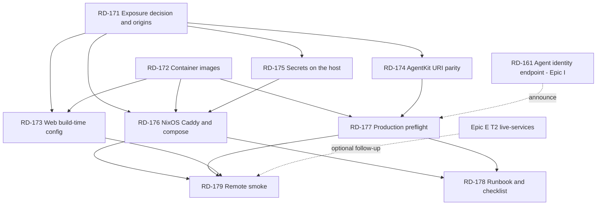

# Epic D — Demo Deployment (RD-171 … RD-179)

Parent index: `plan/backlog.md`. Prerequisite reading: `README.md` (env tables), `.env.example`,
`apps/web/.env.example`, `docs/world-agentkit.md`.

Not to be confused with `docs/sui-deployment.md`, which is about publishing the **Move package**.
This epic is about hosting the **three services** somewhere a judge can open in a browser.

## Why This Epic Exists

Everything runs on `localhost` today. `pnpm demo:up` starts the provider on `:4021`, the agent on
`:4022`, and the web app on `:3000` (`scripts/demo-up.sh`), and that is the only way the system has
ever run. There is **no Dockerfile in the repository** and no host configuration of any kind.

The deployment target is a Hetzner VPS running NixOS, already on the user's headscale network, with
Caddy and a valid certificate already configured. The stated constraints, from the session that
produced this epic:

| Constraint | Consequence |
|---|---|
| A judge may want to see it online | Headscale-only exposure is not sufficient. Someone outside the tailnet must be able to load the app. |
| The demo must run against real services, not mocks | `AGENTKIT_MODE=real`, `WALRUS_MODE=real`, `NEXT_PUBLIC_WALRUS_MODE=http`, `PROVIDER_STORE=postgres`. Every mock fallback in this repo is silent by design — see RD-177. |
| Deployment target is Sui **testnet** | No mainnet keys, no mainnet gas. The published package is the testnet one in `packages/contracts-config/testnet.json`. |
| Ease over cleanliness | Prefer one `docker compose up` on the host over an orchestrated pipeline. This epic does not build CI/CD. |

### The two things that will actually break

Most of this epic is ordinary containerization. Two items are not, and both fail in ways that look
like something else:

**1. The AgentKit header is bound to the exact request URL.** The agent signs
`${PROVIDER_API_URL}${path}` (`apps/agent/src/providerClient.ts:46,50`), putting that absolute URL in
the payload's `uri` and `resources` and the bare hostname in `domain`
(`apps/agent/src/agentkitSigner.ts:68-78`). The provider validates against `c.req.url` — the URL *as
the Node server saw it* (`apps/provider-api/src/middleware/agentkit.ts:12`). On localhost these are
the same string. Behind Caddy terminating TLS they are not: the agent signs
`https://api.example/...` while the provider reconstructs `http://…:4021/...`. The failure is
`401 AGENTKIT_UNVERIFIED` with no indication that a scheme mismatch caused it. That is RD-174, and it
is the single highest-risk ticket in the epic.

**2. `NEXT_PUBLIC_*` is inlined at build time.** Next.js bakes these into the bundle
(`README.md:142`, `apps/web/.env.example`). The web image is therefore **origin-specific** — an image
built with `NEXT_PUBLIC_PROVIDER_API_URL=http://localhost:4021` will have every browser on the public
internet trying to reach the judge's own laptop. Changing the origin means rebuilding the image, not
restarting it. That is RD-173.

### The mode-mismatch failure already observed

Running `pnpm demo:up`, uploading a packet, then clicking *Start run* produced:

```
Run failed: Provider API /listings/listing_lisbon_eligible/applications
returned 401: AGENTKIT_UNVERIFIED
```

with the agent reporting `agentkit: mock`. Tracked as **RD-180** (`plan/backlog.md` → *Open Thread*),
deferred until after this epic. The verifier is chosen by a single string comparison —
`mode === "real" ? real : mock` (`packages/agentkit/src/server.ts:118`) — and the mock verifier
requires `x-demo-*` headers while the real one requires an `agentkit` header. An agent in mock mode
talking to a provider in real mode sends the wrong header set and gets exactly that 401. Nothing logs
the disagreement unless `AGENTKIT_DEBUG=1`. **This is a local bug, not a deployment bug, but it is the
same class of failure the deployment will hit at a larger blast radius** — RD-177 exists to make both
impossible to ship.

## What This Epic Does Not Do

| Option | Why not |
|---|---|
| CI/CD pipeline, image registry, automated rollout | The deploy is a hackathon demo with one operator and one host. `docker compose up -d` over SSH is the right size. Revisit only if the demo outlives the event. |
| Kubernetes, Nomad, or any scheduler | Three containers and a Postgres. |
| A NixOS module that builds the apps from source | The repo is developed on Arch inside distrobox and `AGENTS.md` forbids assuming Nix for repo tooling. `deploy/` is the **only** directory where NixOS-specific configuration belongs, and even there it should be thin — Caddy vhosts and a systemd unit that calls `docker compose`. |
| Horizontal scaling, health-check-driven restarts, zero-downtime deploys | One judge at a time. `restart: unless-stopped` is the entire availability story. |
| Migrating off testnet | Out of scope and explicitly not wanted. |
| Fixing the `AGENTKIT_UNVERIFIED` mode mismatch | A local configuration bug, not a deploy task. It is tracked as **RD-180** in `plan/backlog.md` → *Open Thread*, and the user has deferred it until after this epic. RD-177 **detects** it; it does not fix it. Do not let this epic block on it — but see the risk table for what it costs RD-179. |

## Rules For Every Ticket In This Epic

| Rule | Requirement |
|---|---|
| One origin table | RD-171 produces the canonical origin strings. Every other ticket reads them from there. No ticket invents a hostname. |
| Build-time vs run-time | Before adding any configuration value, decide which it is. `NEXT_PUBLIC_*` is build-time and cannot be changed by restarting a container. Everything else is run-time. State which one in the ticket. |
| No secret in an image layer | See RD-175. The user is willing to bake secrets in for convenience; the cheaper option is a root-owned `env_file` on the host, which is *less* work than baking and keeps the image safe to rebuild and copy around. |
| Mocks fail the deploy | A production start that silently falls back to a mock is a demo that lies on stage. Every mode must be asserted at startup, not discovered at demo time. |
| The local path keeps working | `pnpm demo:up` must still work unchanged after every ticket. Containerization is additive — do not move the apps' entry points or rewrite their `start` scripts to require Docker. |
| Sponsor integrity | The deployed instance is the one judges see. If Walrus or Seal is running mocked there, the UI label must say so, per `plan/backlog.md` → Coordination Rules. |
| Secrets discipline | `deploy/` must contain no key material. Only `*.example` files are committed. Verify with `git status` before every commit in this epic. |

## Ticket Index

| ID | Title | Lane | Deps |
|---|---|---|---|
| RD-171 | Public exposure decision and canonical origin table | L0 | none — **needs a user decision** |
| RD-172 | Container images for web, provider API, and agent | L0 | none |
| RD-173 | Web image build-time configuration and origin guard | L0 / L7 | RD-171, RD-172 |
| RD-174 | AgentKit resource-URI parity behind the reverse proxy | L3 Provider | RD-171 |
| RD-175 | Secrets and environment on the host | L0 | RD-171 |
| RD-176 | NixOS host wiring — Caddy, compose unit, tailnet | L0 | RD-171, RD-172 |
| RD-177 | Production preflight — fail loudly on any mock or mode mismatch | L0 / L8 | RD-172 |
| RD-178 | Hosting runbook, rollback, and demo-day checklist | L9 Docs | RD-176, RD-177 |
| RD-179 | Remote smoke against the deployed origin | L10 QA | RD-176, RD-177 |

RD-172 and RD-174 are the natural first wave: different directories, no shared files, and RD-174 is
the long pole. RD-171 gates almost everything but is a decision plus one committed table — do it first
and it costs an hour.

---

### RD-171 Public Exposure Decision And Canonical Origin Table

| Field | Value |
|---|---|
| Priority | P0-deploy |
| Status | TODO — blocked on a user decision |
| Lane | L0 Project setup |
| Objective | Settle how a judge reaches the app, and freeze the resulting origin strings in one committed file that every other ticket reads. |
| Suggested implementation | The tailnet is not enough on its own: a judge is not on the user's headscale network. Present these three and record the choice. **(a) Public DNS + Caddy on the VPS public IP** — a real hostname, Let's Encrypt via the existing Caddy, reachable by anyone. Most robust for a live demo; requires a DNS record and open 80/443. **(b) Tailscale Funnel** — public HTTPS on a `*.ts.net` name without opening ports. Fastest if the tailnet is Tailscale-backed; note the user runs **headscale**, whose Funnel support differs from Tailscale SaaS and must be confirmed before choosing this. **(c) Tailnet-only** — judges cannot open it; the demo is screen-shared instead. Legitimate as a fallback, unacceptable as the plan. Recommend (a). Then write `deploy/origins.md`: one table of the three public origins plus the internal upstreams. Prefer **three subdomains** over path-prefixing a single host — path prefixes would require a base-path rewrite in Next.js and change every URL the AgentKit header is signed over, for no benefit. Suggested shape: `app.<domain>` → web `:3000`, `api.<domain>` → provider `:4021`, `agent.<domain>` → agent `:4022`. Record whether the agent origin is public at all: it takes `POST /runs` with no authentication (`apps/agent/src/server.ts:71` opens CORS and adds no auth), so exposing it publicly lets anyone trigger a gas-spending run. Default to keeping the agent **tailnet-only** and confirm the browser can still reach it — the `/agent` page calls it from the judge's browser (`NEXT_PUBLIC_AGENT_API_URL`), so tailnet-only means the judge cannot start a run. If that trade is unacceptable, the agent goes public and RD-175 must add a shared-secret header. Name the decision explicitly in the file. |
| Files/modules | `deploy/origins.md` (new), `deploy/README.md` (new, one paragraph pointing at it). |
| Dependencies | None, but requires the user's answer on exposure and domain. |
| Blocks | RD-173, RD-174, RD-175, RD-176. |
| Acceptance criteria | `deploy/origins.md` states the chosen exposure option with its reason, lists all three public origins and their internal upstreams, and answers the agent-exposure question with an explicit trade-off note. No other file in the epic contains a hardcoded hostname that is not sourced from this table. |
| Tests | None (decision + docs). |
| Verification | Paste the committed table. Confirm with the user that the domain exists and DNS resolves before RD-176 starts. |
| Failure fallback | If no public domain is available in time, choose (c), record it, and make the demo-day checklist in RD-178 a screen-share script. Do not stall the rest of the epic — every other ticket works with tailnet-only origins. |
| Sponsor | None directly. |
| Demo impact | Total — this decides whether the demo has a URL. |
| Parallel safety | New directory, no contention. |

---

### RD-172 Container Images For The Three Services

| Field | Value |
|---|---|
| Priority | P0-deploy |
| Status | TODO |
| Lane | L0 Project setup |
| Objective | Produce reproducible images for web, provider API, and agent from this pnpm workspace, plus a compose file that runs all four containers including Postgres. |
| Suggested implementation | One multi-stage `deploy/Dockerfile` with three final targets beats three Dockerfiles: the install and workspace build are identical for all of them. Base on `node:22-alpine` — the root `package.json` pins `"node": ">=22"` and `"packageManager": "pnpm@11.3.0"`; enable pnpm with `corepack enable` so the pinned version is honored. Stage 1 copies `package.json`, `pnpm-lock.yaml`, `pnpm-workspace.yaml` and every workspace `package.json`, then `pnpm install --frozen-lockfile` so the dependency layer caches independently of source. Stage 2 copies sources and runs `pnpm -r --if-present build`. The three final stages copy `dist/` plus pruned production `node_modules`. Entry points already exist and must not change: provider `node dist/server.js` (`apps/provider-api/package.json`), agent `node dist/server.js` via `start:server`, web `next start`. **Drop `--env-file-if-exists=../../.env` in the container** — that path resolves outside the image and compose injects the environment directly; keep the workspace scripts untouched for local use and override the container `command`. For the web target, check whether `apps/web/next.config.*` sets `output: "standalone"`; if not, either add it (much smaller image, and `next start` is replaced by `node server.js`) or accept copying `.next` plus full `node_modules`. Then write `deploy/docker-compose.yml` with `postgres`, `provider-api`, `agent`, and `web`, each `restart: unless-stopped`, ports bound to **`127.0.0.1` only** so Caddy is the sole ingress. Reuse the existing Postgres service definition from the root `docker-compose.yml` (`postgres:16-alpine`, named volume `postgres_data`) rather than reinventing it, and keep the root file as-is for local dev. Provider migrations must run before the API accepts traffic: a one-shot `migrate` service (`node apps/provider-api/scripts/migrate.mjs`) that the API `depends_on` with `condition: service_completed_successfully`. |
| Files/modules | `deploy/Dockerfile` (new), `deploy/docker-compose.yml` (new), `deploy/.dockerignore` (new — must exclude `node_modules`, `.next`, `.playwright-wallet-profile`, `.playwright-mcp`, `.demo-logs`, `.env`), possibly `apps/web/next.config.*` for `output: "standalone"`. |
| Dependencies | None. |
| Blocks | RD-173, RD-176, RD-177. |
| Acceptance criteria | All three images build from a clean checkout with no network access beyond the registry and npm. `docker compose -f deploy/docker-compose.yml up` brings up four containers; provider `/health` and agent `/health` both answer; the web app renders. Migrations run exactly once before the API starts. No published port is reachable from outside the host. `pnpm demo:up` still works unchanged on the developer machine. |
| Tests | No unit tests. The build itself is the test — record image sizes and total build time in the ticket. |
| Verification | Paste `docker compose ps`, the two `/health` responses, and `curl -sf localhost:3000` returning HTML. Confirm from a second machine that the ports are **not** reachable. |
| Failure fallback | If the pnpm workspace prune fights the multi-stage copy, ship a fatter single-stage image. Size is not a demo constraint; a working image is. |
| Sponsor | None. |
| Demo impact | None until RD-176. |
| Parallel safety | New `deploy/` directory. The only shared file is `apps/web/next.config.*` — announce if any L7 ticket is live. |

---

### RD-173 Web Image Build-Time Configuration And Origin Guard

| Field | Value |
|---|---|
| Priority | P0-deploy |
| Status | TODO |
| Lane | L0 / L7 Frontend |
| Objective | Make the web image's baked-in origins explicit and impossible to get wrong silently. |
| Suggested implementation | The five browser variables — `NEXT_PUBLIC_ENCRYPTION_MODE`, `NEXT_PUBLIC_WALRUS_MODE`, `NEXT_PUBLIC_PROVIDER_API_URL`, `NEXT_PUBLIC_AGENT_API_URL`, `NEXT_PUBLIC_WALRUS_EPOCHS` (`apps/web/.env.example`) — become `ARG`s in the web build stage, promoted to `ENV` before `next build`. Compose passes them under `build.args` from the origin table. Add a **build-time guard**: a short script run immediately before `next build` that fails when `NEXT_PUBLIC_PROVIDER_API_URL` or `NEXT_PUBLIC_AGENT_API_URL` contains `localhost` or `127.0.0.1` while a `DEPLOY_TARGET=host` arg is set. This is the one mistake that produces a deployed app which looks completely healthy to the operator — their own browser resolves localhost to their own running stack — and is broken for every judge. Also assert `NEXT_PUBLIC_WALRUS_MODE=http` and `NEXT_PUBLIC_ENCRYPTION_MODE=seal` for a host build, since the mock branches are the silent fallbacks called out in `README.md:158-162`. Document in `deploy/README.md`, in one sentence a tired operator will read at 2am: **changing an origin requires `docker compose build web`, not `restart`.** Optionally have the guard grep the built `.next` output for `localhost:4021` and fail on a hit — a direct assertion on the artifact rather than on the input. |
| Files/modules | `deploy/Dockerfile` (web stage), `deploy/docker-compose.yml` (`build.args`), `scripts/check-web-build-env.mjs` (new), `deploy/README.md`. |
| Dependencies | RD-171 (origins), RD-172 (Dockerfile exists). |
| Blocks | RD-179. |
| Acceptance criteria | A web image built with the deploy origins serves a bundle containing those origins and no `localhost` API URL. A build attempted with a localhost origin and `DEPLOY_TARGET=host` fails with a message naming the offending variable. A local build with no `DEPLOY_TARGET` is unaffected. |
| Tests | Unit-test the guard script: localhost URL + host target → non-zero exit; public URL → zero; missing variable → non-zero with the variable named. |
| Verification | Paste the failing build output for a deliberately-wrong origin, then the passing build, plus a `grep` over `.next` showing the deployed origin and no `localhost:4021`. |
| Failure fallback | If grepping the build output proves brittle across Next versions, keep the input-level guard only and note the limitation. |
| Sponsor | Walrus and Seal — the mode assertions are what keep the deployed labels honest. |
| Demo impact | High. This is the difference between a demo URL that works for judges and one that works only on the operator's laptop. |
| Parallel safety | Shares `deploy/Dockerfile` with RD-172 — land RD-172 first, then this. |

---

### RD-174 AgentKit Resource-URI Parity Behind The Reverse Proxy

| Field | Value |
|---|---|
| Priority | P0-deploy |
| Status | TODO |
| Lane | L3 Provider API |
| Objective | Make the URL the provider validates identical to the URL the agent signed, once TLS is terminated by a proxy in front of the API. |
| Suggested implementation | The mismatch chain is short and worth reading in full before touching anything: the agent signs `${PROVIDER_API_URL}${path}` (`apps/agent/src/providerClient.ts:46,50`) into `uri`/`resources`/`domain` (`apps/agent/src/agentkitSigner.ts:68-78`); the provider passes `c.req.url` to `validateAgentkitMessage` (`apps/provider-api/src/middleware/agentkit.ts:12`). Under `@hono/node-server`, `c.req.url` is built from the incoming `Host` header with scheme `http` — so with Caddy terminating TLS the provider sees `http://api.example/...` and the agent signed `https://api.example/...`. Same host, same path, different scheme, and the header is rejected. **Prefer an explicit `PROVIDER_PUBLIC_URL` over trusting `X-Forwarded-*`.** Deriving from forwarded headers means the value the provider validates against is attacker-influenced, and the failure mode is subtle; an env var is deterministic and matches the agent's own `PROVIDER_API_URL` by construction. In the middleware, when `PROVIDER_PUBLIC_URL` is set, rebuild the resource URI as that origin plus the request's path and query, and pass *that* to `verify`. When unset, keep `c.req.url` exactly as today so local runs are untouched. Log the effective resource-URI base **once at startup** — this is the diagnostic that turns a future `AGENTKIT_UNVERIFIED` from a guessing game into a one-line comparison. Consider extending the `AGENTKIT_DEBUG=1` path in `packages/agentkit/src/server.ts:74-78` to log both the expected and received URI on a validation failure; today it logs only `validation.error`, which does not name the mismatch. Confirm whether `validateAgentkitMessage` compares the full URI or only `domain` — if only the hostname, the scheme mismatch may not bite, but the port would; either way pin the behavior with a test rather than assuming. |
| Files/modules | `apps/provider-api/src/middleware/agentkit.ts`, `apps/provider-api/src/middleware/agentkit.test.ts`, `packages/agentkit/src/server.ts` (debug logging only), `.env.example`, `README.md` env table, `docs/provider-api.md`. |
| Dependencies | RD-171 (the public origin string). |
| Blocks | RD-177, RD-179. |
| Acceptance criteria | With `PROVIDER_PUBLIC_URL=https://api.example`, a request arriving as `http://provider:4021/listings/x/applications` is verified against `https://api.example/listings/x/applications`. With it unset, behavior is byte-identical to today. Startup logs the effective base exactly once. `pnpm --filter @rentdelegate/provider-api test` passes and `pnpm -r --if-present test` is green. |
| Tests | Unit tests on the middleware with a stub verifier capturing the `resourceUri` argument: unset → `c.req.url`; set → rebuilt origin + path + query preserved; set with a trailing slash → normalized, no double slash; query string preserved exactly. Plus one end-to-end test with the **real** verifier and a header signed by a throwaway key over the public URL, proving the two sides agree — this is the test that would have caught the bug. |
| Verification | Paste the vitest output, the startup log line, and — once RD-176 is up — a real reserve call from the agent through Caddy returning 201 rather than 401. |
| Failure fallback | If `validateAgentkitMessage` turns out to compare only `domain`, keep the change anyway: it costs nothing and makes the two sides agree by construction rather than by luck. Record the finding in the ticket so RD-178's troubleshooting section is accurate. |
| Sponsor | World — this is the AgentKit verification path itself. |
| Demo impact | Total. Without it the agent cannot reserve an application on the deployed host, which is the centre of the demo. |
| Parallel safety | Owns `middleware/agentkit.ts`. Does **not** touch `services/applications.ts`, so it can run alongside Epic I's RD-164 — announce, but they do not collide. |

---

### RD-175 Secrets And Environment On The Host

| Field | Value |
|---|---|
| Priority | P0-deploy |
| Status | TODO |
| Lane | L0 Project setup |
| Objective | Get two private keys and the run-time configuration onto the VPS without putting either into a git object or an image layer. |
| Suggested implementation | The secrets are `AGENT_SUI_PRIVATE_KEY` (or `_BASE64`) and `AGENT_EVM_PRIVATE_KEY`; the Postgres password is a third if it stops being the default. The user is willing to bake them into the image for convenience — **the host `env_file` is strictly less work and strictly safer**, so take it: a root-owned `/etc/rentdelegate/rentdelegate.env` at mode `0600`, referenced by `env_file:` in the compose file. No rebuild when a key rotates, and the image stays safe to copy or rebuild anywhere. Baking into a layer means the key survives in the image history and leaks to anyone who can `docker save` it. If the user still prefers baking after reading that, honor it and record the decision plus the constraint that the image must never reach a public registry. Commit `deploy/rentdelegate.env.example` with every variable and an empty value for each secret, derived from `.env.example` — it is already well-annotated, so port the comments rather than rewriting them. Host-specific values that differ from the local defaults: `PROVIDER_STORE=postgres`, `DATABASE_URL` pointing at the compose service name (`postgres`, not `localhost`), `PROVIDER_API_URL` and the new `PROVIDER_PUBLIC_URL` from RD-174, `AGENTKIT_MODE=real`, `WALRUS_MODE=real`. Note the two that are easy to miss: `AGENT_SUI_PRIVATE_KEY` must derive exactly `AGENT_SUI_ADDRESS` (`README.md:192`), and `AGENT_ACCESS_WINDOW_DAYS` must stay strictly inside the Walrus blob lifetime — 3 against `WALRUS_EPOCHS=5` today, and exceeding it aborts the run before gas is spent (`.env.example`). If RD-171 decided the agent origin is public, add the shared-secret header here: a single `AGENT_RUN_TOKEN` compared in `apps/agent/src/server.ts` before `POST /runs` does the job, and the web app needs it as a `NEXT_PUBLIC_*` value — which makes it visible in the bundle and therefore only a spam-brake, not authentication. Say that plainly in the file. |
| Files/modules | `deploy/rentdelegate.env.example` (new), `deploy/docker-compose.yml` (`env_file`), `deploy/README.md`, and — only if the agent is public — `apps/agent/src/server.ts` plus its test. |
| Dependencies | RD-171. |
| Blocks | RD-176, RD-177. |
| Acceptance criteria | The example file lists every variable the three services read, with empty secrets. `git status` is clean of real key material and `.gitignore` covers any non-example env file under `deploy/`. Containers start with the env file absent from the image — prove it with `docker history` or by inspecting the image filesystem. |
| Tests | If `AGENT_RUN_TOKEN` is added: unit tests for present/absent/wrong token. Otherwise none. |
| Verification | Paste the example file, the file mode of the real env file on the host (`ls -l`), and evidence that no secret appears in any image layer. |
| Failure fallback | If the user insists on baked secrets, do it, document it, and add a line to RD-178's post-demo checklist to destroy the image afterwards. |
| Sponsor | None. |
| Demo impact | The agent cannot sign anything without these — no keys, no Sui transaction and no AgentKit header. |
| Parallel safety | Owns `deploy/rentdelegate.env.example`. Touches `apps/agent/src/server.ts` **only** in the public-agent case, which collides with Epic I's RD-161 — check that ticket's status first. |

---

### RD-176 NixOS Host Wiring — Caddy, Compose Unit, Tailnet

| Field | Value |
|---|---|
| Priority | P0-deploy |
| Status | TODO |
| Lane | L0 Project setup |
| Objective | Serve the three origins from the existing Caddy over TLS, and keep the stack running across reboots. |
| Suggested implementation | Thin configuration only — the host is the user's and this repo does not own it. Commit a `deploy/nixos/` directory containing a Caddy vhost fragment and a systemd unit, as **reference snippets the user pastes into their own configuration**, not a module the repo tries to manage. Caddy: three `reverse_proxy` blocks to `127.0.0.1:3000`, `:4021`, `:4022`, matching the origin table. Two details that matter. First, Caddy's `reverse_proxy` preserves the inbound `Host` by default, which is what makes RD-174's `PROVIDER_PUBLIC_URL` line up — do **not** add a `header_up Host {upstream_hostport}` override. Second, if the agent origin stays tailnet-only per RD-171, bind that vhost to the tailnet interface rather than exposing it, and re-check that the judge's browser can still reach `NEXT_PUBLIC_AGENT_API_URL` — if it cannot, the *Start run* button is dead on the deployed app and RD-171's decision must be revisited before the demo, not during it. Systemd: a unit with `ExecStart=docker compose -f /opt/rentdelegate/deploy/docker-compose.yml up` and `Restart=always`, or `virtualisation.oci-containers` if the user prefers — either is fine, pick one and document it. Deployment itself is a `git pull` plus `docker compose up -d --build` on the host; no registry needed. Keep a note that the first `--build` on a 2-vCPU Hetzner box takes a while and should not be run for the first time on demo day. CORS is currently wide open on both APIs (`apps/provider-api/src/app.ts:46`, `apps/agent/src/server.ts:71`) with no origin restriction, so cross-origin calls from the web origin will work as-is; tightening to the known web origin is a one-line improvement worth taking while here, but only after the happy path is proven working. |
| Files/modules | `deploy/nixos/caddy-rentdelegate.conf` (new), `deploy/nixos/rentdelegate.service` (new), `deploy/README.md` (host bootstrap steps). |
| Dependencies | RD-171, RD-172, RD-175. |
| Blocks | RD-178, RD-179. |
| Acceptance criteria | All three origins answer over HTTPS with a valid certificate. The web app loads and its browser calls reach the provider and agent origins without CORS errors. The stack comes back automatically after `reboot`. Nothing but Caddy listens on a public interface. |
| Tests | None (host configuration). |
| Verification | `curl -sI` against all three origins showing 200 and the TLS chain; a browser screenshot of the deployed app; `systemctl status` after a reboot; a port scan from outside showing only 80/443. |
| Failure fallback | If Caddy integration fights the user's existing configuration, run the stack tailnet-only and screen-share, per RD-171's fallback. Do not start rewriting the user's host configuration to make this epic fit. |
| Sponsor | None. |
| Demo impact | Total — this is the deploy. |
| Parallel safety | New files; the only real contention is the user's host, so one agent at a time and announce before touching it. |

---

### RD-177 Production Preflight — Fail Loudly On Any Mock Or Mode Mismatch

| Field | Value |
|---|---|
| Priority | P0-deploy |
| Status | TODO |
| Lane | L0 / L8 Agent |
| Objective | Turn every silent mock fallback and every cross-service mode disagreement into a startup failure with a specific message. |
| Suggested implementation | `pnpm --filter @rentdelegate/agent check:env` already exists (`apps/agent/src/checkEnv.ts`) and is the natural home for the agent half; add `scripts/preflight-deploy.mjs` for the whole-stack check and wire it into the compose start path so a misconfigured stack refuses to come up. Assert, each with its own message naming the variable: `AGENTKIT_MODE=real` — anything else selects the mock verifier that accepts `x-demo-*` from anyone (`packages/agentkit/src/server.ts:118`, and `.env.example` already warns "never leave this unset on a public host"); `WALRUS_MODE=real` and `NEXT_PUBLIC_WALRUS_MODE=http`; `NEXT_PUBLIC_ENCRYPTION_MODE=seal`; `PROVIDER_STORE=postgres` with a reachable `DATABASE_URL`; `AGENT_SUI_PRIVATE_KEY` present and deriving exactly `AGENT_SUI_ADDRESS`; `AGENT_EVM_PRIVATE_KEY` present, and its derived address AgentBook-registered — the lookup already exists via `createAgentBookVerifier().lookupHuman()`, so call it rather than trusting configuration; `AGENT_ACCESS_WINDOW_DAYS` strictly less than the Walrus blob lifetime implied by `WALRUS_EPOCHS`; `PROVIDER_PUBLIC_URL` (RD-174) equal to the agent's `PROVIDER_API_URL`, since a mismatch there is precisely the 401 this epic opened with. **The cross-service check is the one that earns this ticket.** The observed local failure was an agent in mock mode against a provider in real mode, producing `401 AGENTKIT_UNVERIFIED` with nothing in the logs; the preflight must compare the two modes directly and refuse to start on disagreement. Add a `GET /health` field on the provider exposing its `agentkitMode` so the agent — and the preflight — can read it rather than infer it; the agent's `/health` already publishes `agentkitMode` (`apps/agent/src/server.ts`), so this makes the pair symmetric and comparable. Print a single summary table of every mode on successful start, so the operator can see at a glance what is live. |
| Files/modules | `scripts/preflight-deploy.mjs` (new), `apps/agent/src/checkEnv.ts`, `apps/provider-api/src/routes/health.ts` (or wherever `/health` is defined), `deploy/docker-compose.yml`, `package.json` (`preflight:deploy` script), tests for the new assertions. |
| Dependencies | RD-172. Reads `PROVIDER_PUBLIC_URL` from RD-174 if that has landed; skip that one assertion with a warning if not. |
| Blocks | RD-178, RD-179. |
| Acceptance criteria | Each assertion fails independently with a message naming the variable and the expected value. `AGENTKIT_MODE=mock` in a host configuration is a hard failure. Agent mock + provider real is a hard failure that names both sides. A correct configuration prints the mode summary and exits zero. Local `pnpm demo:up` is unaffected — the preflight is opt-in for deploy, not a new gate on developer machines. |
| Tests | Table-driven unit tests, one per assertion, each verifying the exit code and that the message names the variable. Include the mode-mismatch case explicitly. |
| Verification | Paste the output of a deliberately-broken configuration for at least four distinct assertions, then the passing summary table. |
| Failure fallback | If the AgentBook lookup is slow or rate-limited at startup, downgrade that single check to a warning with the address printed — never downgrade the mode assertions. |
| Sponsor | World, Walrus, Seal — this ticket is what makes the deployed sponsor labels true. |
| Demo impact | High and preventative. This is the ticket that stops a mocked demo reaching a judge. |
| Parallel safety | Touches `checkEnv.ts` (agent) and the provider health route. Coordinate with Epic I's RD-161, which also edits the agent's health payload. |

---

### RD-178 Hosting Runbook, Rollback, And Demo-Day Checklist

| Field | Value |
|---|---|
| Priority | P1-deploy |
| Status | TODO |
| Lane | L9 Demo/docs |
| Objective | Write down the deploy so it can be executed, recovered, and repeated by someone who is not the person who built it — including that person, tired, on demo day. |
| Suggested implementation | New `docs/hosting.md`. Deliberately **not** `docs/deployment.md`: `docs/sui-deployment.md` already exists and means Move package publishing, and two similarly-named files is how the wrong one gets read. Cover: host bootstrap from a clean VPS; the deploy command sequence; how to roll back (previous git ref plus `docker compose up -d --build`; note that a **database migration is not rolled back** by that, so any destructive migration needs a dump first); log locations for all four containers; and a troubleshooting table keyed by the symptom rather than the cause, because that is what the operator has. At minimum: `401 AGENTKIT_UNVERIFIED` → check `PROVIDER_PUBLIC_URL` against the agent's `PROVIDER_API_URL` and both `agentkitMode` values (RD-174, RD-177); *Agent offline* on the `/agent` page → `NEXT_PUBLIC_AGENT_API_URL` was baked at build time and may point at localhost, or the agent origin is tailnet-only and the judge's browser cannot reach it (RD-171, RD-173); packets disappear after restart → `PROVIDER_STORE` fell back to `memory`; run aborts before gas → `AGENT_ACCESS_WINDOW_DAYS` exceeds the Walrus lifetime. Then a **demo-day checklist**, timed: what to verify the night before (full run end to end on the deployed origin, gas balance on the agent address, Walrus blob still inside its lifetime) and what to verify in the ten minutes before presenting (all three origins answer, agent `/health` shows `real`, one dry run). Add a *fallback if the deploy is down* section pointing at the local `pnpm demo:up` path and the pre-recorded evidence in `docs/demo-script.md` — a judge-facing demo needs a plan B that is not improvised. Cross-link from `README.md` and add `docs/hosting.md` to the `docs/` list in `AGENTS.md`. |
| Files/modules | `docs/hosting.md` (new), `README.md` (one link), `AGENTS.md` (docs list), `deploy/README.md` (point at the runbook). |
| Dependencies | RD-176, RD-177. |
| Blocks | None. |
| Acceptance criteria | Someone who has never deployed this can go from a clean VPS to a working origin using only `docs/hosting.md`. Every troubleshooting row names a file or variable a reader can check. The rollback section states plainly what it does not roll back. |
| Tests | None (docs). |
| Verification | Ideally: follow the runbook top to bottom on a fresh host, or at minimum re-derive each step against the actual deployed configuration and paste the checklist. |
| Failure fallback | If the deploy lands late, ship the checklist and troubleshooting table first — those are what get used under pressure. Bootstrap prose can follow. |
| Sponsor | None. |
| Demo impact | High on the day. |
| Parallel safety | Owns `docs/hosting.md`. Edits `AGENTS.md`, which RD-152 and RD-165 may also touch — announce. |

---

### RD-179 Remote Smoke Against The Deployed Origin

| Field | Value |
|---|---|
| Priority | P1-deploy |
| Status | TODO |
| Lane | L10 QA/E2E |
| Objective | Prove the deployed instance actually works end to end, from outside the host, before a judge does it for you. |
| Suggested implementation | **Do not block on Epic E.** `apps/e2e/` currently contains only `node_modules` and `test-results` — the scaffold has not landed — so the first deliverable is a dependency-free `scripts/smoke-deployed.mjs` taking a base-origin argument and asserting, in order: all three origins respond over HTTPS; provider `/health` reports `postgres` and `agentkitMode: real`; agent `/health` reports `real` and the expected `agentSuiAddress`; the listings endpoint returns the seeded demo listings; and the web HTML contains the deployed API origin and **not** `localhost` — the direct check on RD-173's failure mode. Keep it read-only: no reservation, no gas. Then the one thing a script cannot prove — a **full manual run against the deployed origin**, from a browser that is not on the tailnet and has never loaded the app: create a mandate, upload a packet, start a run, verify the receipt. That is the demo, and it is the only evidence that counts. Record its tx digest and receipt ID in `packages/contracts-config/testnet.json` alongside the existing `liveAgentRun` block, following the same shape. **This spends gas — it is under the repo's live-spend gate; get the user's go-ahead first.** If and when Epic E's T2 `live-services` project exists, point it at the deployed origin via a base-URL override rather than duplicating specs; note that as a follow-up in the ticket instead of doing it here. |
| Files/modules | `scripts/smoke-deployed.mjs` (new), `package.json` (`smoke:deployed` script), `packages/contracts-config/testnet.json` (append-only evidence block), `docs/hosting.md` (reference the smoke command). |
| Dependencies | RD-176, RD-177. RD-173 for the bundle-origin assertion. |
| Blocks | None. |
| Acceptance criteria | `pnpm smoke:deployed https://app.example` exits zero against a healthy deploy and non-zero with a specific message against each of: an origin down, a mocked mode, a localhost-baked bundle. The manual run completes and its evidence is recorded. |
| Tests | The script is the test. Unit-test its assertion helpers against stubbed responses so a false green is not possible. |
| Verification | Paste the passing smoke output, one failing case, and the deployed run's tx digest and receipt ID with testnet SuiVision links. |
| Failure fallback | If the manual run cannot be completed from off-tailnet before the demo, say so explicitly in `docs/hosting.md` rather than implying the deployed path is proven. A tailnet-only proof is a real proof of a smaller claim — label it as one. |
| Sponsor | Sui + World — this is the deployed instance of the live run. |
| Demo impact | High. Everything else in this epic is a hypothesis until this passes. |
| Parallel safety | New script. Appends to `packages/contracts-config/testnet.json`, which is append-only and shared with RD-115/RD-123/RD-133 — announce before writing. |

---

## Dependency Graph



## Parallel Execution Plan

Three agents at the widest point. The epic is gated at both ends — RD-171 is a decision everything
reads, and RD-176 is a single host only one agent can touch.

| Wave | Agents | Tickets | Notes |
|---|---:|---|---|
| 0 | 1 | RD-171 | A decision plus one table. Needs the user; everything downstream needs it. Do not start Wave 1 tickets that consume origins until this lands — RD-172 is safe to start in parallel because it consumes none. |
| 1 | 2 | **A** RD-172 · **B** RD-174 | `deploy/` and `apps/provider-api/src/middleware/`. Zero shared files, and RD-174 is the long pole — start it early. |
| 2 | 2 | **A** RD-173 · **B** RD-175 | Both read the origin table; A owns the Dockerfile's web stage, B owns the env example. |
| 3 | 1 | RD-176 | One host, one operator. Serialize. |
| 4 | 2 | **A** RD-177 · **B** RD-178 (draft) | The preflight can be written and unit-tested before the host exists; the runbook's troubleshooting table needs RD-177's messages, so B drafts and finishes after A. |
| 5 | 1 | RD-179 | Needs everything live. Live-spend gated. |

### Contended Files

| File | Wanted by | Rule |
|---|---|---|
| `deploy/Dockerfile` | RD-172, RD-173 | RD-172 creates it, RD-173 extends the web stage. Strictly sequential. |
| `deploy/docker-compose.yml` | RD-172, RD-173, RD-175, RD-177 | RD-172 creates it; the rest add one section each. Announce, do not serialize — the edits are in different blocks. |
| `apps/agent/src/server.ts` | RD-175 (public-agent case only), Epic I RD-161 | Check RD-161's status first; if it is in flight, defer the token to after it lands. |
| `apps/agent/src/checkEnv.ts` | RD-177 | Sole owner within this epic. |
| `packages/contracts-config/testnet.json` | RD-179, plus RD-115/RD-123/RD-133 | Append-only blocks; announce before writing. |
| `AGENTS.md` | RD-178, plus Epic E RD-152 and Epic I RD-165 | Announce; the edits are in different sections. |
| `README.md` | RD-174, RD-178 | Different sections (env table vs docs links). Announce. |

## Known Risks

| Risk | Owner | Mitigation |
|---|---|---|
| `AGENTKIT_UNVERIFIED` on the deployed host after everything looks healthy | RD-174 | The URI-parity fix plus the startup log of the effective base. Do not debug this by disabling AgentKit verification — that deletes the World half of the demo. |
| Web image baked with `localhost` origins; works for the operator, broken for judges | RD-173 | Build-time guard and the bundle grep in RD-179. |
| Agent origin tailnet-only means the judge cannot press *Start run* | RD-171 | Decide before RD-176, not on demo day. Re-verify in RD-176's acceptance criteria. |
| Deployed instance silently running a mock | RD-177 | Hard startup failure on every mode assertion. |
| Agent Sui address runs out of testnet gas mid-demo | RD-178 | Balance check in the demo-day checklist; top up the night before. |
| Walrus blob expires between upload and the landlord's read | RD-175, RD-177 | `AGENT_ACCESS_WINDOW_DAYS` strictly inside `WALRUS_EPOCHS`, asserted at startup rather than trusted. |
| First `docker compose build` on a small VPS is slow enough to derail a demo | RD-176 | Build and warm the images at least a day ahead; never let demo day be the first build. |
| The unresolved local `AGENTKIT_UNVERIFIED` mode mismatch is still open | **RD-180**, outside this epic | Tracked as an Open Thread in `plan/backlog.md`, deferred until after this epic by the user's decision. RD-177 detects the class at startup; detection is not a fix, and **RD-179's live run will fail the same way until RD-180 is resolved.** Do not let RD-179 be the place this is discovered. |

## Definition Of Done

1. A judge on the open internet opens one URL and sees the working application.
2. The renter creates a mandate, uploads a packet, and starts an agent run entirely through the deployed origin — no localhost, no tunnel on the judge's side.
3. That run reserves against the provider with a real AgentKit header, verified against the public URL, and submits a real transaction to Sui testnet. Its digest and receipt ID are recorded in `packages/contracts-config/testnet.json`.
4. No service on the deployed host is running a mock, and the preflight would have refused to start if one were.
5. Only Caddy listens on a public interface; no private key exists in any image layer or git object.
6. The stack survives a reboot without manual intervention.
7. `docs/hosting.md` takes a reader from a clean VPS to that URL, and its troubleshooting table names a file or variable for every symptom listed.
8. `pnpm demo:up` still works unchanged on a developer machine.
