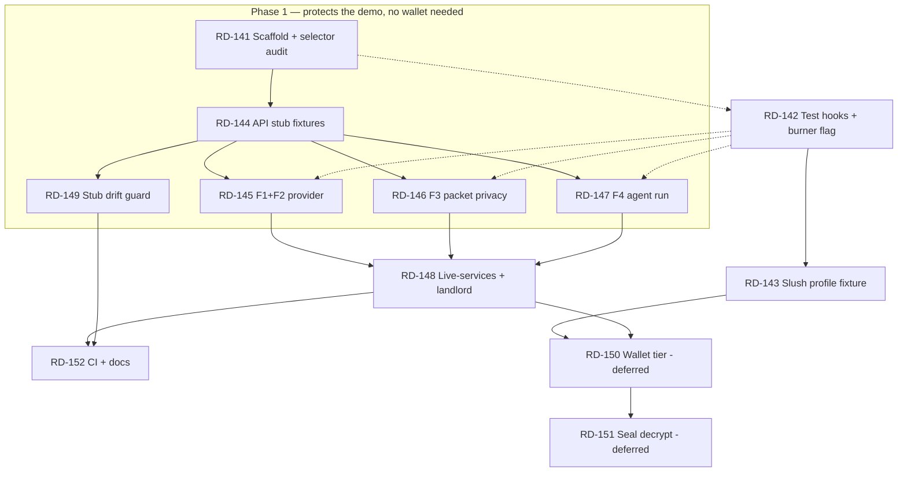

# Epic E — Playwright End-To-End Tests (RD-141 … RD-152)

Parent index: `plan/backlog.md`. Prerequisite reading: `docs/browser-testing.md`, `docs/demo-script.md`.

## Why This Epic Exists

Every subsystem has unit tests (143 JS/TS + 28 Move) and every claim in `docs/demo-script.md` has been
verified **by hand, once**. Nothing re-verifies the demo path after a change. The failure that matters
is not "a function returns the wrong value" — it is "the provider dashboard shows no listings on stage
because `next start` served a stale build", which no unit test can catch.

This epic covers the four flows that are actually demoed, in the browser, with the real app:

| # | Flow | Page | Why it is demo-critical |
|---|---|---|---|
| F1 | Role navigation | `/` | First thing shown on stage. |
| F2 | Provider: listings table + receipt verification | `/provider` | Sui receipt → `accepted` is the Sui proof surface. |
| F3 | Renter: encrypt and upload packet | `/renter` | "Plaintext never leaves the browser" — the privacy claim. |
| F4 | Agent operator: eligible run + ineligible refusal | `/agent` | "Sui limits what the agent can do" — the core message. |
| F5 | Landlord: on-chain receipt panel | `/landlord` | Receipt fields read live from testnet. |
| F6 | Renter: mandate create → status → revoke | `/renter` | Wallet-signed; revocation is the renter's stop control. |
| F7 | Landlord: Seal request-access → decrypt | `/landlord` | Browser-only by construction (RD-136); stretch. |

## Recommended Order — Start Here

**Do not work this epic front-to-back.** Recorded 2026-07-25, with the demo imminent and the last three
commits being demo fixes (explorer subdomain, provider dashboard refresh, Seal namespace) — exactly the
class of bug the first slice below would have caught.

### Phase 1 — the minimum slice that protects the demo (do this first)

| Order | Ticket | Why it is in the slice |
|---|---|---|
| 1 | RD-141 scaffold + selector audit | ~1 h; unblocks everything else |
| 2 | RD-147 agent run (F4) | This *is* the pitch: the eligible run completes, Porto is refused |
| 3 | RD-145 provider + receipt verification (F1+F2) | Step 8 of `docs/demo-script.md`; guards the explorer-link fix |
| 4 | RD-146 packet privacy (F3) | Asserts the "plaintext never leaves the browser" claim |
| 5 | RD-149 stub drift guard | One second of vitest; the only thing stopping the stubs from rotting |

**The property that makes this slice cheap: none of these four flows needs a wallet.** Navigation, the
provider dashboard, the agent page, and `PacketBuilder`'s AES-GCM path never touch a connected account.
So RD-142 and RD-143 are **not** prerequisites here — the expensive wallet work is the optional part of
this epic, not its foundation. Pull RD-142 in only if RD-141's audit reports a `NEEDS TESTID` that a
scoped text selector cannot cover.

### Phase 2 — after the demo, if the tests are earning their keep

RD-148 (live services), RD-152 (CI + docs), then RD-142 + RD-143 when a wallet-gated flow actually needs
covering.

### Deferred, with reasons

| Ticket | Why it is not worth doing yet |
|---|---|
| RD-150 wallet tier | Spends real gas, needs the user's Slush session, headed-only, never runs in CI. Real value — it covers the digest-vs-object-ID parsing trap `AGENTS.md` warns about — but not before a demo. |
| RD-151 Seal decrypt | Must build an entire new on-chain chain just to satisfy `ctx.sender() == receipt.landlord`, for proof the Move denial matrix already carries. Worst effort-to-evidence ratio in the epic. |

### The honest counter-argument

Judges do not score E2E tests, and `AGENTS.md` still lists RD-014 (two-live-agent World proof) as
PARTIAL. If sponsor-proof completeness matters more than demo insurance, RD-014 is the better use of the
same hours — this epic protects a demo that already works.

## The Central Constraint

**The app writes to Sui testnet through a wallet.** There is no hermetic way to fake that: the frontend
talks gRPC (`@mysten/sui` `SuiGrpcClient`) to `fullnode.testnet.sui.io:443`, and faking binary protobuf
responses in `page.route` is not a reasonable engineering investment for a hackathon repo. The repo rule
"never fake Sui" points the same way.

So this epic does **not** try to make one suite do everything. It defines three tiers, and every ticket
states which tier it belongs to.

| Tier | Playwright project | Browser context | External deps | Runs in CI | What it proves |
|---|---|---|---|---|---|
| **T1 stubbed** | `stubbed` | fresh, ephemeral | none — provider API and agent API intercepted by `page.route`; no chain access; dApp Kit's built-in burner wallet for account-gated UI | yes, on every push | UI wiring, state machines, privacy assertions, error paths |
| **T2 live-services** | `live-services` | fresh, ephemeral | real `provider-api` + `agent` servers via Playwright `webServer`; read-only testnet gRPC | on demand / nightly | The app talks to the real APIs and reads real on-chain objects |
| **T3 wallet** | `wallet` | **persistent — `.playwright-wallet-profile/`** | T2 plus the user's live Slush web-wallet session; **spends gas** | never automatically | Real wallet signing through Slush, `create_mandate`, `revoke_mandate`, `create_listing` |

T3 is under the repo's **live-spend gate** (`plan/backlog.md` → Coordination Rules): get the user's
explicit go-ahead before the first run. It also depends on a session only the user can renew, so it
`test.skip()`s — loudly, with the reason — when the profile is missing, locked, or its session has
expired. A skipped test is honest; a passing stub of a chain write is not.

### Rejected Alternatives

| Option | Why not |
|---|---|
| Localnet (`sui start`) + publish per run | Package/object IDs are compile-time constants in `packages/contracts-config`; making them env-overridable touches L0-owned canonical config that the demo, the agent, and the provider all read. Cost is high, and it would weaken the "one canonical ID source" invariant RD-115 established. Revisit only if chain writes must become hermetic. |
| Stubbing Sui gRPC in `page.route` | Binary protobuf request/response synthesis. Brittle, and a green test would prove nothing about the real client. |
| A hand-rolled Wallet Standard mock wallet | Unnecessary twice over: dApp Kit already ships `unsafeBurnerWalletInitializer` for the no-chain case, and the real Slush session in `.playwright-wallet-profile/` covers the signing case. A hand-rolled wallet would also prove nothing about the wallet path the demo actually uses. Keep it as a last-resort fallback only if the burner flag is rejected by L7. |
| `@vitest/browser` (already a devDep of `apps/web`) | Component-level, single-origin. Cannot orchestrate three servers, cross-origin stubs, and a wallet. |

---

## Architecture

New workspace package `apps/e2e` (`@rentdelegate/e2e`) — covered by the existing `apps/*` glob in
`pnpm-workspace.yaml`, so no workspace change is needed.

```
apps/e2e/
  package.json              scripts: e2e:stubbed, e2e:live, e2e:testnet, e2e:ui  (NO "test" script — see below)
  playwright.config.ts      three projects, webServer wiring, reporters
  tsconfig.json
  README.md                 how to run each tier, what each needs
  src/
    fixtures/
      test.ts               extended `test` export: composes wallet + stub fixtures
      providerApi.ts        page.route handlers for http://localhost:4021/**
      agentApi.ts           page.route handlers for http://localhost:4022/**
      data.ts               fixture payloads — IDs imported from @rentdelegate/contracts-config
      console.ts            console-error collector (see Log Hygiene below)
    wallet/
      profile.ts            persistent-context launch: profile path, SingletonLock check
      session.ts            slush:session preflight — decode exp, never log the token
      connect.ts            auto-connect detection + ConnectButton/"Slush" fallback, address read
      approve.ts            approveInSlush / rejectInSlush popup helpers (my.slush.app/dapp-request)
  specs/
    navigation.spec.ts          T1  F1
    provider-dashboard.spec.ts  T1  F2
    renter-packet.spec.ts       T1  F3
    agent-run.spec.ts           T1  F4
    live-services.spec.ts       T2  F2/F4/F5 against real servers
    landlord-receipt.spec.ts    T2  F5
    mandate-lifecycle.spec.ts   T3  F6
    listing-create.spec.ts      T3  F6
    seal-decrypt.spec.ts        T3  F7 (stretch)
```

**Do not define a `test` script in `apps/e2e/package.json`.** The root `pnpm -r --if-present test` would
pick it up and every existing `pnpm test` invocation would start browsers. E2E runs under its own
`pnpm e2e:*` scripts and its own root aliases.

### Wallet Strategy (the one non-obvious piece)

**The wallet is in the user profile directory.** `.playwright-wallet-profile/` is not an obstacle to
work around — it is the wallet. Nothing in this epic hand-rolls a signer for the signing tiers.

Verified against the installed packages, not assumed:

| Fact | Source | Consequence for tests |
|---|---|---|
| dApp Kit registers the **Slush web wallet** by default (`slushWalletConfig !== null` → `slushWebWalletInitializer`), and `apps/web/app/client-providers.tsx` passes no override | `@mysten/dapp-kit-core/dist/index.mjs` | The wallet appears with no app change. Its registered name is `"Slush"`. |
| `autoConnect` defaults to `true` with a 5 s `autoConnectTimeout` | same | With the profile loaded the app may connect **without any click**. Specs must assert the connected state and only click Connect if it did not. |
| The profile holds `mysten-dapp-kit:selected-wallet-and-address` **and** the Slush `slush:session` JWT under origin `http://localhost:3000` | inspected in `Default/Local Storage/leveldb` | **Serving on port 3000 is mandatory, not conventional.** Any other port and the session is invisible and Slush will demand a Google sign-in — which is the user's action, never an agent's. |
| The recorded account is `0x4541d030…` | same | It is **not** `PUBLISHER_ADDRESS` (`0x371321…`). Seeded listings and existing receipts use the publisher as landlord, so `/landlord` → "Your Applications" is legitimately **empty** for this wallet. See RD-148 and RD-151. |
| Signing opens a popup: `window.open('about:blank','_blank')` navigated to `https://my.slush.app/dapp-request`, then `postMessage`; the channel polls and rejects if the popup closes | `@mysten/window-wallet-core/dist/web-wallet-channel/dapp-post-message-channel.mjs` | Every signature needs `const popup = await page.waitForEvent('popup')` **before** the click resolves, then an approve click inside `popup`. A closed popup surfaces as a rejection, which is also how the refusal path gets tested. |
| Chromium locks a user-data-dir (`SingletonLock`) | Chromium | The T3 project runs `workers: 1`, and it cannot run while an opencode Playwright MCP session holds the same profile. Fail fast on the lock with that message. |

**Fixture shape** — `chromium.launchPersistentContext()` cannot be selected through a Playwright project
option, so T3 overrides the `context` fixture (worker-scoped) with a persistent launch pointed at
`E2E_WALLET_PROFILE` (default `.playwright-wallet-profile`). Provide alongside it:

- `walletSession` — a **preflight** that decodes the `exp` of the `slush:session` JWT and fails with
  `Slush session expired — the user must re-authenticate (docs/browser-testing.md)`. Fail fast; never
  print the token, and never attempt the sign-in.
- `walletAddress` — reads the connected address from the page instead of hardcoding it, so a profile
  re-auth to a different account does not silently break every spec.
- `approveInSlush(page, action)` — the popup helper above, plus a `rejectInSlush` that closes the popup.

**T1 needs no signatures at all** — it never executes a transaction. It only needs an account to exist so
that `MandateForm` and `ListingForm` render instead of their connect prompts. Use dApp Kit's built-in
burner: `createDAppKit({ enableBurnerWallet: … })`, env-gated so production is untouched (RD-142).

**No private key ever enters this harness.** There is no `E2E_SUI_PRIVATE_KEY`: the signing key stays
inside Slush, and gas comes from the profile's own account.

---

## Rules For Every Ticket In This Epic

| Rule | Requirement |
|---|---|
| Selectors | Prefer `getByRole` / `getByText` / `getByLabel` against the strings already in the components. Add a `data-testid` **only** when text is genuinely ambiguous, and only through RD-142 — no other ticket may edit `apps/web`. |
| No arbitrary waits | No `waitForTimeout`. Use web-first assertions and `expect.poll`. The `/agent` page polls the agent API every 2 s, so agent assertions need a ≥ 15 s expect timeout, not a sleep. |
| Object IDs | `scripts/check-object-ids.mjs` scans `apps/**/*.ts` and excludes only `*.test.ts` — Playwright `*.spec.ts` files **are** scanned. Import every ID from `@rentdelegate/contracts-config`. Run `pnpm lint:object-ids` before claiming a ticket done. |
| Dialogs | `RevokeButton` calls `window.confirm`; `PacketBuilder`'s round-trip check calls `alert`. Register `page.on('dialog', …)` **before** the click or the test hangs. |
| CORS preflight | The stubbed APIs are cross-origin (`:3000` → `:4021`/`:4022`) and POSTs send `content-type: application/json`, so the browser sends an `OPTIONS` preflight. Stub handlers must answer `OPTIONS` with `access-control-allow-origin: *`, `-methods`, `-headers` or every POST fails before your handler sees it. |
| Build-time env | Next.js inlines `NEXT_PUBLIC_*` at **build** time. A tier needing different modes (e.g. Seal) needs its own build, not a different runtime env. State the build command in the ticket. |
| Port 3000 | The Slush session in the profile is bound to origin `http://localhost:3000`. T2/T3 must serve there. If the port is busy, **stop** — do not fall back to 3001, the session will be gone. |
| Wallet profile | T1/T2 use fresh ephemeral contexts. T3 uses `.playwright-wallet-profile/` read-write, `workers: 1`. **Never delete it, never re-authenticate it, never sign in on the user's behalf** (`docs/browser-testing.md`). If it is missing, locked, or expired: skip with the reason. |
| Log hygiene | Sharper for T3 than for T1: this profile's console logs carry OAuth URLs and the user's email, and traces/videos capture the Slush popup and account identifiers. For the `wallet` project set `trace: 'off'`, `video: 'off'`, `screenshot: 'only-on-failure'`, keep artifacts local, and never attach them to a ticket, PR, or chat. Console assertions compare **single message strings**, never dumps. Add `apps/e2e/test-results/`, `apps/e2e/playwright-report/` to `.gitignore` (RD-141). |
| Secrets | No private key belongs in this harness — the signer is Slush. Never print or persist the `slush:session` JWT, and never copy the profile into a repo path or an artifact bundle. |
| Evidence | A ticket is done when its `Verification` row is satisfied by a real run — paste the Playwright summary line (`N passed`), not a claim. |

### Ports And Text Anchors (verified against current source)

| Service | Port | Notes |
|---|---|---|
| web | 3000 | `next build` then `next start` for T1/T2 stability; `dev` only for authoring |
| provider-api | 4021 | `PROVIDER_STORE=memory` default; listings are seeded (`listing_lisbon_eligible`, `listing_porto_ineligible`) |
| agent | 4022 | `/health`, `POST /runs` → `202 {runId,status:"running"}`, `GET /runs/:id` |

Anchors that exist today — use them, and if one changes, update the spec in the same commit:
`"Renter Dashboard"`, `"Provider Dashboard"`, `"Agent Operator"`, `"Landlord — Access Panel"`,
`"Encrypt and upload packet"`, `"Packet uploaded"`, `"Walrus blob ID"`,
`"[MOCK encryption — AES-GCM, key in browser only]"`, `"Start run"`, `"Running…"`, `"Agent online"`,
`"Agent offline:"`, stage labels `loading-mandate → evaluating → uploading → reserving → submitting →
verifying → complete`, `"Status: complete"`, `"Status: ineligible"`, `"Verify Sui receipt"`,
placeholders `"tx digest"` / `"receipt object ID (0x...)"`, `"No listings yet."`,
`"No applications yet. The agent will populate this once it submits."`, `"+ New listing"`,
`"Create mandate on testnet"`, `"Revoke mandate"`, `"✅ Mandate revoked."`, `"Loading mandate from
testnet…"`, `"✅ Active"` / `"⛔ Revoked"`, `"Request access (sign session key)"`, `"Decrypt packet"`,
`"Packet decrypted"`, `"Decryption failed:"`.

---

## Ticket Index

| ID | Title | Tier | Lane | Deps |
|---|---|---|---|---|
| RD-141 | E2E harness scaffold and selector audit | — | L10 | none |
| RD-142 | Test hooks (`data-testid`) and env-gated burner wallet in `apps/web` | — | L7 | RD-141 |
| RD-143 | Persistent Slush wallet-profile fixture | T3 | L10 | RD-141 |
| RD-144 | Provider and agent API stub fixtures | T1 | L10 | RD-141 |
| RD-145 | Flow F1+F2 — navigation, listings, receipt verification | T1 | L10 | RD-144 (RD-142 only if the audit demands a testid) |
| RD-146 | Flow F3 — renter packet upload and privacy assertions | T1 | L10 | RD-144 (RD-142 only if the audit demands a testid) |
| RD-147 | Flow F4 — agent run: complete / ineligible / offline | T1 | L10 | RD-144 (RD-142 only if the audit demands a testid) |
| RD-148 | Live-services tier and landlord receipt panel (F5) | T2 | L10 | RD-145..147 |
| RD-149 | Stub drift guard against the real provider API | T1 | L10 | RD-144 |
| RD-150 | Wallet tier — mandate lifecycle and listing create (F6) | T3 | L10 | RD-143, RD-148 |
| RD-151 | Seal landlord decrypt E2E (F7) | T3 | L6+L10 | RD-150 |
| RD-152 | CI workflow, root scripts, and docs | — | L9 | RD-145..149 |

New lane **L10 QA/E2E** owns `apps/e2e/`. Only RD-142 may touch `apps/web/`; only RD-152 may touch
`README.md`, `AGENTS.md`, `docs/`, and `.github/`.

---

### RD-141 E2E Harness Scaffold And Selector Audit

| Field | Value |
|---|---|
| Priority | P1-e2e |
| Status | TODO |
| Lane | L10 QA/E2E |
| Objective | Stand up `apps/e2e` with a three-project Playwright config and one passing smoke test, and produce the list of selectors the flow tickets will need. |
| Suggested implementation | `pnpm --filter @rentdelegate/e2e add -D @playwright/test` (pin to the `playwright@1.61.1` already in the lockfile — a version skew changes the `~/.cache/ms-playwright/chromium-*` directory the opencode MCP config pins, see `docs/browser-testing.md`). `playwright.config.ts`: `testDir: 'specs'`, `fullyParallel: true`, `forbidOnly: !!process.env.CI`, `retries: process.env.CI ? 1 : 0`, `reporter: [['list'], ['html', { open: 'never' }]]`, `use: { baseURL: 'http://localhost:3000', trace: 'on-first-retry', video: 'retain-on-failure' }`. Three projects filtered by `testMatch`/`grep`: `stubbed`, `live-services`, `wallet` (the last two defined here but empty until RD-148/RD-150; the `wallet` project additionally sets `workers: 1`, `trace: 'off'`, `video: 'off'` — see the Rules table on profile hygiene). `webServer` for the web app only in this ticket: `command: 'pnpm --filter @rentdelegate/web build && pnpm --filter @rentdelegate/web start'`, `url: 'http://localhost:3000'`, `reuseExistingServer: !process.env.CI`, `timeout: 180_000`. Add root scripts `test:e2e` → `pnpm --filter @rentdelegate/e2e e2e:stubbed`. Then walk `/`, `/renter`, `/provider`, `/agent`, `/landlord` in the browser and write `apps/e2e/README.md` § *Selector audit*: for each assertion the flow tickets need, the selector that works today, or `NEEDS TESTID` with the component and line. |
| Files/modules | `apps/e2e/**` (new), root `package.json` (scripts only), `.gitignore` (test artifacts). |
| Dependencies | None. |
| Blocks | RD-142, RD-143, RD-144. |
| Acceptance criteria | `pnpm --filter @rentdelegate/e2e e2e:stubbed` builds the web app, starts it, and passes one smoke test asserting `/` renders `RentDelegate` and three role links. `pnpm -r --if-present test` still runs exactly the pre-existing suites — no browser launches. `pnpm -r --if-present build` unaffected. The selector audit exists and names every `NEEDS TESTID` case. |
| Tests | The smoke spec is the test. |
| Verification | Paste the Playwright summary line and the output of `pnpm -r --if-present test` showing unchanged suite count. |
| Failure fallback | If the pinned Chromium is missing, `pnpm exec playwright install chromium` into the default cache — do not change the MCP-pinned path in `opencode.json`. |
| Sponsor | None (infrastructure). |
| Demo impact | None directly; everything else depends on it. |
| Parallel safety | Owns `apps/e2e` exclusively. Do it first, alone. |

---

### RD-142 Test Hooks And Env-Gated Burner Wallet In `apps/web`

| Field | Value |
|---|---|
| Priority | P1-e2e |
| Status | TODO |
| Lane | L7 Frontend |
| Objective | Add the minimum set of stable hooks so E2E specs never select on styling or on reworded text, plus the one flag that lets T1 render account-gated UI without a wallet session. |
| Suggested implementation | **Burner flag first.** In `apps/web/app/client-providers.tsx`, pass `enableBurnerWallet: process.env.NEXT_PUBLIC_E2E_BURNER === "1"` to `createDAppKit` (dApp Kit's `unsafeBurnerWalletInitializer`, off by default). It must be a build-time env gate so a production build cannot ship a burner: `NEXT_PUBLIC_*` is inlined at build time, so the T1 build sets it and every other build does not. Do not touch `slushWalletConfig` — Slush must stay registered exactly as today, since T2/T3 and the live demo depend on it. Then the hooks: take the `NEEDS TESTID` list from RD-141's audit and add `data-testid` attributes — nothing else. Expected shortlist, to be confirmed against the audit: `data-testid="listings-table"` and a per-row `data-testid="listing-row"` + `data-testid="listing-status"` in `apps/web/app/provider/page.tsx` (status cells are plain `<span>`s distinguished only by colour); `data-testid="agent-health"` and `data-testid="run-stage-list"` / `data-testid="run-result"` in `apps/web/app/agent/page.tsx` (two `RunSection`s render identical labels, so specs must scope by section — give each section `data-testid="run-section-eligible"` / `"run-section-ineligible"`); `data-testid="packet-result"` in `PacketBuilder`; `data-testid="application-card"` + `data-testid="application-status"` in `ApplicationInbox`. Do not restructure markup, do not rename visible text, do not change styles. |
| Files/modules | `apps/web/app/client-providers.tsx`, `apps/web/app/provider/page.tsx`, `apps/web/app/agent/page.tsx`, `apps/web/src/components/PacketBuilder.tsx`, `apps/web/src/components/ApplicationInbox.tsx` (only those the audit requires), `apps/web/.env.example` (document the flag). |
| Dependencies | RD-141. |
| Blocks | RD-143, RD-145, RD-146, RD-147. |
| Acceptance criteria | Every `NEEDS TESTID` entry from the audit is resolved. A default build lists exactly the wallets it lists today — no burner. A build with `NEXT_PUBLIC_E2E_BURNER=1` additionally offers the burner, and connecting it makes `MandateForm` and `ListingForm` render their forms. `pnpm --filter @rentdelegate/web typecheck` and `build` pass. Visible text and layout are byte-identical apart from the added attributes. |
| Tests | Existing `apps/web` vitest suite still passes. |
| Verification | `git diff --stat` showing attribute additions plus the one flag line; typecheck + build output; a note confirming the default build does **not** expose the burner. |
| Failure fallback | If a hook would require restructuring a component, skip it and record in the audit that the spec must use a scoped text selector instead. |
| Sponsor | None. |
| Demo impact | None — attributes are invisible. |
| Parallel safety | **The only ticket in this epic that may edit `apps/web`.** Coordinate with any live L7 work before starting. |

---

### RD-143 Persistent Slush Wallet-Profile Fixture

| Field | Value |
|---|---|
| Priority | P1-e2e |
| Status | TODO |
| Lane | L10 QA/E2E |
| Objective | Drive the real wallet the demo uses — the Slush web-wallet session already living in `.playwright-wallet-profile/` — including popup approval, with a preflight that fails fast and legibly when the session is gone. |
| Suggested implementation | See *Wallet Strategy* above for the verified facts; do not re-derive them. Build four pieces in `apps/e2e/src/wallet/`. **(1) `context` fixture override**, worker-scoped: `chromium.launchPersistentContext(process.env.E2E_WALLET_PROFILE ?? '<repo>/.playwright-wallet-profile', { viewport, baseURL })`, used only by the `wallet` project, which sets `workers: 1`. Detect an existing `SingletonLock` and skip with `Wallet profile is in use — close the opencode Playwright MCP browser first` rather than hanging. **(2) `walletSession` preflight**: read `slush:session` from the `http://localhost:3000` origin (navigate to the app, then `localStorage.getItem`), decode the JWT payload's `exp` **without logging the token**, and skip with `Slush session expired — the user must re-authenticate; see docs/browser-testing.md` when absent or past expiry. Attempting the Google sign-in is out of bounds for an agent. **(3) `connectWallet(page)`**: because `autoConnect` is on, first assert whether an account is already connected; only if not, click the `mysten-dapp-kit-connect-button` and pick `"Slush"` in `mysten-dapp-kit-connect-modal` (Playwright pierces shadow DOM). Return the connected address read from the page — never hardcode `0x4541d0…`, since a re-auth can change it. **(4) `approveInSlush(page, action)`**: `const popupPromise = page.waitForEvent('popup')`, run `action()` (the click that triggers signing), `const popup = await popupPromise`, `await popup.waitForURL(/my\.slush\.app\/dapp-request/)`, then click the approve control; plus `rejectInSlush` which closes the popup so the app's rejection path can be asserted. Record the approve-button selector in `apps/e2e/README.md` — it belongs to a third-party UI that can change under us, and that is the fixture's single most brittle line. This ticket ends at "the fixture works"; no chain writes yet. |
| Files/modules | `apps/e2e/src/wallet/*`, `apps/e2e/src/fixtures/test.ts`, `apps/e2e/playwright.config.ts` (the `wallet` project), `apps/e2e/specs/wallet-connect.spec.ts`. |
| Dependencies | RD-141, RD-142 (the burner flag, for the T1 half of the connect spec). |
| Blocks | RD-150, RD-151. |
| Acceptance criteria | In the `wallet` project, `/renter` reaches the connected state (auto-connect or one click) and shows the mandate form; the address the fixture reports matches the address rendered on `/landlord`. With the profile path pointed at an empty directory, the run **skips** with the expired-session message instead of failing obscurely or opening a sign-in page. In the `stubbed` project the burner covers the same gating with no profile at all. The profile is not modified beyond what normal browsing writes, and is never deleted. |
| Tests | `wallet-connect.spec.ts`: connect on `/renter` (T3), connect on `/landlord` and assert the address line (T3), the same two gated by the burner (T1), and one skip-path assertion for a missing profile. |
| Verification | Playwright summary; state whether auto-connect fired or a click was needed; confirm the approve-popup selector was exercised (from RD-150 if no signing happens here). Do **not** paste console logs or traces from the profile tier. |
| Failure fallback | If the popup cannot be driven headless, run the `wallet` project headed (`--headed`) and record that it is a headed-only tier — it never runs in CI anyway. If the session is expired, stop and ask the user; do not work around it. |
| Sponsor | Sui (the real wallet path the demo uses). |
| Demo impact | Indirect: gates every wallet-signed test, and exercises the exact wallet the demo runs on. |
| Parallel safety | Owns `apps/e2e/src/wallet` plus the `wallet` project block in the config. |

---

### RD-144 Provider And Agent API Stub Fixtures

| Field | Value |
|---|---|
| Priority | P1-e2e |
| Status | TODO |
| Lane | L10 QA/E2E |
| Objective | Deterministic, schema-shaped stubs for `:4021` and `:4022` so T1 needs no servers and no chain. |
| Suggested implementation | `providerApi.ts`: a `page.route('http://localhost:4021/**')` handler backed by an in-test mutable store, covering `GET /health`, `GET /listings`, `GET /applications` (+ `?mandateId=`), `POST /packets` (201, records the body for assertions), `POST /applications/:id/verify` (flips the stored status to `accepted` and attaches `{receiptId, txDigest}`; a `failVerify` control returns `422 {"error":"RECEIPT_INVALID"}`), `POST /applications/:id/withdraw`. `agentApi.ts`: `GET /health` (online/offline switch), `POST /runs` → `202 {runId,status:"running"}`, `GET /runs/:id` → `running` for the first N polls then `done` with a scripted `RunResult` — provide `complete`, `ineligible` (`reason: "Listing municipality not allowed"`), and `failed` scripts. **Answer `OPTIONS` preflights** (see Rules). Fixture payloads live in `data.ts` and import all IDs from `@rentdelegate/contracts-config`; shapes must match `ReservedApplication` in `ApplicationInbox.tsx`, `ProviderListing` in `provider/page.tsx`, and `RunResult` in `agent/page.tsx`. Expose a per-test `providerApi.seed({...})` so specs declare their own state instead of sharing globals. |
| Files/modules | `apps/e2e/src/fixtures/providerApi.ts`, `agentApi.ts`, `data.ts`, `test.ts`. |
| Dependencies | RD-141. |
| Blocks | RD-145, RD-146, RD-147, RD-149. |
| Acceptance criteria | A spec can render `/provider` with two seeded listings and one reserved application with zero servers running. Preflighted POSTs succeed. `pnpm lint:object-ids` is clean. |
| Tests | Exercised by RD-145..147; add one self-test asserting the verify stub's state transition. |
| Verification | Playwright summary; `pnpm lint:object-ids` output. |
| Failure fallback | If a page turns out to need a Sui gRPC read that cannot be avoided in T1, move that assertion to T2 (RD-148) rather than stubbing gRPC. |
| Sponsor | None. |
| Demo impact | Indirect. |
| Parallel safety | Self-contained; RD-145..147 may start as soon as the fixture signatures land, even if bodies are still being filled in. |

---

### RD-145 Flow F1+F2 — Navigation, Listings Table, Receipt Verification (T1)

| Field | Value |
|---|---|
| Priority | P1-e2e |
| Status | TODO |
| Lane | L10 QA/E2E |
| Objective | Lock the provider's on-stage path: the dashboard shows the right listings, and verifying a Sui receipt moves an application to `accepted`. |
| Suggested implementation | `navigation.spec.ts`: `/` renders the tagline and three links; each navigates to a page whose `h1` matches. `provider-dashboard.spec.ts`: (a) seeded listings render one `Active` Lisbon row and one `Ineligible` Porto row — assert the municipality label and the status cell, since the ineligible marker is currently only a colour plus the word; (b) empty state shows `"No listings yet."` when the stub returns `[]`; (c) API error → `"Error loading listings:"`; (d) one reserved application renders its card with mandate link, blob prefix and truncated human hash, then expanding `"Verify Sui receipt"`, filling the two placeholders with `SMOKE.receiptId` and the smoke tx digest from `@rentdelegate/contracts-config`, and clicking `"Verify"` flips the badge to `accepted` and shows the `✅ Receipt:` line; (e) `failVerify` shows `RECEIPT_INVALID` inline and leaves the badge at `reserved`. |
| Files/modules | `apps/e2e/specs/navigation.spec.ts`, `apps/e2e/specs/provider-dashboard.spec.ts`. |
| Dependencies | RD-144. RD-142 only if RD-141's audit flagged a `NEEDS TESTID` this spec needs — no wallet is required for this flow. |
| Blocks | RD-152. |
| Acceptance criteria | Five provider assertions plus navigation pass in the `stubbed` project, three times consecutively with no flake. No `waitForTimeout`. |
| Tests | This ticket is tests. |
| Verification | `pnpm --filter @rentdelegate/e2e e2e:stubbed --repeat-each=3` summary. |
| Failure fallback | If the ineligible row cannot be distinguished without a testid, file it back to RD-142 rather than asserting on inline colour. |
| Sponsor | Sui (receipt verification surface). |
| Demo impact | High — this is Step 8 of `docs/demo-script.md`. |
| Parallel safety | Own spec files; parallel with RD-146, RD-147. |

---

### RD-146 Flow F3 — Renter Packet Upload And Privacy Assertions (T1)

| Field | Value |
|---|---|
| Priority | P1-e2e |
| Status | TODO |
| Lane | L10 QA/E2E |
| Objective | Prove in a test what the demo asserts on stage: the packet is encrypted in the browser and **no plaintext reaches the provider API**. |
| Suggested implementation | `renter-packet.spec.ts`, no wallet needed (the AES-GCM path does not touch the Sui client). Fill "Renter name (synthetic)" with a distinctive marker, salary, and a marker cover letter; click `"Encrypt and upload packet"`; assert the result panel shows a `mock:`-prefixed Walrus blob ID, a `0x…` packet hash, a byte size, and the line "Only ciphertext was uploaded. Plaintext never sent to provider API." Then the assertions that matter: capture the intercepted `POST /packets` body and assert its key set is exactly `{mandateId, walrusBlobId, packetHash, sizeBytes, encryptionMode}` and that neither marker string appears anywhere in the serialized body. Also assert the mode badge reads `[MOCK encryption — AES-GCM, key in browser only]` — the README is explicit that a `201` is not evidence Seal or Walrus ran, so the badge is part of the contract. Cover the failure path: stub `POST /packets` → 422 and assert the inline `Error: Packet registration failed: …`. Optionally cover the round-trip button with a `dialog` handler asserting the alert text contains the synthetic name. |
| Files/modules | `apps/e2e/specs/renter-packet.spec.ts`. |
| Dependencies | RD-144. RD-142 only if RD-141's audit flagged a `NEEDS TESTID` this spec needs — no wallet is required for this flow. |
| Blocks | RD-152. |
| Acceptance criteria | Upload, no-plaintext, badge, and failure assertions pass in `stubbed`. The no-plaintext assertion fails if someone adds a plaintext field to the registration body. |
| Tests | This ticket is tests. |
| Verification | Playwright summary; quote the asserted request-body key set. |
| Failure fallback | None — if this cannot be asserted, the privacy claim is not testable and that must be reported, not worked around. |
| Sponsor | Walrus/Seal (mode labeling), privacy claim. |
| Demo impact | High — Step 4 of `docs/demo-script.md`. |
| Parallel safety | Own spec file. |

---

### RD-147 Flow F4 — Agent Run: Complete, Ineligible, Offline (T1)

| Field | Value |
|---|---|
| Priority | P1-e2e |
| Status | TODO |
| Lane | L10 QA/E2E |
| Objective | Lock the core-message surface: the agent completes an in-scope run and **refuses** the out-of-scope Porto listing. |
| Suggested implementation | `agent-run.spec.ts`, scoped per `RunSection` via the testids from RD-142 (both sections render identical labels). (a) Health online → `"Agent online"` with truncated address and `agentkit: mock`; health failing → `"Agent offline:"`. (b) Eligible section: click `"Start run"`, assert the button reads `"Running…"` and is disabled, assert the stage list advances (poll for `complete` — first poll lands at t+2 s, so use `expect(...).toHaveText(..., { timeout: 15_000 })`), then assert the result panel shows `Status: complete`, an application ID, a `mock:` blob ID, and tx/receipt links whose `href`s point at the testnet SuiVision subdomain (guards the fix in commit `01bde65`). (c) Ineligible section: `Status: ineligible` plus the reason line, and assert no tx link is rendered. (d) Agent returns `failed` → `Run failed:` message. (e) `POST /runs` → 500 → the `role="alert"` shows `Agent returned 500` and the button re-enables. |
| Files/modules | `apps/e2e/specs/agent-run.spec.ts`. |
| Dependencies | RD-144. RD-142 only if RD-141's audit flagged a `NEEDS TESTID` this spec needs — no wallet is required for this flow. |
| Blocks | RD-152. |
| Acceptance criteria | All five assertions pass in `stubbed`, three consecutive runs, no flake, no fixed sleeps. |
| Tests | This ticket is tests. |
| Verification | `--repeat-each=3` summary. |
| Failure fallback | If stage-list timing proves inherently racy against a 2 s poll, assert the terminal state and the presence of the stage list, and record the limitation in the spec header comment. |
| Sponsor | Sui + World (the "both constraints" message). |
| Demo impact | Highest — this is the pitch. |
| Parallel safety | Own spec file. |

---

### RD-148 Live-Services Tier And Landlord Receipt Panel (T2)

| Field | Value |
|---|---|
| Priority | P2-e2e |
| Status | TODO |
| Lane | L10 QA/E2E |
| Objective | Run the same demo path against the **real** provider API and agent server, plus real read-only testnet gRPC, so integration drift is caught without spending gas. |
| Suggested implementation | Extend `playwright.config.ts` with `webServer` entries for the `live-services` project: provider API (`pnpm --filter @rentdelegate/provider-api build && start`, `PROVIDER_STORE=memory`, `AGENTKIT_MODE=mock`) and the agent server (`build && run start:server` with the `AGENTKIT_DEMO_*` pair from `README.md`; **no** `AGENT_SUI_PRIVATE_KEY`, so runs stop at the PTB fallback and no gas is spent). Health-gate both with `url:` probes. `live-services.spec.ts`: `/provider` lists the two seeded listings from the real API; `/agent` reports the real agent address and `agentkit: mock`. `landlord-receipt.spec.ts`: expand "Demo evidence (known testnet receipts)" and assert the smoke receipt table read live from testnet shows `✅ Submitted`, a mandate row matching `SMOKE.mandateId`, a listing row, an agent address, ISO submitted/expiry timestamps, and storage mode `Mock (labeled)` for the mock blob. Mark the whole project `@live` and set `retries: 1` — public testnet RPC is the flaky dependency, and the retry should be explicit rather than pretended away. T2 runs with no wallet, so the landlord's "Your Applications" section is asserted only in its **disconnected** state ("Connect your wallet to see applications for your listings."); the connected view belongs to T3, where it is legitimately empty until RD-150 creates a listing whose landlord is the profile's own address. |
| Files/modules | `apps/e2e/playwright.config.ts`, `apps/e2e/specs/live-services.spec.ts`, `apps/e2e/specs/landlord-receipt.spec.ts`. |
| Dependencies | RD-145, RD-146, RD-147. |
| Blocks | RD-150, RD-152. |
| Acceptance criteria | `pnpm --filter @rentdelegate/e2e e2e:live` starts all three servers, passes, and leaves no stale processes on 3000/4021/4022 (`ss -ltnp | grep -E ':(3000|4021|4022)'` clean afterwards). No transaction is signed and no gas is spent. |
| Tests | This ticket is tests. |
| Verification | Playwright summary plus the post-run `ss` output. |
| Failure fallback | If the public testnet endpoint is unreachable, the receipt assertions must fail loudly with the RPC error — never soft-pass on a network error. |
| Sponsor | Sui (live on-chain read). |
| Demo impact | High — Step 9 of `docs/demo-script.md`. |
| Parallel safety | Touches the shared config file; land after RD-145..147 to avoid conflicts. |

---

### RD-149 Stub Drift Guard Against The Real Provider API

| Field | Value |
|---|---|
| Priority | P2-e2e |
| Status | TODO |
| Lane | L10 QA/E2E |
| Objective | Stop the T1 stubs from silently diverging from the real API — the standard failure mode of a stubbed suite. |
| Suggested implementation | A plain vitest file (not Playwright) in `apps/e2e` that imports `createApp()` from `@rentdelegate/provider-api` and drives it in-process with `app.request(...)`, then asserts that each stub payload in `fixtures/data.ts` has the same key set as the real response for `GET /listings`, `GET /applications`, `POST /packets`, and `POST /applications/:id/verify`. Compare key sets and value *types*, not values. Where the real response needs AgentKit context, drive the reserve endpoint in mock mode. If `apps/provider-api` does not export `createApp` from its package entry point, add the export in that package — coordinate with L3 first. |
| Files/modules | `apps/e2e/src/fixtures/data.drift.test.ts` (named `*.test.ts`, run by vitest, excluded from the object-ID lint by design). |
| Dependencies | RD-144. |
| Blocks | RD-152. |
| Acceptance criteria | The guard fails if a field is added to or removed from any of the four responses. It runs in under a second and needs no servers. |
| Tests | This ticket is tests. |
| Verification | Vitest output, plus a demonstration: temporarily add a field to a real response, show the guard failing, revert. |
| Failure fallback | If in-process import is awkward, boot the API on an ephemeral port in `beforeAll` and hit it over HTTP — same assertions. |
| Sponsor | None. |
| Demo impact | None; protects everything else. |
| Parallel safety | Own file; may run in parallel with RD-145..147. |

---

### RD-150 Wallet Tier — Mandate Lifecycle And Listing Create (T3)

| Field | Value |
|---|---|
| Priority | P2-e2e |
| Status | TODO |
| Lane | L10 QA/E2E |
| Objective | Prove the wallet-signed writes end to end: create a mandate, read it back from chain, revoke it; create a listing and see it in the dashboard. |
| Suggested implementation | **Live-spend gate: get the user's explicit go-ahead before the first run.** Gas comes from the profile's own Slush account (`0x4541d0…` at time of writing), so confirm with the user that it is funded on testnet before running — and confirm again that they are happy for tests to spend it. Gate the project on `E2E_ALLOW_SPEND=1` **and** the RD-143 session preflight; skip otherwise. Every signature goes through `approveInSlush`. `mandate-lifecycle.spec.ts`: connect on `/renter`; fill the mandate form with the agent Sui address from `@rentdelegate/contracts-config` and Lisbon only; submit; assert the page moves to `MandateStatus`, which reads the new object from testnet showing `✅ Active`, the remaining-application count, and OwnerCap/AgentCap rows — this is exactly the parsing path `AGENTS.md` warns about, where a digest must never be recorded as an object ID, so assert the three IDs match `/^0x[0-9a-f]{64}$/` **and** differ from the tx digest. Then click `"Revoke mandate"` with a `dialog` accept handler, and assert `"✅ Mandate revoked."` and the status flipping to `⛔ Revoked` (the status query refetches every 10 s — poll, do not sleep). `listing-create.spec.ts`: `/provider` → "+ New listing" → submit → `"✅ Listing created."` and the new row in the table (the fix in commit `31fae06`). Leave the landlord address defaulted to the connected account — that is what makes the listing visible in `/landlord` → "Your Applications" later, and it is the only way this profile ever sees a non-empty landlord view (the seeded listings belong to `PUBLISHER_ADDRESS`). Set gas expectations: `signAndExecuteWithExplicitGas` requires a coin ≥ 100 000 000 MIST, so the spec must fail with a clear message when the account is short rather than timing out in a popup. Also assert the refusal path once, with `rejectInSlush`: the app surfaces the rejection and re-enables the button instead of hanging. |
| Files/modules | `apps/e2e/specs/mandate-lifecycle.spec.ts`, `apps/e2e/specs/listing-create.spec.ts`, `apps/e2e/playwright.config.ts` (project env only). |
| Dependencies | RD-143, RD-148. |
| Blocks | RD-151. |
| Acceptance criteria | With `E2E_ALLOW_SPEND=1`, a live session, and a funded account, both specs pass against testnet and print the created object IDs and tx digests. Without any one of those, both skip with the specific reason, and the `stubbed`/`live-services` projects are unaffected. No key material and no session token appears in output, artifacts, or the repo. |
| Tests | This ticket is tests. |
| Verification | Playwright summary plus the created mandate ID, OwnerCap, AgentCap, and both tx digests, with SuiVision links (testnet subdomain). Record them in this ticket, not in `packages/contracts-config` — E2E objects are not canonical demo objects. |
| Failure fallback | If the Slush popup cannot be driven reliably, run the tier headed and say so; if it still fails, report it and keep the tier skipped. Do **not** substitute a hand-rolled signer to get a green run — a T3 that did not go through the real wallet proves nothing the demo depends on. |
| Sponsor | Sui (mandate scope enforcement). |
| Demo impact | High — Step 4 and the revocation stop-control story. |
| Parallel safety | Own spec files; only the project `env` block in the shared config. |

---

### RD-151 Seal Landlord Decrypt E2E (T3, stretch)

| Field | Value |
|---|---|
| Priority | P3-e2e stretch |
| Status | TODO |
| Lane | L6 Seal + L10 QA/E2E |
| Objective | Automate the one flow that is browser-only by construction: the landlord signs a `SessionKey` and decrypts the packet, and a non-landlord is refused. |
| Suggested implementation | Needs a dedicated build — `NEXT_PUBLIC_ENCRYPTION_MODE=seal`, `NEXT_PUBLIC_WALRUS_MODE=http` — because Next.js inlines these at build time and a `mock:` blob is unresolvable after upload (`README.md`). Sequence in one spec: renter connects, uploads a Seal-encrypted packet through `PacketBuilder` (badge must read `[Seal encryption — policy-controlled…]`, blob ID must **not** start with `mock:`), then the landlord decrypts. **The address constraint decides the whole design:** `seal_approve_packet` requires `ctx.sender() == receipt.landlord`, and every existing receipt has `PUBLISHER_ADDRESS` (`0x371321…`) as landlord — a CLI key that is not in Slush. The profile wallet is a different address, so there is no shortcut: this spec must build its own chain, starting from RD-150's listing (landlord = the profile account) → mandate → Seal packet → an agent run that submits a receipt against that listing → decrypt as that same wallet. Budget the gas accordingly and confirm with the user. Assert `"Request access (sign session key)"` → the personal-message signature approved in the Slush popup → `"Decrypt packet"` → the synthetic document renders and the session TTL counts down. Negative case, which is the more valuable one and is nearly free once the chain exists: the seeded publisher-landlord receipt decrypted from the profile wallet must show `"Decryption failed:"` with the abort code from `seal_approve_packet`. |
| Files/modules | `apps/e2e/specs/seal-decrypt.spec.ts`, `apps/e2e/playwright.config.ts` (a `seal` project with its own build command). |
| Dependencies | RD-150. |
| Blocks | None. |
| Acceptance criteria | Positive and negative cases both pass against testnet Seal key servers, or the ticket is closed as `BLOCKED` with the specific reason recorded. |
| Tests | This ticket is tests. |
| Verification | Playwright summary, the blob ID (non-`mock:`), and the abort code observed in the negative case. Never paste decrypted document content beyond confirming it is the synthetic fixture. |
| Failure fallback | If key-server round trips are too slow or rate-limited for CI-shaped runs, keep this manual and document the exact click path in `docs/browser-testing.md` instead — the Move denial matrix already proves the policy. |
| Sponsor | Seal. |
| Demo impact | Medium-high, but the Move tests already carry the proof. |
| Parallel safety | Own spec file; last ticket in the epic. |

---

### RD-152 CI Workflow, Root Scripts, And Docs

| Field | Value |
|---|---|
| Priority | P2-e2e |
| Status | TODO |
| Lane | L9 Demo/docs |
| Objective | Make the suite runnable by someone who has not read this file, and run T1 automatically. |
| Suggested implementation | `.github/workflows/e2e.yml` (the repo has no workflows yet): Node 22, pnpm 11, `pnpm install --frozen-lockfile`, `pnpm exec playwright install --with-deps chromium`, `pnpm test:e2e` (T1 only — never T2/T3, which touch the network and gas), upload `playwright-report` as an artifact on failure. Root `package.json`: `test:e2e`, `test:e2e:live`, `test:e2e:ui`. New `docs/e2e-testing.md`: the tier table, what each tier needs, how to run one spec, how to read a trace, and the hard rules (never use `.playwright-wallet-profile`, never commit artifacts, never hardcode object IDs, T3 is gated on the user's go-ahead). Add pointers from `README.md` (Build + Test section) and `AGENTS.md` (Environment / Frontend Verification Notes), and one line in `docs/browser-testing.md` distinguishing *exploratory* browser driving via the harness from the *committed* E2E suite — and stating that both use the same `.playwright-wallet-profile/`, so they cannot run at the same time. |
| Files/modules | `.github/workflows/e2e.yml`, root `package.json`, `docs/e2e-testing.md`, `README.md`, `AGENTS.md`, `docs/browser-testing.md`. |
| Dependencies | RD-145, RD-146, RD-147, RD-149. |
| Blocks | None. |
| Acceptance criteria | A clean clone can run `pnpm install && pnpm test:e2e` and get a green T1 run. CI runs T1 on push and never spends gas or hits testnet writes. Docs state the tier boundaries and the secrets rules. |
| Tests | The workflow run is the test. |
| Verification | Link the first green CI run, or paste its log summary if run locally with `act`. |
| Failure fallback | If GitHub Actions is not wired for this repo, ship the docs and root scripts and mark the workflow row `DEFERRED` with the reason. |
| Sponsor | None. |
| Demo impact | None directly; makes the rest repeatable. |
| Parallel safety | Owns the docs and CI files; no overlap with `apps/e2e` specs. |

---

## Dependency Graph

Solid edges are hard dependencies. Dotted edges are conditional — RD-142 is needed only if RD-141's
selector audit finds text selectors insufficient for that spec.



## Parallel Execution Plan

Useful concurrency here is **three agents**, matching the repo's existing guidance. Waves 1–3 are
Phase 1 from *Recommended Order* above; stop there if the demo is close.

| Wave | Phase | Agents | Tickets | Notes |
|---|---|---|---|---|
| 1 | 1 | 1 | RD-141 | Nothing else can start; it defines the config every other ticket edits. |
| 2 | 1 | 1 | RD-144 | Stub fixtures. No wallet work is needed to reach a green Phase 1. |
| 3 | 1 | 3 | RD-147 ‖ RD-145 ‖ RD-146 (+ RD-149 for whoever finishes first) | One spec file each, no shared edits. RD-147 first if only one agent is available. |
| 4 | 2 | 1 | RD-148, then RD-152 | Both touch shared files (`playwright.config.ts`, docs, CI); serialize them. |
| 5 | 2 | 1 | RD-142 → RD-143 | Only when a wallet-gated flow actually needs covering. RD-143 needs RD-142's burner flag for its T1 half. |
| 6 | deferred | 1 | RD-150 → RD-151 | Live-spend gated; one agent, sequential, with the user in the loop. **Never two agents at once here** — one Chromium at a time may hold the wallet profile, and that includes any interactive browser session the user or another agent has open. |

## Definition Of Done

### Phase 1 — the slice worth shipping before the demo

1. `pnpm test:e2e` (T1) is green from a clean clone and needs no servers, no wallet, and no network.
2. It covers F4 (agent complete + ineligible), F2 (listings + receipt verification), F3 (packet upload with the no-plaintext assertion), and F1 navigation.
3. `pnpm -r --if-present test` still runs only the pre-existing unit suites — no browser launches.
4. `pnpm lint:object-ids` is clean.
5. No artifact, log, key, or wallet profile is committed.

Phase 1 is a legitimate stopping point. If the epic never goes past it, the demo path is still guarded.

### Full epic

6. `pnpm test:e2e:live` (T2) is green with the three real servers and read-only testnet access.
7. T3 either passes through the real Slush wallet or skips with a specific reason (no profile, profile locked, session expired, `E2E_ALLOW_SPEND` unset) — never silently passes.
8. CI runs T1 on push and never spends gas or touches testnet writes.
