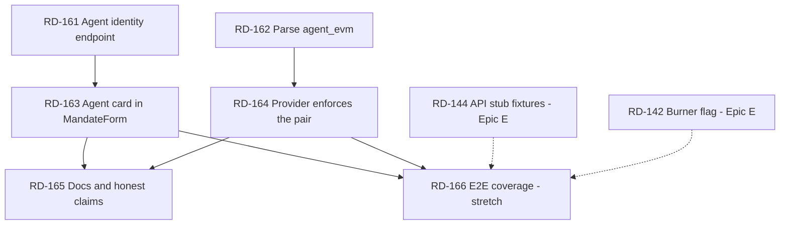

# Epic I — Agent Identity Binding (RD-161 … RD-166)

Parent index: `plan/backlog.md`. Prerequisite reading: `docs/world-agentkit.md`, `docs/provider-api.md`.

## Why This Epic Exists

The mandate carries **two** addresses for one agent — `agent_sui` and `agent_evm` — because the agent has
one identity per chain. Sui enforces the first. World AgentKit verifies the second. The core product
message ("World limits who the agent represents. Sui limits what the agent can do.") lives exactly in
that pair.

Today the pair is **entered by hand and never cross-checked.** Two independent problems:

| # | Problem | Evidence |
|---|---|---|
| 1 | **The renter is asked to author the agent's identity.** `MandateForm` has two free-text inputs: `agentSuiAddress` starts empty so it must be pasted, and `agentEvmAddress` is hardcoded to a demo constant. | `apps/web/src/components/MandateForm.tsx:37-38` |
| 2 | **`agent_evm` is write-only.** Nothing reads it — no Move getter, `submit_application` never touches it, `parseMandate` does not even parse it, and the provider compares the request against the AgentKit header, never against the mandate. | `packages/move/sources/rental.move` (no reader), `packages/sui-client/src/objects.ts:5-19`, `apps/provider-api/src/services/applications.ts:158` |

The two compound. Because nothing reads `agent_evm`, a wrong value has **no observable effect** — the
mandate is created, the agent runs, the demo passes, and the on-chain record of who was authorized is
simply wrong. A field whose mistakes are invisible must never be hand-typed.

The failure modes are asymmetric, which is what makes problem 2 the more serious half:

| Mistake | What happens today | Severity |
|---|---|---|
| Wrong `agent_sui` | Fails closed, loudly. `create_mandate` transfers the `AgentCap` to the typo'd address (`rental.move:171`) and `submit_application` aborts on `sender == mandate.agent_sui` (`rental.move:234`). The renter must revoke and recreate. | Annoying, self-announcing |
| Wrong `agent_evm` | **Nothing.** The mandate works. No abort, no rejection, no log line. | Silent — the one that matters |

There is also a standing honesty gap: `ERROR_CODES.MANDATE_EVM_MISMATCH` reads *"The verified EVM agent
does not match the Sui mandate"* (`packages/shared/src/errors.ts:32`), but the check behind it never
looks at the mandate. This epic makes that message true.

## What This Epic Does Not Do

**On-chain EVM enforcement is out of scope, deliberately.** Recording the rejected options so nobody
re-derives them:

| Option | Why not |
|---|---|
| Verify an EVM signature inside `submit_application` | The Move module would need secp256k1 recovery plus an AgentKit message format, and the agent submits from its **Sui** key — there is no EVM signature in that transaction to check. Wrong layer. |
| Add `mandate_agent_evm()` getter to `rental.move` | Would require a package upgrade (the RD-133 path) for a value TypeScript already reads straight out of the object's JSON fields. Cost is a live deploy; benefit is zero. If a future Move-side consumer needs it, fold the getter into whatever upgrade is already shipping. |
| Have the web app verify AgentBook registration before creating the mandate | AgentBook lookup is server-side in `packages/agentkit` and needs `AGENTKIT_EVM_RPC_URL`. Exposing it to the browser is a new surface for a check the provider already performs at reservation time. |

The enforcement point this epic chooses is **the provider's `reserve` call** (RD-164): it is the only
place that simultaneously holds an AgentKit-verified EVM signer, a Sui client, and the mandate ID. That
is where a mismatched pair becomes a 403 instead of a silent success.

## The Identity Pair — Source Of Truth

| Value | Authoritative source | Read by |
|---|---|---|
| `agentSuiAddress` | The agent process — `AGENT_SUI_ADDRESS`, or derived from `AGENT_SUI_PRIVATE_KEY` (`apps/agent/src/checkEnv.ts:9-29`) | Move (`sender` check), `AgentCap` transfer target, provider `mandateAgentSuiAddress` |
| `agentEvmAddress` | The agent's World registration — `AGENTKIT_DEMO_AGENT_EVM_ADDRESS` in mock mode; recovered from the `agentkit` header signature in live mode (`packages/agentkit/src/server.ts:80-88`) | Provider AgentBook lookup → `humanIdHash` → duplicate-human enforcement |

**The agent service already knows both.** That is the whole basis of RD-161: the values do not need to
be typed, they need to be *fetched*. `GET /health` already publishes `agentSuiAddress`
(`apps/agent/src/server.ts:63-74`) and the web app already polls it (`apps/web/app/agent/page.tsx:297`).

## Rules For Every Ticket In This Epic

| Rule | Requirement |
|---|---|
| Display, do not hide | The renter is signing a delegation of spending authority. Never remove the addresses from the UI — remove only the *authoring* of them. A renter who cannot see who they are authorizing is worse off than one who types it. |
| Self-assertion is not verification | The agent's `/health` asserts its own addresses. That is fine for prefilling a form and **not** fine as a security claim. Never label a fetched pair "verified" anywhere in the UI. Verification is RD-164's job, and it happens at the provider. |
| Fail loudly | Every check this epic adds must produce a specific error code and a user-visible message. Silently coercing, lowercasing away, or defaulting a mismatched address defeats the entire point of the epic. |
| Object IDs and addresses | `scripts/check-object-ids.mjs` scans `apps/**/*.ts` excluding `*.test.ts`. No address literal in app code — import from `@rentdelegate/contracts-config`. Run `pnpm lint:object-ids` before claiming a ticket done. |
| Sponsor integrity | Do not describe the binding as enforced until RD-164 lands. Until then the README and docs must say the mandate *records* the EVM identity. |
| Demo safety | The demo path (`docs/demo-script.md`) must keep working at every commit. RD-163 changes a form the demo drives; RD-164 adds a rejection that must not fire on the happy path. Both tickets carry a demo-regression check in their acceptance criteria. |

## Ticket Index

| ID | Title | Lane | Deps |
|---|---|---|---|
| RD-161 | Agent identity endpoint — publish the pair from the agent service | L8 Agent | none |
| RD-162 | Parse `agent_evm` in `parseMandate` and `RentalMandate` | L2 Sui TS | none |
| RD-163 | Replace the two address inputs with a fetched agent card | L7 Frontend | RD-161 |
| RD-164 | Provider enforces the mandate's on-chain identity pair at reserve | L3 Provider | RD-162 |
| RD-165 | Docs and honest-claim update for the identity binding | L9 Demo/docs | RD-163, RD-164 |
| RD-166 | E2E coverage — agent card and mismatch denial (stretch) | L10 QA/E2E | RD-163, RD-164, RD-144 |

RD-161 and RD-162 are leaf work in different packages with no shared files — **the natural first wave,
two agents in parallel.**

---

### RD-161 Agent Identity Endpoint

| Field | Value |
|---|---|
| Priority | P1-identity |
| Status | DONE |
| Lane | L8 Agent |
| Objective | Make the agent service the source of truth for its own identity pair, so no human has to transcribe either address. |
| Suggested implementation | In `apps/agent/src/server.ts`, add `agentEvmAddress` to the existing `GET /health` payload — the value is already read as `process.env.AGENTKIT_DEMO_AGENT_EVM_ADDRESS` in `readDemoAgentKitHeaders()` (line 38), and in live mode it comes from `AGENTKIT_HEADER`'s signer. Return `null` when unknown rather than an empty string, so a consumer can distinguish "not configured" from "configured as blank". Then add `GET /identity` returning `{ agentSuiAddress, agentEvmAddress, agentkitMode, packageId }` — a dedicated endpoint so the mandate form is not coupled to the shape of a liveness probe, and so a future agent registry can serve the same shape. `packageId` comes from `@rentdelegate/contracts-config`; it lets the form warn when the agent targets a different package than the browser. CORS is already open (`app.use("*", cors(...))`, line 61). Do not add authentication — this endpoint publishes only public addresses. Keep `/health`'s existing keys untouched: `apps/web/app/agent/page.tsx:323-326` reads `agentSuiAddress` and `agentkitMode`, and RD-144's stubs mirror the shape. |
| Files/modules | `apps/agent/src/server.ts`, `apps/agent/src/types.ts` (response type), `README.md` env table only if a new var is introduced (none expected). |
| Dependencies | None. |
| Blocks | RD-163. |
| Acceptance criteria | `GET /health` returns its current keys **plus** `agentEvmAddress`. `GET /identity` returns all four fields. With `AGENTKIT_DEMO_AGENT_EVM_ADDRESS` unset, `agentEvmAddress` is `null` and neither endpoint throws. `pnpm --filter @rentdelegate/agent test` and `build` pass. The `/agent` page still renders "Agent online" unchanged. |
| Tests | Unit tests for both handlers: configured pair, unset EVM address, and mock-vs-live `agentkitMode`. |
| Verification | Paste both `curl` responses (mock mode), and a screenshot or text confirmation that `/agent` still shows "Agent online". |
| Failure fallback | If live mode cannot expose the EVM address without parsing `AGENTKIT_HEADER`, return `null` in live mode and record the limitation in the ticket — RD-163 must handle `null` regardless. |
| Sponsor | World (agent identity surface). |
| Demo impact | None directly; unblocks RD-163. |
| Parallel safety | Owns `apps/agent/src/server.ts`. Coordinate if any Epic C agent work is live. |

---

### RD-162 Parse `agent_evm` In The Sui Client

| Field | Value |
|---|---|
| Priority | P1-identity |
| Status | DONE |
| Lane | L2 Sui TS |
| Objective | Make the mandate's on-chain EVM address readable off-chain — the prerequisite for enforcing it. |
| Suggested implementation | `packages/sui-client/src/objects.ts:5-19` — `parseMandate` currently skips `agent_evm`. Add `agentEvm` to the returned object and to the `RentalMandate` type in `types.ts`. The on-chain field is `vector<u8>` (`rental.move:42`), so the JSON arrives as a number array; normalize to a **lowercase `0x`-prefixed hex string** so every consumer compares like with like — that normalization belongs here and nowhere else. Handle the degenerate cases explicitly: empty vector → `null` (test mandates use `vector[]`, see `create_test_mandate` at `rental.move:439`), and a byte length other than 20 → keep the hex but do not pad or truncate, so RD-164 can reject it as malformed rather than silently comparing a wrong-length value. Reuse the existing `numberArrayOf` helper. |
| Files/modules | `packages/sui-client/src/objects.ts`, `packages/sui-client/src/types.ts`. |
| Dependencies | None. |
| Blocks | RD-164, RD-163 (only if the form displays the on-chain value; not required for the fetch path). |
| Acceptance criteria | `parseMandate` returns `agentEvm` as lowercase hex, `null` for an empty vector, and unpadded for a wrong-length vector. Existing `parseMandate` callers still compile. `pnpm --filter @rentdelegate/sui-client test` and the full `pnpm -r --if-present build` pass. |
| Tests | Table-driven unit tests in the existing sui-client suite: 20-byte vector → hex; empty → `null`; 19-byte → unpadded hex, not an error. |
| Verification | Vitest output, plus `parseMandate` run against the live smoke mandate ID from `@rentdelegate/contracts-config` showing the real stored value. |
| Failure fallback | None expected — this is a pure parsing addition. |
| Sponsor | Sui (on-chain read fidelity). |
| Demo impact | None directly. |
| Parallel safety | Leaf package, no overlap with any active epic. |

---

### RD-163 Agent Card Replaces The Address Inputs

| Field | Value |
|---|---|
| Priority | P1-identity |
| Status | DONE |
| Lane | L7 Frontend |
| Objective | Stop asking the renter to author the agent's identity, without hiding who they are authorizing. |
| Suggested implementation | In `apps/web/src/components/MandateForm.tsx`, delete the two `<input>`s at lines 112-131 and the hardcoded demo EVM constant at line 38. Fetch `GET ${NEXT_PUBLIC_AGENT_API_URL}/identity` on mount — the env var already exists and `apps/web/app/agent/page.tsx:11` shows the read pattern; extract that constant rather than duplicating the `??` default. Render an **agent card**: both addresses truncated (`0x4541d0…a91c`) with the full value available on hover/expand, plus the `agentkitMode` badge reusing the `/agent` page's `mock`/`live` wording. Treat the pair as atomic — one fetch, one displayed unit, never independently editable. Three states to handle explicitly: (a) **loaded** — card renders, submit enabled; (b) **agent unreachable** — reuse the existing "Agent offline:" phrasing and disable submit, since creating a mandate for an agent you cannot reach is the mistake this ticket exists to prevent; (c) **`agentEvmAddress: null`** — show "not registered with World" and disable submit, because a mandate with an empty `agent_evm` is exactly the silent-failure case from this epic's premise. Keep an **advanced override** behind a collapsed disclosure for dev and future multi-agent use: opening it restores both inputs, and it must be visibly labeled as unverified. Warn (do not block) if the identity's `packageId` differs from `PACKAGE_ID`. Two cleanups while in this file: validate through `parsed.data` rather than re-reading `fields` after `safeParse` (line 64 vs 70-76), and keep the `Buffer.from(addr.slice(2),"hex")` conversion **after** schema validation so a malformed address cannot be silently truncated into a short byte vector. |
| Files/modules | `apps/web/src/components/MandateForm.tsx`, a new `apps/web/src/lib/agentApi.ts` (shared `AGENT_API` constant + `fetchAgentIdentity`), `apps/web/app/agent/page.tsx` (import the shared constant only), `apps/web/src/components/MandateForm.test.ts`. |
| Dependencies | RD-161. |
| Blocks | RD-165, RD-166. |
| Acceptance criteria | The form has no free-text address input in its default state. A renter with the agent server running can create a mandate without typing an address, and the resulting on-chain `agent_sui` equals the agent's own `AGENT_SUI_ADDRESS`. Both addresses remain visible before signing. Agent-down and null-EVM states disable submit with a specific reason. The advanced override still creates a mandate and is labeled unverified. `pnpm --filter @rentdelegate/web test`, `typecheck`, and `build` pass. |
| Tests | Extend the existing `MandateForm.test.ts`: identity loaded → payload uses fetched values; agent unreachable → submit disabled; `agentEvmAddress: null` → submit disabled; override path → payload uses typed values. |
| Verification | Browser run (`docs/browser-testing.md` first): create a mandate on testnet with no address typed, and paste the mandate ID, `OwnerCap`, `AgentCap`, and tx digest with testnet SuiVision links. Confirm the created mandate's `agent_sui` matches the agent's configured address. **This spends gas — it is under the repo's live-spend gate; get the user's go-ahead first.** |
| Failure fallback | If the agent service cannot be reached in the demo environment, ship the card with the override open by default and record that the demo runs on the override path — do **not** reinstate the hardcoded EVM constant. |
| Sponsor | World + Sui (the identity pair the message rests on). |
| Demo impact | High — Step 4 of `docs/demo-script.md` runs through this form. Re-run that step before claiming done. |
| Parallel safety | Owns `MandateForm.tsx`. Touches `app/agent/page.tsx` by one import line — announce it if RD-166 or any Epic E ticket is live. |

---

### RD-164 Provider Enforces The On-Chain Identity Pair

| Field | Value |
|---|---|
| Priority | P1-identity |
| Status | DONE |
| Lane | L3 Provider API |
| Objective | Make a wrong `agent_evm` fail loudly at reservation time, so the mandate's recorded identity is a constraint rather than a decoration. |
| Suggested implementation | In `apps/provider-api/src/services/applications.ts`, `reserve()` currently compares the request body against the AgentKit header (line 158) and never reads the chain. Add a mandate fetch and compare the **AgentKit-verified signer** against the **on-chain** `agentEvm` from RD-162, plus `agentSui` against the request's `agentSuiAddress`. Widen the injected client from `Pick<RentDelegateClient, "getReceipt">` to include `"getMandate"` — `apps/provider-api/src/app.ts:84-85` already constructs a full `createRentDelegateClient`, so this is a type widening, not new wiring. Reuse the existing codes: `MANDATE_EVM_MISMATCH` (403) and `MANDATE_SUI_MISMATCH` (403) — both already exist in `packages/shared/src/errors.ts:4-5` with accurate messages that this ticket finally makes true. Compare lowercase hex on both sides. Decide and document the three edge cases in the ticket: mandate **not found** on chain → `SUI_MANDATE_REJECTED`; `agentEvm` **null/empty** (legacy mandates created before RD-163) → reject with `MANDATE_EVM_MISMATCH` and a message naming the empty field, since accepting it reopens the silent hole; mandate **revoked or expired** → reject here rather than letting the agent discover it at `submit_application`. Cache the mandate read per request only — never across requests, or revocation would not take effect. In-memory (non-DB) mode must enforce identically; if no Sui client is injected in a test/mock configuration, **skip the check and log a warning naming it as unenforced** rather than silently passing. |
| Files/modules | `apps/provider-api/src/services/applications.ts`, `apps/provider-api/src/services/suiVerifier.ts` (type widening only if the client type is shared), `apps/provider-api/src/app.ts` (injection), `apps/provider-api/src/services/applications.test.ts`, `docs/provider-api.md` (error-code table). |
| Dependencies | RD-162. |
| Blocks | RD-165, RD-166. |
| Acceptance criteria | A reserve call whose mandate's on-chain `agent_evm` differs from the AgentKit-verified signer returns 403 `MANDATE_EVM_MISMATCH`. The same for `agent_sui` → `MANDATE_SUI_MISMATCH`. The existing happy path — the demo's real mandate and real agent — still returns 201. A legacy mandate with empty `agent_evm` is rejected with a message that names the field. Mock-mode without a Sui client logs the unenforced warning. `pnpm --filter @rentdelegate/provider-api test` passes and the full `pnpm -r --if-present test` is green. |
| Tests | Unit tests with a stubbed `getMandate`: match → 201; EVM mismatch → 403; Sui mismatch → 403; mandate not found → `SUI_MANDATE_REJECTED`; empty `agent_evm` → 403; revoked mandate → rejected; no-client mode → warning path. Idempotent replay of an already-reserved application must not re-fetch or re-reject. |
| Verification | Vitest output naming each case, **plus** a live demonstration against testnet: reserve once with the real mandate (201), then once with a mandate whose `agent_evm` does not match the header (403), pasting both responses. This is the evidence that the epic's central claim is now enforced. |
| Failure fallback | If the extra chain read makes reservation latency unacceptable for the demo, keep the check and make the **read** resilient (retry once, then fail closed with a specific code) — do not make the check optional. A check that can be disabled by a slow RPC is the status quo with extra steps. |
| Sponsor | Sui + World (this is the cross-chain binding itself). |
| Demo impact | High and two-sided — it guards the demo path and can break it. Re-run `docs/demo-script.md` Steps 5-8 end to end before claiming done. |
| Parallel safety | `applications.ts` is a **contended file** (see `plan/backlog.md` → Contended Files). One owner at a time; confirm no Epic C or Epic W ticket holds it. |

---

### RD-165 Docs And Honest-Claim Update

| Field | Value |
|---|---|
| Priority | P2-identity |
| Status | DONE |
| Lane | L9 Demo/docs |
| Objective | State exactly what the identity binding is, where each half is enforced, and what remains unenforced — so the claim survives a judge's follow-up question. |
| Suggested implementation | Add an *Agent Identity Binding* section to `docs/world-agentkit.md`: the two-address table from this epic's *Source Of Truth* section, which layer enforces which half (Move enforces `agent_sui` via `sender`; the provider enforces `agent_evm` via AgentBook + RD-164; **nothing enforces `agent_evm` on-chain, by design** — link the *What This Epic Does Not Do* table). Update the error-code table in `docs/provider-api.md` with the two 403s and their new meaning. Update `README.md`'s sponsor rows only where RD-164 changed what is true. Add one line to `docs/demo-script.md` Step 4 noting the renter no longer types the agent's addresses — that is a visible on-stage difference. If Epic E is live, coordinate the `AGENTS.md` edit with RD-152 rather than both writing it. |
| Files/modules | `docs/world-agentkit.md`, `docs/provider-api.md`, `docs/demo-script.md`, `README.md`. |
| Dependencies | RD-163, RD-164. |
| Blocks | None. |
| Acceptance criteria | Every claim in the new section maps to a file and line that a reader can check. No sentence says "verified" about a value the code only records. The demo script matches what the form actually does. |
| Tests | None (docs). |
| Verification | Paste the new `docs/world-agentkit.md` section and the diff summary for the other three files. |
| Failure fallback | If RD-164 lands as `BLOCKED`, still ship the docs — describing `agent_evm` as *recorded, not enforced*, with the reason. An accurate limitation is publishable; an overclaim is not. |
| Sponsor | World. |
| Demo impact | Medium — this is the answer to "how do you know the agent is the one the renter authorized?" |
| Parallel safety | Owns the docs files; no overlap with the code tickets. |

---

### RD-166 E2E Coverage — Agent Card And Mismatch Denial (stretch)

| Field | Value |
|---|---|
| Priority | P3-identity stretch |
| Status | TODO |
| Lane | L10 QA/E2E |
| Objective | Regression-guard the two behaviors this epic introduces, at the tier each one can actually be tested in. |
| Suggested implementation | Follow `plan/backlog-e2e.md`'s tier model — do not re-derive it. **T1 (`stubbed`)**: extend RD-144's `agentApi.ts` fixture with `GET /identity` and add `specs/mandate-identity.spec.ts` asserting the card renders both truncated addresses, that no free-text address input exists by default, that an agent-offline stub disables submit with the reason, and that `agentEvmAddress: null` does the same. Requires the RD-142 burner flag, since `MandateForm` renders only for a connected account. **Not a chain write — no wallet, no gas.** The mismatch denial belongs in the provider's own vitest suite (RD-164 already covers it) or in RD-149's drift guard, **not** in Playwright: driving a real mismatch through the browser would need a second mandate created on testnet purely to be rejected. Add the `/identity` shape to RD-149's drift guard so the stub cannot rot away from the real agent response. |
| Files/modules | `apps/e2e/specs/mandate-identity.spec.ts`, `apps/e2e/src/fixtures/agentApi.ts`, `apps/e2e/src/fixtures/data.drift.test.ts`. |
| Dependencies | RD-163, RD-164, RD-144 (RD-142 for the burner flag). |
| Blocks | None. |
| Acceptance criteria | The spec passes in the `stubbed` project three consecutive runs with no flake and no `waitForTimeout`. `pnpm lint:object-ids` clean. `pnpm -r --if-present test` still launches no browsers. |
| Tests | This ticket is tests. |
| Verification | `pnpm --filter @rentdelegate/e2e e2e:stubbed --repeat-each=3` summary. |
| Failure fallback | If Epic E's scaffold (RD-141/RD-144) has not landed, close this ticket as `DEFERRED` with that reason — the unit tests in RD-163 and RD-164 already carry the proof; this ticket only adds regression insurance. |
| Sponsor | None (test infrastructure). |
| Demo impact | None; protects RD-163 and RD-164. |
| Parallel safety | Own spec file; touches one shared fixture — land after RD-144. |

---

## Dependency Graph

## Parallel Execution Plan

Two agents, two waves. The epic is small and its two halves are genuinely independent until they meet
at the docs.

| Wave | Agents | Tickets | Notes |
|---|---|---|---|
| 1 | 2 | **A** RD-161 · **B** RD-162 | Different packages (`apps/agent`, `packages/sui-client`), zero shared files. The cleanest split in the epic. |
| 2 | 2 | **A** RD-163 · **B** RD-164 | Frontend and provider. `applications.ts` is contended — B must confirm no Epic C/W ticket holds it before starting. A's browser verification is live-spend gated. |
| 3 | 1 | RD-165 | Needs both halves settled before any claim is written. |
| 4 | 1 | RD-166 | Only once Epic E's scaffold exists; otherwise `DEFERRED`. |

### Contended Files

| File | Wanted by | Rule |
|---|---|---|
| `apps/provider-api/src/services/applications.ts` | RD-164, plus Epic C RD-110/117 and Epic W RD-126 | One owner at a time. Epic C is DONE, so RD-164 should have a clear run — confirm before starting. |
| `apps/web/src/components/MandateForm.tsx` | RD-163 only | Sole owner within this epic. |
| `apps/web/app/agent/page.tsx` | RD-163 (one import line), Epic E RD-142 | Announce; the edit is a single shared-constant import. |
| `apps/agent/src/server.ts` | RD-161 | Sole owner within this epic. |

## Definition Of Done

1. A renter creates a mandate without typing either address, and can still see both before signing.
2. The mandate's on-chain `agent_sui` provably equals the agent service's own configured address — verified by reading the created object back from testnet, not by inspection of the form.
3. A reserve call whose AgentKit-verified EVM signer does not match the mandate's on-chain `agent_evm` is rejected with 403 `MANDATE_EVM_MISMATCH`, demonstrated live against testnet.
4. `agent_evm` is read by at least one code path that can reject. It is no longer a write-only field.
5. `docs/world-agentkit.md` states which layer enforces which half of the pair, and says plainly that on-chain EVM enforcement is out of scope, with the reason.
6. The full demo path in `docs/demo-script.md` runs end to end unchanged apart from Step 4's simplified form.
7. `pnpm -r --if-present test` and `build` are green; `pnpm lint:object-ids` is clean.
