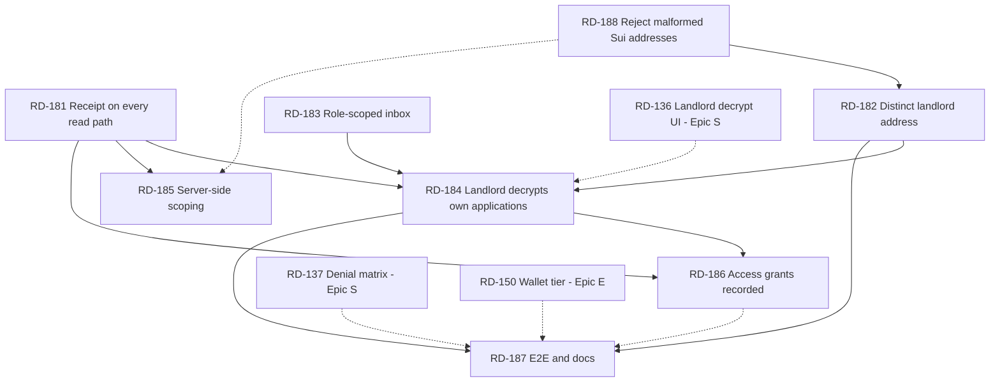

# Epic L — The Landlord Is A Real Party (RD-181 … RD-188)

Parent index: `plan/backlog.md`. Prerequisite reading: `docs/seal.md`, `docs/provider-api.md`.
Builds directly on Epic S (RD-131 … RD-138), which shipped the policy. This epic makes the app use it.

## Why This Epic Exists

The landlord is **load-bearing on chain and decorative in the app.**

On chain the role is the whole privacy claim. `RentalListing.landlord` is set at creation
(`packages/move/sources/rental.move:176`), copied into `ApplicationReceipt.landlord` at submit
(`rental.move:248`), and is the *sole identity gate* on document decryption — check 1 of
`seal_approve_packet` is `assert!(tx_context::sender(ctx) == receipt.landlord, ESEAL_WRONG_SENDER)`
(`rental.move:353`). The provider's verifier independently cross-checks
`receipt.landlord == application.landlordSuiAddress` (`apps/provider-api/src/services/suiVerifier.ts:104`).
Six Move tests prove the denial paths.

In the running application, none of that is exercised. Verified against the code before writing these
tickets:

| # | Gap | Evidence |
|---|---|---|
| 1 | **The decrypt UI is not wired to the landlord's own applications.** `PacketViewer` is rendered exactly twice, both inside the collapsed *Demo evidence* `
` for two hardcoded receipts. The wallet-connected "Your Applications" inbox never renders it. | `apps/web/app/landlord/page.tsx:130,149` vs `:99` |
| 2 | **The only action in the landlord inbox is a provider action.** `/landlord` reuses `ApplicationInbox` verbatim; its sole control is *Verify Sui receipt* → `POST /applications/:id/verify`, which flips status to `accepted`. Same component as `/provider`, no role differentiation. | `apps/web/src/components/ApplicationInbox.tsx:35-58,84-116` |
| 3 | **The receipt ID never reaches the landlord on the Postgres path.** Neither `dbGetApplication` nor `listAll`'s DB branch joins `sui_receipts`, so `receipt` is `undefined` for every accepted application. It is populated only in memory mode, by `verify` writing into a `Map`. | `apps/provider-api/src/services/applications.ts:110-130`, `:405-430` vs `:485` |
| 4 | **Scoping is cosmetic.** `GET /applications` is unauthenticated and returns everything; the page fetches all and filters client-side by connected address. | `apps/provider-api/src/routes/applications.ts:23`, `apps/web/app/landlord/page.tsx:69-71` |
| 5 | **Landlord and provider are the same address everywhere.** `landlordSuiAddress: PUBLISHER_ADDRESS` in demo listings, seeds, and E2E fixtures. `landlord.spec.ts` even comments that the agent and provider are the same address on these objects. | `services/listings.ts:27,39`, `db/seeds.ts:14,25`, `apps/e2e/src/fixtures/data.ts:88,101,123` |
| 6 | **Access-grant logging is built but dead.** `document_access_grants`, `createAccessGrant`, and both routes exist. Nothing in `apps/web` or `apps/agent` calls them — RD-136 asked for this and it was never wired. | `drizzle/0001_initial.sql:57`, `routes/applications.ts:76,99`, zero callers |
| 7 | **No test covers the real landlord path.** The live tier asserts the wallet-gated *empty* state, that two demo receipts render, and that the Seal button is **absent** (tier pinned to mock encryption). | `apps/e2e/specs/live/landlord.spec.ts:21-27,66-89` |

Gap 5 is what makes the rest unfalsifiable: when provider, landlord, and agent are one address, every
wallet that can act as one can act as all three, so `ESEAL_WRONG_SENDER` can never fire on the demo
path. The strongest guarantee in the system is currently untested by construction.

## What This Epic Does Not Do

| Option | Why not |
|---|---|
| Add authentication to the provider API | The provider has no session concept and adding one touches every route, the agent client, and all three E2E tiers. RD-185 adds *scoping* (a server-side filter) and says plainly in the docs that it is not *authorization*. A hackathon demo does not need auth; it does need to stop implying it has it. |
| Move landlord accept/reject on chain | `ApplicationReceipt.status` has exactly two states (`STATUS_SUBMITTED`, `STATUS_WITHDRAWN`) and adding a third means a package upgrade for a field no policy reads. Acceptance stays a provider-side record. |
| A separate landlord notification channel | Out of scope; the inbox polls on a 15s interval and that is sufficient for a demo. |
| Landlord-authored listings | The provider creates listings and names the landlord. Changing that inverts the data model for no demo gain. |

## Rules For Every Ticket In This Epic

| Rule | Requirement |
|---|---|
| Provider ≠ landlord | Once RD-182 lands, no new fixture, seed, or doc may reuse one address for both roles. A test that passes only because the addresses are equal is not a test. |
| Keys never leave the machine | The landlord wallet is created by an agent under a standing grant. Private keys, keystore files, and recovery phrases are never written to a file, a ticket, a log, or a commit. Addresses only. |
| Scoping is not authorization | Never label a filtered list "private", "authorized", or "access controlled" in UI or docs. The only real gate in this system is `seal_approve_packet`, and it lives in Move. |
| Plaintext stays in memory | Inherited from RD-136 and non-negotiable. A decrypted packet is never logged, persisted, or sent to the provider — including to the access-grant endpoint, which records *that* a decrypt happened, never *what* was read. |
| Mock labeling | `NEXT_PUBLIC_ENCRYPTION_MODE=mock` must keep showing the `seal-mode-alert` fallback banner and must not offer a Seal button it cannot complete. Every ticket that touches the packet panel re-checks this. |
| Object IDs and addresses | No address literal in app code — import from `@casium/contracts-config`. Run `pnpm lint:object-ids` before claiming a ticket done. |
| Demo safety | `docs/demo-script.md` must run end to end at every commit. RD-182 changes addresses the script names; RD-183 removes a button Step 8 clicks. Both carry a demo-regression check. |

## Wallet Provisioning — The Landlord Address Is The Agent's To Create

**Standing authorization, granted by the user on 2026-07-26.** The index's *Host Setup Boundary* makes
wallet creation a user action. For this one address the user has delegated it: **whoever takes RD-182
creates and funds the landlord Sui address themselves.** Do not wait for it to be handed over, and do
not ask again.

Scope of the grant, deliberately narrow:

| Permitted | Not permitted |
|---|---|
| `sui client new-address ed25519 landlord` on the demo machine | Touching, rotating, or re-funding any other wallet — publisher, renter, or agent |
| `sui client faucet` for that address on **testnet** | Any mainnet operation |
| Exporting the resulting **address** into `packages/contracts-config` | Committing a private key, keystore file, or recovery phrase — ever, in any form |

The address must be a Sui address (`0x` + 64 hex), distinct from `PUBLISHER_ADDRESS`, with its key in
the demo machine's `sui.keystore`. The landlord signs a Seal `SessionKey` in the browser, so an address
without its key can seed a listing but cannot decrypt anything. If `sui client new-address` prints a
recovery phrase, it stays in the terminal — it is never pasted into a file, a ticket, or a commit.

**Why it must be a Sui address.** The landlord is a Sui-only party:

| Consumer | Field | Type |
|---|---|---|
| `seal_approve_packet` check 1 (`rental.move:353`) | `receipt.landlord`, compared against `tx_context::sender(ctx)` | Sui address, 32 bytes |
| `submit_application` (`rental.move:248`) | copies `listing.landlord` onto the receipt | Sui address |
| Provider verifier (`suiVerifier.ts:104`) | `receipt.landlord == application.landlordSuiAddress` | Sui address |
| Seal `SessionKey` signature (RD-136) | signed by the connected Sui wallet | Sui keypair |

There is no landlord EVM field anywhere in the schema, on chain, or in the database, and none should be
added. EVM addresses in this project belong to **the agent only**, because World AgentKit verifies the
agent's human backing (`agentEvmAddress`, `packages/shared/src/schemas.ts:10,36`). Nothing in the
landlord path touches World, MetaMask, or World Chain.

**The confusion is silent today, which is why RD-188 exists.** `suiAddressSchema` is
`/^0x[a-fA-F0-9]+$/` with **no length constraint** (`packages/shared/src/schemas.ts:4`), so a 40-hex
EVM address passes listing validation, is stored, is copied onto the on-chain receipt, and fails only
much later — when the landlord's real Sui wallet does not match `receipt.landlord` and Seal refuses
with `ESEAL_WRONG_SENDER` (17). That abort names the sender check, not the malformed address, so the
demo would look like a policy denial when it is a typo.

---

### RD-181 Provider Returns The Receipt On Every Read Path

| Field | Value |
|---|---|
| Priority | P1-landlord |
| Status | DONE — landed ahead of this ticket in `d16868f`; confirmed 2026-07-26. Both DB read paths join `sui_receipts` and map through `toReceiptSummary` (`applications.ts:137,439`); the memory path attaches the same narrow shape at verify (`:497`). `ReservedApplication` in `ApplicationInbox.tsx` declares all six fields. Verified against a running Postgres provider: `GET /applications` returns `receipt.receiptId` for `app_118bed30ad5f` and `app_108c8f608f3f`. **Not verified:** the memory path is code-inspected only, and no test yet asserts the receipt survives a re-read on the DB path — the *Tests* row below is still open. |
| Lane | L3 Provider API |
| Objective | Make an accepted application carry its receipt when read back, so the landlord has something to decrypt against. |
| Suggested implementation | `verify` writes to `sui_receipts` (`applications.ts:493`) and returns `receipt: verified.value` in its own response, but every later read drops it: `dbGetApplication` (`:110-130`) and the DB branch of `listAll` (`:405-430`) never join `suiReceiptsTable`. Add the join in both, keyed by application, and map the row back into the `receipt` field. Decide and document what the wire shape is: the memory path currently returns the full `VerifiedReceipt` (including `rawObject` and `blobVerification`), the DB row stores less. Pick the **narrow** shape — `{ receiptId, txDigest, mandateId, listingObjectId, submittedAtMs, accessExpiresAtMs }` — make both paths return exactly it, and stop returning `rawObject` over the wire (the browser re-reads the receipt from chain in RD-184; a provider-supplied copy of on-chain state is a second source of truth waiting to drift). Update `ReservedApplication` in `apps/web/src/components/ApplicationInbox.tsx:22`, which currently under-declares the field as `{ receiptId, txDigest }`, and in `apps/e2e/src/live/providerApi.ts`. |
| Files/modules | `apps/provider-api/src/services/applications.ts`, `apps/provider-api/src/routes/applications.test.ts`, `apps/web/src/components/ApplicationInbox.tsx`, `apps/e2e/src/live/providerApi.ts`. |
| Dependencies | None. Epic C RD-109/RD-110 are DONE — confirm no other ticket holds `applications.ts` before starting. |
| Blocks | RD-184, RD-186. |
| Acceptance criteria | With Postgres configured, an application verified in one process and read by `GET /applications` in another returns a `receipt` with a non-empty `receiptId`. Memory and DB paths return byte-identical JSON for the same application. The "✅ Receipt" line in `ApplicationInbox` renders in both modes. |
| Tests | Extend `routes/applications.test.ts`: verify then re-`GET` both the collection and the single application, asserting the receipt survives. One test must run against the DB path, not only the `Map`. |
| Verification | Test output plus a `curl` of `GET /applications` against a running Postgres-backed provider, showing the receipt field. |
| Failure fallback | None — RD-184 cannot start without this. |
| Sponsor | Sui. |
| Demo impact | Invisible until RD-184, then load-bearing. |
| Parallel safety | Owns `apps/provider-api/src/services/applications.ts`. Conflicts with RD-185, which touches the same file — same owner should take both, RD-181 first. |

---

### RD-182 Give The Landlord Its Own Address

| Field | Value |
|---|---|
| Priority | P1-landlord |
| Status | TODO |
| Lane | L0 Project setup + L3 Provider API |
| Objective | Make provider and landlord two different parties in demo data, so the Seal sender check can actually fail for the wrong wallet. |
| Suggested implementation | Every demo listing sets `landlordSuiAddress: PUBLISHER_ADDRESS`, which is also `providerSuiAddress` (`services/listings.ts:27,39`, `db/seeds.ts:14,25`, `apps/e2e/src/fixtures/data.ts:88,101,123`, `apps/e2e/src/live/providerApi.ts:116`). Create the landlord Sui wallet yourself under the standing authorization above, add its address as a `LANDLORD_ADDRESS` export in `packages/contracts-config`, and use it for the landlord on at least one demo listing. Record the address in `packages/contracts-config/testnet.json` alongside the other canonical IDs — the address only, never the key. Keep one listing with provider == landlord if a same-wallet rehearsal is wanted, but label it in the seed comment as the degenerate case. Note the ordering constraint: `ApplicationReceipt.landlord` is copied from the listing at submit time, so **existing testnet receipts keep the old landlord forever**. Either create a new listing and a new receipt for the demo, or accept that the archived smoke/live receipts are decryptable only by the publisher wallet and say so in `docs/seal.md`. This ticket does not rewrite history; it makes new objects honest. |
| Files/modules | `packages/contracts-config/src/index.ts`, `packages/contracts-config/testnet.json`, `apps/provider-api/src/services/listings.ts`, `apps/provider-api/src/db/seeds.ts`, `apps/e2e/src/fixtures/data.ts`, `apps/e2e/src/live/providerApi.ts`, `docs/demo-script.md`. |
| Dependencies | RD-188, so the new address cannot be seeded through the unbounded schema. No user hand-off: this ticket's owner creates and funds the landlord Sui wallet under the standing authorization in *Wallet Provisioning* above. |
| Blocks | RD-184 (its denial case), RD-187. |
| Acceptance criteria | At least one demo listing has `landlordSuiAddress != providerSuiAddress`. A receipt submitted against it names the landlord wallet. `docs/demo-script.md` names which wallet each tab connects. No test asserts equality of the two addresses. |
| Tests | Update `listings.test.ts` and the E2E fixtures. Add an assertion that the demo listing's provider and landlord differ — the regression guard against silently collapsing them again. |
| Verification | SuiVision link to the new listing object showing distinct provider and landlord fields. |
| Failure fallback | Wallet creation is local and cannot fail; the faucet can. If it is rate-limited or down, seed the listing with the new address anyway — a listing needs no gas — and defer only the parts that require the landlord to send a transaction, noting which. If the address itself cannot be created, keep one address but add a **failing, skipped** test named for the missing wallet, and state in `docs/seal.md` that the sender check is proven only by Move tests. Never quietly proceed as if the roles were distinct. |
| Sponsor | Sui/Seal. |
| Demo impact | High — this is what makes the denial demo real rather than a Move unit test. |
| Parallel safety | Touches `packages/contracts-config/testnet.json`, which is append-only and shared. Announce before writing. |

---

### RD-183 Role-Scoped Application Inbox

| Field | Value |
|---|---|
| Priority | P1-landlord |
| Status | TODO |
| Lane | L7 Frontend |
| Objective | Stop showing the landlord a provider's controls, so each dashboard states one role's job. |
| Suggested implementation | `ApplicationInbox` is rendered identically on `/provider` and `/landlord`, and its only interactive control is the *Verify Sui receipt* form that calls `POST /applications/:id/verify` (`ApplicationInbox.tsx:35-58,84-116`). Receipt verification is the provider's job — it is what moves an application to `accepted`. Add a required `role: "provider" \| "landlord"` prop and render the verify block only for `provider`. For `landlord`, render the receipt link, the status badge, and (after RD-184) the packet panel. Do not fork the component into two files: the shared parts are most of it, and two copies will drift. Keep every existing `data-testid` stable for the `provider` role so the E2E specs do not churn; add landlord-specific test IDs rather than renaming. |
| Files/modules | `apps/web/src/components/ApplicationInbox.tsx`, `apps/web/app/provider/page.tsx`, `apps/web/app/landlord/page.tsx`. |
| Dependencies | None. |
| Blocks | RD-184. |
| Acceptance criteria | `/landlord` shows no verify inputs and no verify button. `/provider` is unchanged pixel-for-pixel. The `role` prop is required, so a future third caller cannot default into the wrong surface. |
| Tests | Component-level or stubbed-tier E2E: assert `verify-receipt-summary` is present on `/provider` and absent on `/landlord`. |
| Verification | Stubbed-tier E2E run; both dashboards screenshotted. |
| Failure fallback | None. |
| Sponsor | None directly — narrative clarity. |
| Demo impact | Medium. Step 8 of `docs/demo-script.md` clicks verify on `/provider`; Step 9 must stop implying the landlord does it too. |
| Parallel safety | Owns `ApplicationInbox.tsx`. Contended with RD-184, which adds the packet panel to the same component — same owner should take both, RD-183 first. |

---

### RD-184 The Landlord Decrypts Their Own Applications

| Field | Value |
|---|---|
| Priority | P1-landlord |
| Status | DONE — 2026-07-26. `ApplicationPacketAccess` reads the receipt from chain and mounts `PacketViewer` per inbox row via a `renderPacketAccess` render prop on `ApplicationInbox`, so `/provider` keeps the decrypt path out of its bundle and stays unchanged. Browser-verified both ways: authorized landlord decrypted `app_108c8f608f3f` (live Walrus blob `ZjKENP5v…`), and the same wallet was refused on the smoke receipt with `ESEAL_WRONG_SENDER` (17) named in the UI. Evidence in `docs/seal.md` → *Live Browser Evidence*. **Deviation from the plan:** `PacketViewer` was not left read-only — key servers return a generic no-access error and never expose the abort code, so naming the denial required a local diagnosis from on-chain receipt fields (codes 17/19/20 only; 18/21/22 are indistinguishable client-side and show the raw message). **Not done:** the stubbed-tier test in the *Tests* row below; the denial was proven with a wrong *receipt* rather than a second wallet, since only one wallet exists in the demo profile. |
| Lane | L7 Frontend + L6 Seal |
| Objective | Wire the decrypt UI to real applications. This is the ticket the epic exists for. |
| Suggested implementation | `PacketViewer` today is mounted only against `SMOKE.receiptId` and `LIVE_AGENT_RUN.receiptId` inside the *Demo evidence* panel (`landlord/page.tsx:130,149`). Mount it per application in the landlord inbox: for each row with a `receipt.receiptId` (available after RD-181), read the `ApplicationReceipt` from chain with `createCasiumClient(...).getReceipt(id)` — the same call the evidence panel already makes — and pass it to `PacketViewer` unchanged. **Read from chain, do not reconstruct from the provider's JSON:** the Seal identity is derived from `receipt.mandateId ‖ receipt.listingId` and the policy is evaluated against the on-chain object, so the browser must see the same bytes the key servers will. Batch the reads with one `useQuery` per receipt ID and let TanStack dedupe. Leave the evidence panel exactly as it is — it is the labeled fixture surface and RD-114's honesty rule keeps it. Empty and error states matter here: an application with no receipt yet must say "awaiting on-chain receipt", not render a disabled decrypt button. |
| Files/modules | `apps/web/app/landlord/page.tsx`, `apps/web/src/components/ApplicationInbox.tsx`, `apps/web/src/components/PacketViewer.tsx` (read-only if possible). |
| Dependencies | RD-181, RD-183. RD-182 for the denial half of the acceptance criteria. |
| Blocks | RD-186, RD-187. |
| Acceptance criteria | Connected as the landlord of a listing, with `NEXT_PUBLIC_ENCRYPTION_MODE=seal`: the inbox lists the application, one signature creates the `SessionKey`, and the synthetic packet renders in the browser. Connected as any other wallet, the same row's decrypt fails with `ESEAL_WRONG_SENDER` (17) surfaced by name. In `mock` encryption mode the row shows the `seal-mode-alert` fallback banner and offers no Seal button. |
| Tests | Wallet-tier E2E (RD-187). Until that tier runs, a stubbed-tier test asserting the packet panel mounts per application and shows the fallback banner in mock mode. |
| Verification | **Browser verification required.** Read `docs/browser-testing.md` first. Capture: the decrypted packet for the authorized landlord, and the named Move abort for a second wallet. Both go in `docs/seal.md` alongside the existing denial matrix. |
| Failure fallback | If the second wallet is unavailable, ship the authorized path and mark the denial row in `docs/seal.md` as proven by Move test only — matching how RD-137 already labels its fixture proofs. |
| Sponsor | Seal (primary), Sui, Walrus. |
| Demo impact | **Highest in the epic.** Step 9 of the demo currently reads a fixture receipt; this makes it read the application the agent just submitted. |
| Parallel safety | Owns `apps/web/app/landlord/page.tsx`. The index lists RD-114 and RD-136 as prior owners of that file; both are DONE. |

---

### RD-185 Server-Side Landlord Scoping

| Field | Value |
|---|---|
| Priority | P2-landlord |
| Status | TODO |
| Lane | L3 Provider API |
| Objective | Stop shipping every application in the system to every browser, and stop implying that filtering is a security boundary. |
| Suggested implementation | `GET /applications` accepts `listingId`, `mandateId`, and `status` (`routes/applications.ts:23-35`); the landlord page fetches unfiltered and filters client-side (`landlord/page.tsx:69-71`). Add a `landlord` query parameter threaded into `listAll`'s filter object — the DB branch joins `listings` already, so it is one more `eq(listingsTable.landlordSuiAddress, …)` condition, plus the equivalent in the memory branch. Normalize case on both sides, since the client currently compares lowercased. Have the landlord page pass the connected address and drop its client-side filter. **Then write down what this is not:** any caller can pass any address, so this is a query filter, not authorization. Say exactly that in `docs/provider-api.md` next to the endpoint, and say what the real gate is (`seal_approve_packet`). An unauthenticated endpoint that looks scoped is worse than one that obviously is not. |
| Files/modules | `apps/provider-api/src/routes/applications.ts`, `apps/provider-api/src/services/applications.ts`, `apps/web/app/landlord/page.tsx`, `docs/provider-api.md`. |
| Dependencies | RD-181 (same file — take both, in order). |
| Blocks | None. |
| Acceptance criteria | `GET /applications?landlord=0x…` returns only applications on that landlord's listings, in both memory and DB modes. The landlord page performs no client-side address filtering. `docs/provider-api.md` states the endpoint is unauthenticated and that the filter is not a permission check. |
| Tests | Route tests for the filter in both storage modes, including the case-insensitivity case and an address with no listings (empty array, not 404). |
| Verification | Test output plus `curl` with two different landlord addresses against seeded data. |
| Failure fallback | Keep client-side filtering; the docs sentence about it not being authorization is required either way. |
| Sponsor | None. |
| Demo impact | Low visually, but a judge who opens devtools sees every applicant's data in one response. |
| Parallel safety | Contended with RD-181 on `applications.ts`. |

---

### RD-186 Record Document Access Grants

| Field | Value |
|---|---|
| Priority | P2-landlord |
| Status | TODO |
| Lane | L7 Frontend + L3 Provider API |
| Objective | Close the audit-trail half of RD-136: make a successful decrypt leave a record. |
| Suggested implementation | The table, service, and both routes exist and have **zero callers** (`drizzle/0001_initial.sql:57`, `applications.ts:createAccessGrant/listAccessGrants`, `routes/applications.ts:76,99`). On a successful decrypt in `PacketViewer`, `POST /applications/:id/access-grants` with `{ requesterSuiAddress, expiresAt }` — `expiresAt` is the receipt's `accessExpiresAtMs`, not the session TTL, because the on-chain grant is what the policy enforces. The endpoint derives `receiptId` from the application, so nothing else is needed. Render the grant history under the packet panel: who requested, when, and when the on-chain access expires. **Post only on success, never on attempt** — a failed decrypt is a Seal denial and recording it here would imply the provider observed something it did not. **Never post packet contents, the session key, or any decrypted field.** The POST must be fire-and-forget: a provider outage must not break decryption, which is a browser-and-key-server operation the provider has no part in. Note the endpoint is unauthenticated (see RD-185) — anyone can write a grant row, so `docs/provider-api.md` must call this a convenience log, not an audit log. |
| Files/modules | `apps/web/src/components/PacketViewer.tsx`, `apps/web/src/components/ApplicationInbox.tsx`, `docs/provider-api.md`, `docs/seal.md`. |
| Dependencies | RD-181, RD-184. |
| Blocks | None. |
| Acceptance criteria | A successful decrypt creates exactly one grant row, visible via `GET /applications/:id/access-grants` and in the UI. A failed decrypt creates none. A provider returning 500 to the POST leaves the decrypted packet on screen. No plaintext appears in any request body or log. |
| Tests | Route tests already cover create/list — add the negative: no grant on decrypt failure, exercised at the component level with a stubbed fetch. |
| Verification | Screenshot of the grant list plus the matching `document_access_grants` row from `psql`. |
| Failure fallback | Ship the read-side list without the write, and mark the table as unused in `docs/provider-api.md` rather than leaving a silent dead endpoint. |
| Sponsor | Seal (supporting evidence). |
| Demo impact | Medium — "and here is the record that it happened" is a good closing beat. |
| Parallel safety | `PacketViewer.tsx` is otherwise untouched by this epic after RD-184. |

---

### RD-187 Landlord E2E Coverage And Honest Docs

| Field | Value |
|---|---|
| Priority | P1-landlord |
| Status | TODO |
| Lane | L10 QA/E2E + L9 Demo/docs |
| Objective | Prove the landlord path in a test tier rather than by hand, and make the docs describe what the role now does. |
| Suggested implementation | `apps/e2e/specs/live/landlord.spec.ts` asserts three things and all three are absence: the wallet-gated empty state, two fixture receipts rendering, and the Seal button *not* being offered in mock mode. Extend the **wallet tier** (RD-143/RD-150 scaffolding, `.playwright-wallet-profile`, origin pinned to port 3000) with: the landlord wallet connects and sees exactly its own applications; the packet decrypts after one `SessionKey` signature; a second wallet on the same row is refused with `ESEAL_WRONG_SENDER`. That last case needs RD-182's distinct address and a second profile — if the profile does not exist, mark the case `test.skip` with the reason named, per Epic E's soft-pass prohibition. Keep the existing live-tier spec passing unchanged; it covers the fixture panel and should keep doing so. Then update the docs: `docs/demo-script.md` Step 9 currently says "the smoke receipt loads from testnet" — rewrite it around the application the agent submitted minutes earlier, name which wallet each tab uses, and fold the *Privacy Flow* section into the main sequence. `docs/seal.md` gains the browser-captured denial evidence from RD-184. The README's Seal row stays honest: it may claim landlord decryption only if RD-184's browser verification actually succeeded. |
| Files/modules | `apps/e2e/specs/live/landlord.spec.ts`, new wallet-tier spec, `apps/e2e/src/fixtures/data.ts`, `docs/demo-script.md`, `docs/seal.md`, `README.md`. |
| Dependencies | RD-182, RD-184. RD-186 if the grant assertion is included. |
| Blocks | None — this is the epic's closer. |
| Acceptance criteria | The wallet tier runs the authorized decrypt green. The unauthorized case either passes or is explicitly skipped with a named reason — never soft-passes. `docs/demo-script.md` Step 9 describes the live application, not a fixture. Every claim in the README's Seal row is backed by something that was run. |
| Tests | This ticket is the tests. |
| Verification | Playwright report for both tiers. Per the index's evidence discipline, a fixture-backed assertion must say it is one. |
| Failure fallback | If the wallet tier cannot run, write the manual browser transcript into `docs/seal.md` and mark the specs `TODO` — do not delete them. |
| Sponsor | Seal, Sui. |
| Demo impact | The demo script is what gets read on stage. |
| Parallel safety | Owns `apps/e2e/specs/live/landlord.spec.ts` and the docs. Coordinate with any live Epic E ticket holding the wallet profile — it is a single shared browser profile and two concurrent runs will fight over it. |

---

### RD-188 Reject Malformed Sui Addresses At The Edge

| Field | Value |
|---|---|
| Priority | P1-landlord |
| Status | TODO |
| Lane | L3 Provider API |
| Objective | Make a wrong-shaped address fail at the API boundary with a message that names the problem, instead of at Seal decrypt with a message that blames the sender. |
| Suggested implementation | `suiAddressSchema` is `z.string().regex(/^0x[a-fA-F0-9]+$/)` (`packages/shared/src/schemas.ts:4`) — any hex length passes, so an EVM address (40 hex) is accepted everywhere a Sui address is expected: `providerSuiAddress`, `landlordSuiAddress`, `agentSuiAddress`. Tighten it to the Sui shape: `0x` plus 1…64 hex characters, and normalize to the 64-character zero-padded form before storage so `0x2` and `0x0000…02` are one address rather than two. Sui itself accepts short forms, which is why a length *maximum* plus normalization is correct and a fixed `{64}` is not — it would reject legitimately abbreviated input. Apply the same normalization on the comparison in `suiVerifier.ts:104` and in RD-185's filter, both of which currently rely on `toLowerCase()` alone and would treat padded and unpadded forms as different landlords. Keep `evmAddressSchema` exactly as it is: `{40}` is right for EVM. Add the reverse guard too — an address that is exactly 40 hex characters is almost certainly an EVM address pasted into a Sui field, so the error message should say so by name. |
| Files/modules | `packages/shared/src/schemas.ts`, `apps/provider-api/src/services/suiVerifier.ts`, `apps/provider-api/src/services/listings.ts`, `apps/web/src/components/ListingForm.tsx`. |
| Dependencies | None. Should land before RD-182 seeds a new address. |
| Blocks | Nothing hard, but RD-182 and RD-185 are both safer after it. |
| Acceptance criteria | Posting a listing with a 40-hex `landlordSuiAddress` is rejected with a message naming the EVM/Sui confusion, not stored. `0x2` and its zero-padded form resolve to one landlord in the RD-185 filter and in receipt verification. Existing valid data still round-trips unchanged. |
| Tests | Schema unit tests: full-length Sui address, abbreviated Sui address, 40-hex EVM address (rejected, message asserted), non-hex, missing `0x`. Verifier test for padded vs unpadded equality. |
| Verification | Test output plus a `curl` of `POST /listings` with the EVM address showing the 422 and its message. |
| Failure fallback | If normalization proves invasive, ship the length bound and the EVM-shaped error message alone — that is the half that prevents the silent failure. |
| Sponsor | Sui. |
| Demo impact | Prevents a class of demo failure that presents as a Seal denial. |
| Parallel safety | `packages/shared/src/schemas.ts` is imported by every app — a narrow, well-tested change, but announce it. |

---

## Dependency Graph

## Parallel Execution Plan

Three agents at the widest point. The provider chain and the frontend chain are independent until they
meet at RD-184, and RD-182 is a data/config change that touches neither component.

| Wave | Agents | Tickets | Notes |
|---|---:|---|---|
| 1 | 3 | **A** RD-181 · **B** RD-183 · **C** RD-188 → RD-182 | Provider service, web component, and schema/config. A and B share no files. RD-188 is small and lands first in lane C so RD-182 cannot seed a malformed address. Lane C creates the landlord wallet itself — no user hand-off, see *Wallet Provisioning*. |
| 2 | 2 | **A** RD-184 · **B** RD-185 | A is the epic's centerpiece and needs all of wave 1. B continues A's owner from RD-181 if `applications.ts` is still held. |
| 3 | 2 | **A** RD-186 · **B** RD-187 (specs only) | B can write the wallet-tier specs against RD-184's UI while A adds the grant write; B's doc pass waits for A. |
| 4 | 1 | RD-187 (docs) | Last, once every claim is settled. |

### Contended Files

| File | Wanted by | Rule |
|---|---|---|
| `apps/provider-api/src/services/applications.ts` | RD-181, RD-185, plus Epic C RD-110/117, Epic W RD-126, Epic I RD-164 | One owner at a time. Epic C is DONE; confirm RD-164 is not live before starting. |
| `apps/web/src/components/ApplicationInbox.tsx` | RD-183, RD-184, RD-186 | Same owner takes all three, in that order. |
| `apps/web/app/landlord/page.tsx` | RD-184, RD-185 (one query param) | RD-184 owns it; RD-185's edit is two lines — announce, do not serialize. |
| `apps/web/src/components/PacketViewer.tsx` | RD-186 | Sole owner. RD-184 should consume it unchanged; if it cannot, RD-184 takes it first. |
| `packages/contracts-config/testnet.json` | RD-182, plus RD-115/123/133/179 | Append-only blocks; announce before writing. |
| `apps/e2e/src/fixtures/data.ts` | RD-182, RD-187, plus Epic E | Announce; Epic E owns the tier scaffolding. |
| `.playwright-wallet-profile/` | RD-187, Epic E RD-150 | One run at a time. Wallet re-authentication is the user's action, never an agent's. |
| `docs/seal.md` | RD-182, RD-184, RD-186, RD-187 | RD-187 does the consolidating pass; earlier tickets append evidence only. |
| `packages/shared/src/schemas.ts` | RD-188 | Sole owner, but imported by every app — announce before starting. |

## Definition Of Done

1. A landlord connects a wallet, sees only applications on their own listings, and decrypts one in the browser after a single signature — with no hardcoded object ID involved.
2. A wallet that is not the receipt's landlord is refused, and the failure names `ESEAL_WRONG_SENDER` (17) on screen.
3. Provider and landlord are different addresses on the demo path, so criterion 2 is a real test rather than a tautology.
4. The landlord dashboard offers no provider controls; verification remains the provider's action.
5. An accepted application carries its receipt on every provider read path, in both memory and Postgres modes.
6. A successful decrypt leaves a `document_access_grants` row; a failed one does not; no plaintext ever leaves the browser.
7. `docs/provider-api.md` states plainly that `GET /applications` is unauthenticated and that landlord filtering is not authorization.
8. `docs/demo-script.md` Step 9 walks the live application, not a fixture, and names the wallet per tab.
9. An address of the wrong shape — an EVM address in a Sui field being the motivating case — is rejected by the API with a message naming the confusion, never by a Seal abort hours later.
10. `pnpm -r --if-present test` and `build` are green; `pnpm lint:object-ids` is clean.
