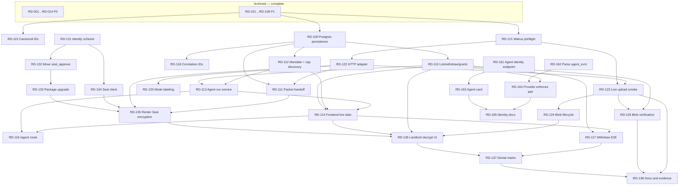

# RentDelegate Backlog — Index

Core product message: **World limits who the agent represents. Sui limits what the agent can do.**

This file is the coordination surface: where tickets live, who owns what, what can run in parallel.
Ticket detail lives in the epic files. `spec/development-spec.md` is the implementation contract.

## Where Tickets Live

| File | Range | Status |
|---|---|---|
| `plan/backlog-archive.md` | RD-001 … RD-108 | Complete and frozen. Read for evidence; do not edit. |
| `plan/backlog-completion.md` | RD-109 … RD-118 | **Epic C — Close The Loop.** Active. |
| `plan/backlog-walrus.md` | RD-121 … RD-126 | **Epic W — Live Walrus Storage.** Active. |
| `plan/backlog-seal.md` | RD-131 … RD-138 | **Epic S — Seal Access Control.** Active. |
| `plan/backlog-e2e.md` | RD-141 … RD-152 | **Epic E — Playwright E2E Tests.** Active. Not front-to-back: start with Phase 1 (RD-141 → RD-144 → RD-147, RD-145, RD-146, RD-149), which needs no wallet. See that file's *Recommended Order*. |
| `plan/backlog-identity.md` | RD-161 … RD-166 | **Epic I — Agent Identity Binding.** Active. Closes the gap where the renter hand-types the agent's Sui and EVM addresses and nothing ever reads `agent_evm`. Start with RD-161 ‖ RD-162 — two agents, zero shared files. |
| `plan/backlog-stretch.md` | RD-202, RD-203 | Optional. RD-201 superseded by Epic S. |

## Current State

Everything in the workspace builds and all tests pass (7 packages, 57 passed / 3 skipped, plus 21
Move tests). The Move package is live on testnet and an agent-signed `submit_application` has been
executed for real. **The remaining work is not repair — it is wiring, live storage, and access
control.** Each stage of the system works in isolation and is joined to the next by hand-edited
environment variables and hardcoded fixtures rather than by code.

| Area | Real today | Missing |
|---|---|---|
| Sui Move | Published testnet package, 6 functions, live agent submission, live Move-enforced rejection | `seal_approve` policy function (RD-132) |
| World AgentKit | Real signature/message verification | Live same-human/two-agent proof (RD-014, still open); the mandate's `agent_evm` is recorded but never read by anything (Epic I) |
| Provider API | AgentKit middleware, real Sui receipt verification | Durable storage — state is in `Map`s (RD-109); application listing, withdraw, access grants (RD-110); reserve never checks the mandate's on-chain identity pair (RD-164) |
| Agent | Deterministic rules, real signing, receipt parsing | Service mode and cap discovery — mandate and cap come from env (RD-112, RD-113) |
| Web | Wallet connect, mandate/listing PTBs, packet encryption UI | Live data — pages read hardcoded fixtures (RD-114); `/agent` route does not exist (RD-116) |
| Walrus | Adapter interface, mock, CLI adapter | Any byte ever reaching the network; a browser-usable adapter (Epic W) |
| Seal | Nothing — `packages/seal` is a `package.json` | All of it (Epic S) |

## Coordination Rules

| Rule | Requirement |
|---|---|
| Ticket ownership | One agent owns one ticket at a time and updates the `Status` field in that ticket's epic file. |
| Dependency respect | Do not start a ticket until its `Dependencies` are complete or explicitly mocked. |
| Interfaces first | Cross-team interfaces land before dependent app work. |
| Sponsor integrity | Never fake Sui, World, Walrus, or Seal. A mock must be labeled at every surface that displays it, including the README. Seal and Walrus are no longer exempt from this — they are claimed scope now. |
| Evidence discipline | A claim is only as strong as its `Verification` field. A fixture proof must say it is a fixture proof. |
| Privacy | Synthetic documents only. Never commit real personal data, wallet seeds, private keys, or mnemonics. |
| Live-spend gate | Tickets marked as spending live WAL or SUI need the user's explicit go-ahead before running: RD-123, RD-124, RD-133. |
| Browser verification | A ticket with a `Browser verification` row is not done until that row is satisfied. Read `docs/browser-testing.md` first — browser access comes from your agent harness, not from this repo, and the two supported paths do not share wallet state. Wallet re-authentication is the user's action, never an agent's. |
| Working order | Prefer a complete working path over feature breadth. |

## Work Lanes

| Lane | Owner profile | Primary paths | Active epic tickets |
|---|---|---|---|
| L0 Project setup | DevOps/full-stack | root, `scripts/`, `packages/contracts-config/` | RD-115, RD-133 |
| L1 Sui Move | Move engineer | `packages/move/` | RD-132, RD-133 |
| L2 Sui TS | Full-stack Sui | `packages/sui-client/` | RD-112, RD-162 |
| L3 Provider API | Backend | `apps/provider-api/` | RD-109, RD-110, RD-117, RD-118, RD-126, RD-164 |
| L4 World AgentKit | World specialist | `packages/agentkit/`, provider middleware | RD-014 follow-up only |
| L5 Walrus/privacy | Storage engineer | `packages/walrus/`, packet flow | RD-111, RD-121 … RD-126, RD-135 |
| L6 Seal | Privacy engineer | `packages/seal/`, Move policy | RD-131 … RD-137 |
| L7 Frontend | Frontend | `apps/web/` | RD-114, RD-116, RD-117, RD-135, RD-136, RD-142, RD-163 |
| L8 Agent | Agent/full-stack | `apps/agent/` | RD-111, RD-112, RD-113, RD-161 |
| L9 Demo/docs | Writer | `README.md`, `docs/`, `plan/` | RD-138, RD-152, RD-165 |
| L10 QA/E2E | Test engineer | `apps/e2e/` | RD-141, RD-143 … RD-151, RD-166 |

## Dependency Graph



Epic I (RD-161…RD-166) hangs off the completed Epic C work and is otherwise independent — it shares no
files with Epic W or Epic S. Detail and its own graph live in `plan/backlog-identity.md`.

## Parallel Execution Evaluation

### Is splitting the backlog useful?

**Yes, and it has been done — but the file split is the smaller half of the win.**

The single 779-line file had two distinct problems, and only one of them was about conflicts:

| Problem | Severity | Fix |
|---|---|---|
| 413 of 779 lines were completed P0/P1 tickets that no agent needs to write to, but every agent had to read past to find live work | **High.** This was the real cost — context burned on frozen history, and a live ticket's `Status` sitting 500 lines below the index. | `plan/backlog-archive.md` |
| Concurrent `Status` edits by agents in different lanes land in one file | **Moderate.** Different hunks in one file usually auto-merge; it is an occasional annoyance, not a blocker. | Per-epic files |

Per-**epic** files, not per-**ticket** files. Twenty-four active tickets would mean twenty-four files,
and since a lane generally owns a whole epic, the epic is the natural unit of ownership — an agent
working Seal never opens the completion file. Per-ticket granularity would buy a marginal reduction
in an already-minor conflict rate at the cost of making the backlog unreadable as a whole.

### The real constraint is code file ownership, not the backlog file

Splitting the backlog does not raise the parallelism ceiling. Three serial chains do, because each
runs through one file that cannot have two concurrent writers:

| Chain | Serialized through | Order |
|---|---|---|
| Provider | `apps/provider-api/src/services/applications.ts` | RD-109 → RD-110 → RD-117/RD-126 |
| Web | `apps/web/app/**` and `PacketBuilder.tsx` | RD-114 → RD-116/RD-117/RD-136; RD-111 → RD-125 → RD-135 |
| Agent | `apps/agent/src/index.ts` | RD-112 → RD-111 → RD-113 |

**Useful concurrency is therefore about three agents, occasionally four** — not the six or seven the
lane count suggests. Adding more agents past that produces merge conflicts, not throughput. The
genuinely independent early work is in the leaf packages: `packages/move`, `packages/walrus`, and
`packages/seal` have no shared files with each other or with the apps.

### Contended files

| File | Wanted by | Rule |
|---|---|---|
| `apps/provider-api/src/services/applications.ts` | RD-109, RD-110, RD-117, RD-126, RD-164 | One owner at a time, in dependency order. |
| `apps/web/src/components/PacketBuilder.tsx` | RD-111, RD-125, RD-135 | Same owner should take all three. |
| `apps/web/src/components/MandateForm.tsx` | RD-163 | Sole owner; announce if any other L7 work is live. |
| `apps/web/app/agent/page.tsx` | RD-142, RD-163 | RD-163's edit is one shared-constant import — announce, do not serialize. |
| `apps/agent/src/server.ts` | RD-161 | Sole owner. |
| `apps/web/app/landlord/page.tsx` | RD-114, RD-136 | RD-114 lands first, always. |
| `apps/agent/src/index.ts` | RD-111, RD-112, RD-113, RD-115, RD-124 | RD-115 first (mechanical), then one owner for the rest. |
| `packages/move/sources/rental.move` | RD-132, RD-202 | Single owner; RD-133 deploys it. |
| `packages/contracts-config/testnet.json` | RD-115, RD-123, RD-133 | Append-only blocks; announce before writing. |

### Suggested waves

| Wave | Parallel agents | Tickets | Notes |
|---|---:|---|---|
| 0 | 2 | RD-115, RD-131 | RD-115 touches many files shallowly, so it must land before lanes diverge. RD-131 is a decision plus one small module — zero overlap. |
| 1 | 3 | **A** RD-109 · **B** RD-121 → RD-122 · **C** RD-132 | Provider, Walrus package, and Move package share no files. The cleanest wave in the plan. |
| 2 | 4 | **A** RD-110 → RD-118 · **B** RD-112 · **C** RD-134 · **D** RD-133 | RD-133 is a live deploy: announce it, and it changes IDs other lanes read. |
| 3 | 3 | **A** RD-111 → RD-113 · **B** RD-123 → RD-125 · **C** RD-114 | RD-123 needs the live-spend go-ahead. A and C both touch `apps/web` — keep A's edits to `PacketBuilder.tsx` and C's to `app/**`. |
| 4 | 3 | **A** RD-116 → RD-117 · **B** RD-124 → RD-126 · **C** RD-135 | Web, Walrus, and Seal encryption. |
| 5 | 1 | RD-136 → RD-137 | Landlord decrypt then denial matrix. Sequential by nature; needs the whole stack live. |
| 6 | 1 | RD-138 | Docs and evidence, last, once claims are settled. |

## Shared Interfaces

### Host Setup Boundary

The user is on Arch Linux inside distrobox. Do not assume Nix or Ubuntu package commands.

Sui and Walrus are installed in `~/.local/bin/`, but that directory must not be exported into `PATH`.
Call `~/.local/bin/sui` and `~/.local/bin/walrus` directly. Do not edit shell startup files.

User-provisioned, not agent-installable without permission:

| Item | Why |
|---|---|
| Postgres server | Required from RD-109 onward; `psql` is installed but the server was never verified running. |
| Fresh Sui testnet wallets for renter, agent, provider, landlord | Avoid the auto-generated key that printed a recovery phrase. |
| Sui testnet gas | Required for the RD-133 upgrade and all transactions. |
| **Testnet WAL tokens** | Required for RD-123/RD-124. The Walrus epic cannot complete without them. |
| World/AgentKit registration access | User-controlled World flow. |
| Second EVM agent for the same World human | The remaining RD-014 gap. |

### Municipality Codes

| Code | Municipality |
|---:|---|
| 1 | Lisbon |
| 2 | Oeiras |
| 3 | Cascais |
| 4 | Amadora |
| 5 | Almada |
| 6 | Porto — intentionally ineligible demo listing |

### Permission Flags

| Flag | Value | Meaning |
|---|---:|---|
| `ACTION_SUBMIT_DOCS` | `1` | Agent may submit an encrypted document packet. |
| `ACTION_WITHDRAW` | `2` | Agent may withdraw, if implemented. |

Lease signing and fund transfer are not flags. They are impossible in the Move module.

### Core IDs

| ID | Meaning |
|---|---|
| `mandateId` | Sui `RentalMandate` object ID. |
| `ownerCapId` | Renter-owned `OwnerCap` object ID. |
| `agentCapId` | Agent-owned `AgentCap` object ID — per mandate, discovered not configured (RD-112). |
| `listingObjectId` | Sui `RentalListing` object ID. |
| `receiptId` | Sui `ApplicationReceipt` object ID. |
| `applicationId` | Provider DB application ID. |
| `txDigest` | Sui transaction digest. |
| `walrusBlobId` | Walrus blob ID, or `mock:...` in mock mode. |
| `sealIdentity` | `bcs(mandateId) ‖ bcs(listingObjectId)`, namespaced by package ID (RD-131). |
| `humanIdHash` | SHA-256 or HMAC hash of the AgentKit human ID. The raw ID is never stored. |

All object ID literals live in `packages/contracts-config` (RD-115). Nowhere else.

### Provider Application Reserve Request

```json
{
  "mandateId": "0x...",
  "listingObjectId": "0x...",
  "agentSuiAddress": "0x...",
  "agentEvmAddress": "0x...",
  "walrusBlobId": "blob...",
  "packetHash": "0x...",
  "accessExpiresAtMs": 1790000000000,
  "idempotencyKey": "uuid-v4"
}
```

### Receipt Verify Request

```json
{
  "applicationId": "app_...",
  "txDigest": "...",
  "receiptId": "0x..."
}
```

## Integration Contracts Between Agents

| Producer | Artifact | Consumer |
|---|---|---|
| Move | Package ID (original and upgraded), function names, struct fields, abort codes | Sui TS, frontend, backend, agent, Seal |
| Move | `seal_approve_packet` signature and abort codes | Seal client, landlord UI |
| Backend | Route docs, error codes, health shape, AgentKit header path | Frontend, agent |
| Backend | Packet-record and access-grant endpoint shapes | Frontend, agent, Seal |
| World | Registered demo EVM addresses, verification result shape, human ID hash function | Backend, agent |
| Walrus | Adapter interface, active mode, blob lifetime | Frontend, agent, provider, Seal |
| Seal | Identity derivation, key server set, threshold, session TTL | Frontend, Move policy, docs |

## Definition Of Done — Full Application

The core demo definition is in `plan/backlog-archive.md` and is already satisfied. This is the bar for
the *complete* application.

| Requirement | Done when |
|---|---|
| Durable state | Provider survives restart with applications, receipts, and human/listing uniqueness intact. |
| No env-edit seams | A mandate created in the browser is actionable by the agent with no `.env` change and no restart. |
| Renter's own packet | The blob ID in the on-chain receipt is the one the renter's browser produced. |
| Live storage | A real Walrus blob is uploaded, certified, and read back byte-identical, with the blob outliving its access grant. |
| Policy-controlled access | An authorized landlord decrypts in the browser; every unauthorized path is denied by a Move abort surfaced to the user. |
| Live data UI | No page renders a hardcoded object ID outside a labeled evidence panel. |
| Revocability | Mandate revocation and application withdrawal both work end to end and both revoke document access. |
| Honest claims | Every sponsor row in the README is backed by something that was actually run, with the fallback level from spec §19 stated. |

## Known High-Risk Dependencies

| Risk | Owner | Mitigation |
|---|---|---|
| No testnet WAL means Epic W cannot finish | L5 | Confirm funding via RD-121 before starting RD-122. If unfunded, the README keeps saying mock. |
| Package upgrade (RD-133) breaks existing objects or IDs other lanes read | L1/L0 | Dry-run first; verify a pre-upgrade listing still works; record both package IDs; announce before running. |
| Seal identity chosen wrong (RD-131) makes ciphertext permanently unreadable | L6 | Decide and document before any encryption ships; single shared derivation function. |
| Seal key server availability or API drift | L6 | `threshold >= 2` across independent servers; keep the labeled fallback mode. |
| AgentKit same-human two-agent proof is hard to stage | L4 | Fixture proof exists and is labeled; ask sponsor mentors early. |
| Postgres unavailable in the demo environment | L3 | Durable embedded fallback behind the same drizzle schema — never a `Map`. |
| Sui shared-object contention during the demo | L2 | One demo path, fresh object refs, retry with backoff. |
| Testnet RPC instability | L0 | Fallback RPC configured; tx links pre-recorded. |

## Cut List

| Item | Reason |
|---|---|
| Lease signing | Legal and safety risk. |
| Rent or deposit payments | Unnecessary and dangerous. |
| Real identity or financial documents | Privacy risk. Synthetic data only. |
| Credit scoring | Regulated and out of scope. |
| Production tenant screening | Unsupported legal/compliance scope. |
| Arbitrary real-estate scraping | Fragile and not sponsor-critical. |
| General-purpose agent passport | Dilutes the focused rental mandate story. |
| Cross-provider duplicate-human federation | Too broad. |
| Multi-agent wallet routing | Out of scope; single stable agent identity by design. |
