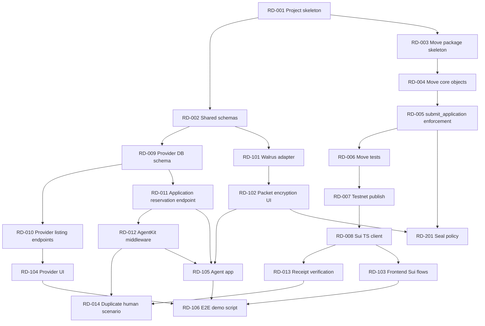

# RentDelegate Parallel Backlog

This backlog is designed for multiple agents working in parallel during the ETHGlobal Lisbon 2026 build. Each ticket includes ownership boundaries, dependencies, acceptance criteria, and verification steps.

Core product message: **World limits who the agent represents. Sui limits what the agent can do.**

## 1. Coordination Rules

| Rule | Requirement |
|---|---|
| Ticket ownership | One agent owns one ticket at a time and updates status in this file or the issue tracker. |
| Dependency respect | Do not start implementation tickets until blocking tickets are complete or explicitly mocked. |
| Interfaces first | Cross-team interfaces must land before dependent app work. |
| Sponsor integrity | Do not fake Sui or World integrations. Mock only Walrus/Seal fallbacks and label them clearly. |
| Privacy | Use synthetic documents only. Never commit real personal data, wallet seeds, private keys, or mnemonics. |
| Demo priority | Prefer end-to-end working flow over feature breadth. |

## 2. Work Lanes

| Lane | Owner Profile | Primary Paths | Can Work In Parallel With |
|---|---|---|---|
| L0 Project setup | DevOps/full-stack | root, `scripts/`, `packages/contracts-config/` | All lanes after interfaces exist |
| L1 Sui Move | Sui Move engineer | `packages/move/` | Backend schema, frontend mock UI, agent rules |
| L2 Sui TS integration | Full-stack Sui engineer | `packages/sui-client/` | Backend, frontend after Move ABI stabilizes |
| L3 Provider API | Backend engineer | `apps/provider-api/` | Move, AgentKit, frontend mock |
| L4 World AgentKit | World specialist | `packages/agentkit/`, `apps/provider-api/src/middleware/`, `apps/agent/` | Backend once route skeleton exists |
| L5 Walrus/privacy | Privacy/storage engineer | `packages/walrus/`, packet UI | Move/backend after packet schema agreed |
| L6 Seal stretch | Privacy engineer | `packages/seal/`, Move policy helper | Only after Sui + Walrus are stable |
| L7 Frontend | Frontend engineer | `apps/web/` | Backend/Move using mocks initially |
| L8 Agent | Agent/full-stack engineer | `apps/agent/` | Provider API route contracts, Sui client |
| L9 Demo/docs | Technical writer/pitch | `README.md`, `docs/`, `plan/` | All lanes |

## 3. Dependency Graph



## 4. Shared Interfaces To Freeze Early

### 4.0 Host Setup Boundary

The user is on Arch Linux inside distrobox. Agents should not assume Nix or Ubuntu package commands for this repo.

User-provisioned system packages that may require `sudo pacman -S`:

| Tool | Why needed | Current assessment |
|---|---|---|
| Node.js 22 LTS | Next.js supports Node >=20.9, pnpm 11 requires Node >=22, Hono supports Node 20+. | Node exists but is v26.5.0; pinning 22 is recommended. |
| pnpm 11 | Planned workspace package manager. | Installed as 11.3.0. |
| git | Repo operations. | Installed. |
| postgresql | Local provider API database and `psql`. | `psql` installed; server availability not verified. |
| jq | JSON output parsing for Sui/Walrus scripts. | Not verified. |
| openssl | Local crypto/debug tooling. | Not verified. |
| curl | Fetching official configs and release metadata. | Not verified. |
| unzip | Release/archive extraction when needed. | Not verified. |
| make, pkgconf | Native dependency build fallback if a package needs compilation. | Not verified. |

User-managed web3 setup that should not be done by agents without explicit permission:

| Item | Why |
|---|---|
| Fresh Sui testnet wallets for renter, agent, provider, landlord | Avoid using the auto-generated Sui key that printed a recovery phrase. |
| Sui testnet gas for demo wallets | Required for Move publish and transactions. |
| World/AgentKit registration access | Requires user-controlled World flow. |
| EVM agent wallet(s) for AgentKit | Needed for human-backed agent requests and duplicate-human demo. |

Agent-installable or repo-local setup to include in RD-001/RD-007 rather than asking for sudo:

| Item | Where |
|---|---|
| Workspace package manifests and local npm dependencies | RD-001 and package-specific tickets. |
| `packageManager` pin for pnpm | Root `package.json` in RD-001. |
| Sui Move package files | RD-003. |
| Sui deployment config JSON | RD-007. |
| Walrus adapter dependency or HTTP adapter code | RD-101. |
| AgentKit npm dependencies and CLI usage through `npx`/`pnpm dlx` | RD-012. |
| Drizzle migrations and local DB scripts | RD-009. |

Sui and Walrus are installed in `~/.local/bin/`, but the user does not want that directory exported into `PATH`. If `sui` or `walrus` are not found, call `~/.local/bin/sui` and `~/.local/bin/walrus` directly. Do not edit shell startup files or export PATH globally for this repo.

### 4.1 Municipality Codes

| Code | Municipality |
|---:|---|
| 1 | Lisbon |
| 2 | Oeiras |
| 3 | Cascais |
| 4 | Amadora |
| 5 | Almada |
| 6 | Porto, used as intentionally ineligible demo listing |

### 4.2 Permission Flags

| Flag | Value | Meaning |
|---|---:|---|
| `ACTION_SUBMIT_DOCS` | `1` | Agent may submit encrypted document packet. |
| `ACTION_WITHDRAW` | `2` | Agent may withdraw only if implemented. |

Lease signing and fund transfer are not represented as flags. They are impossible in the Move module.

### 4.3 Core IDs

| ID | Meaning |
|---|---|
| `mandateId` | Sui `RentalMandate` object ID. |
| `ownerCapId` | Renter-owned `OwnerCap` object ID. |
| `agentCapId` | Agent-owned `AgentCap` object ID. |
| `listingObjectId` | Sui `RentalListing` object ID. |
| `receiptId` | Sui `ApplicationReceipt` object ID. |
| `applicationId` | Provider DB application ID. |
| `txDigest` | Sui transaction digest. |
| `walrusBlobId` | Walrus encrypted blob ID. |
| `humanIdHash` | SHA-256 or HMAC hash of AgentKit human ID. Raw human ID must not be stored. |

### 4.4 Provider Application Reserve Request

```json
{
  "mandateId": "0x...",
  "listingObjectId": "0x...",
  "agentSuiAddress": "0x...",
  "agentEvmAddress": "0x...",
  "walrusBlobId": "blob...",
  "packetHash": "0x...",
  "accessExpiresAtMs": 1790000000000,
  "idempotencyKey": "uuid-v4"
}
```

### 4.5 Receipt Verify Request

```json
{
  "applicationId": "app_...",
  "txDigest": "...",
  "receiptId": "0x..."
}
```

## 5. P0 Backlog: Required For Sponsor Qualification

### RD-001 Project Skeleton

| Field | Value |
|---|---|
| Priority | P0 |
| Status | DONE - merged via `feature/rd-001-project-skeleton`. |
| Lane | L0 Project setup |
| Objective | Create monorepo structure and package manager setup. |
| Suggested implementation | Use `pnpm` workspaces with `apps/web`, `apps/provider-api`, `apps/agent`, `packages/move`, `packages/shared`, `packages/sui-client`, `packages/agentkit`, `packages/walrus`, `packages/seal`, `packages/contracts-config`, `scripts`, `docs`, `plan`. Pin `packageManager` in root `package.json`; add only repo-local dependencies through workspace manifests. Do not use `sudo` or global npm installs. |
| Files/modules | `package.json`, `pnpm-workspace.yaml`, `.gitignore`, `README.md`, directory placeholders. |
| Dependencies | None. |
| Blocks | RD-002, RD-003, all app/package work. |
| Acceptance criteria | `pnpm install` succeeds; workspace filters work; no secrets tracked; app/package directories exist; root manifest documents Node 22 target and pnpm 11 package manager pin. |
| Tests | `pnpm -r --if-present build`; `pnpm -r --if-present test`. |
| Verification | 2026-07-25: `node --version` -> `v26.5.0`; `pnpm --version` -> `11.3.0`; `pnpm install` -> success, generated `pnpm-lock.yaml`; `pnpm -r --if-present build` -> success; `pnpm -r --if-present test` -> success; `pnpm --filter @rentdelegate/shared list --depth -1` -> resolved workspace package. |
| Failure fallback | Create minimal directories and package manifests only; if host Node is incompatible, document blocker instead of installing system packages. |
| Sponsor | Both. |
| Demo impact | Enables all parallel work. |

### RD-002 Shared Schemas And Constants

| Field | Value |
|---|---|
| Priority | P0 |
| Status | DONE - merged via `feature/rd-002-shared-schemas`. |
| Lane | L0/L2 shared |
| Objective | Define shared TypeScript types, Zod schemas, constants, and error code mapping. |
| Suggested implementation | Export schemas for mandate form, listing, application reserve, receipt verify, municipality codes, permission flags, and user-facing errors. |
| Files/modules | `packages/shared/src/schemas.ts`, `packages/shared/src/constants.ts`, `packages/shared/src/errors.ts`, `packages/shared/src/index.ts`. |
| Dependencies | RD-001. |
| Blocks | RD-009, RD-101, RD-103, RD-105. |
| Acceptance criteria | Shared package builds; backend/frontend/agent can import schemas; schemas match section 4. |
| Tests | Vitest schema parse tests for valid and invalid application reserve requests. |
| Verification | 2026-07-25: `pnpm --filter @rentdelegate/shared build` -> success; `pnpm --filter @rentdelegate/shared test` -> success, 1 file/2 tests; `pnpm -r --if-present build` -> success; `pnpm -r --if-present test` -> success, shared package 1 file/2 tests. |
| Failure fallback | Inline duplicated types temporarily, then reconcile before E2E. |
| Sponsor | Both. |
| Demo impact | Prevents integration drift. |

### RD-003 Move Package Skeleton

| Field | Value |
|---|---|
| Priority | P0 |
| Status | DONE - merged via `feature/rd-003-move-package-skeleton`. |
| Lane | L1 Sui Move |
| Objective | Initialize Sui Move package. |
| Suggested implementation | Create `Move.toml`, `sources/rental.move`, `tests/rental_tests.move`, package address aliases. |
| Files/modules | `packages/move/Move.toml`, `packages/move/sources/rental.move`, `packages/move/tests/rental_tests.move`. |
| Dependencies | RD-001. |
| Blocks | RD-004. |
| Acceptance criteria | `sui move build --path packages/move` succeeds with empty/minimal module. |
| Tests | `sui move test --path packages/move`. If `sui` is not on `PATH`, use `~/.local/bin/sui`. |
| Verification | 2026-07-25: `~/.local/bin/sui move build --path packages/move` -> success; `~/.local/bin/sui move test --path packages/move` -> success, 1 test passed; `pnpm -r --if-present build` -> success; `pnpm -r --if-present test` -> success. |
| Failure fallback | Use one module only; skip package splitting. |
| Sponsor | Sui. |
| Demo impact | Starts Sui integration. |

### RD-004 Move Core Object Model

| Field | Value |
|---|---|
| Priority | P0 |
| Status | DONE - merged via `feature/rd-004-move-core-objects`. |
| Lane | L1 Sui Move |
| Objective | Implement `RentalMandate`, `OwnerCap`, `AgentCap`, `RentalListing`, `ApplicationReceipt`, events, constants, and error codes. |
| Suggested implementation | Use shared `RentalMandate`, shared `RentalListing`, renter-owned `OwnerCap`, agent-owned `AgentCap`, shared `ApplicationReceipt`. Use `vector<u64>` municipalities and `u64` permission bitset. |
| Files/modules | `packages/move/sources/rental.move`. |
| Dependencies | RD-003. |
| Blocks | RD-005, RD-006, RD-008. |
| Acceptance criteria | Move structs compile; `create_mandate` creates mandate and caps; `create_listing` creates provider-controlled listing; events emitted. |
| Tests | Create mandate and listing tests; verify caps transfer to correct addresses. |
| Verification | 2026-07-25: `~/.local/bin/sui move build --path packages/move` -> success; `~/.local/bin/sui move test --path packages/move` -> success, 3 tests passed; `pnpm -r --if-present build` -> success; `pnpm -r --if-present test` -> success. |
| Failure fallback | Keep receipt immutable/owned if shared status updates slow down implementation. |
| Sponsor | Sui. |
| Demo impact | Core Sui object topology. |

### RD-005 Move `submit_application` Enforcement

| Field | Value |
|---|---|
| Priority | P0 |
| Status | DONE - merged via `feature/rd-005-submit-application`. |
| Lane | L1 Sui Move |
| Objective | Enforce mandate constraints during application submission. |
| Suggested implementation | Validate not expired, not revoked, active listing, max rent, municipality, bedrooms, valid `AgentCap`, sender equals authorized Sui agent, allowance > 0, `ACTION_SUBMIT_DOCS`, no same mandate/listing duplicate, decrement allowance, create receipt, emit event. |
| Files/modules | `packages/move/sources/rental.move`. |
| Dependencies | RD-004. |
| Blocks | RD-006, RD-007, RD-013, RD-103, RD-105. |
| Acceptance criteria | Valid submission creates receipt and decrements count once; invalid submissions abort with specific error codes. |
| Tests | Valid submission, rent too high, disallowed municipality, too few bedrooms, expired, revoked, zero allowance, wrong cap, wrong sender, inactive listing, duplicate listing. |
| Verification | 2026-07-25: `~/.local/bin/sui move build --path packages/move` -> success; `~/.local/bin/sui move test --path packages/move` -> success, 16 tests passed covering valid submission, rent too high, disallowed municipality, too few bedrooms, expired mandate, revoked mandate, zero allowance, wrong cap, wrong sender, inactive listing, expired listing, missing submit permission, and duplicate listing; `pnpm -r --if-present build` -> success; `pnpm -r --if-present test` -> success. |
| Failure fallback | If dynamic `Table<ID, ID>` causes test friction, drop Sui duplicate prevention for same mandate/listing and rely on allowance plus provider uniqueness for demo, but document this as a shortcut. |
| Sponsor | Sui. |
| Demo impact | Main Sui prize proof. |

### RD-006 Move Owner Actions And Tests

| Field | Value |
|---|---|
| Priority | P0 |
| Status | DONE - merged via `feature/rd-006-owner-actions`. |
| Lane | L1 Sui Move |
| Objective | Implement revocation, withdrawal, optional rotation, and full Move test matrix. |
| Suggested implementation | Add `revoke_mandate`, `withdraw_application`, and `rotate_agent` if safe. Require `OwnerCap` and sender equals owner. Add event emissions. |
| Files/modules | `packages/move/sources/rental.move`, `packages/move/tests/rental_tests.move`. |
| Dependencies | RD-005. |
| Blocks | RD-007, RD-103, RD-106. |
| Acceptance criteria | Owner can revoke; non-owner cannot; post-revoke apply fails; withdrawal changes receipt status. |
| Tests | Owner-only revoke, wrong cap, wrong owner, withdrawal, post-revoke submission failure, optional rotation old/new cap behavior. |
| Verification | 2026-07-25: `~/.local/bin/sui move test --path packages/move` -> success, 21 tests passed including owner revoke, wrong cap, wrong owner, withdrawal, and post-revoke submission failure; `~/.local/bin/sui move build --path packages/move` -> success; `pnpm -r --if-present build` -> success; `pnpm -r --if-present test` -> success. Rotation intentionally deferred to RD-202. |
| Failure fallback | Cut rotation UI and keep only revoke/withdraw. |
| Sponsor | Sui. |
| Demo impact | Revocability and safety proof. |

### RD-007 Sui Testnet Publish And Contract Config

| Field | Value |
|---|---|
| Priority | P0 |
| Status | DONE - merged via `feature/rd-007-sui-testnet-publish-live`. |
| Lane | L0/L1 DevOps |
| Objective | Publish Move package to Sui testnet and save deployment metadata. |
| Suggested implementation | Use Sui CLI testnet env, faucet-funded publisher wallet, deploy script, and JSON config consumed by apps. |
| Files/modules | `scripts/deploy-sui.ts` or `scripts/deploy-sui.sh`, `packages/contracts-config/testnet.json`. |
| Dependencies | RD-006. |
| Blocks | RD-008, RD-103, RD-105, RD-106. |
| Acceptance criteria | Package ID saved; create mandate/listing/apply tx digests recorded; explorer links work. |
| Tests | Run deploy script against testnet; run smoke transaction. |
| Verification | 2026-07-25: `~/.local/bin/sui move build --path packages/move` -> success; `~/.local/bin/sui move test --path packages/move` -> success, 21 tests passed; `~/.local/bin/sui client publish packages/move --gas-budget 500000000 --dry-run --json` -> success, estimated net gas 35,549,600 MIST; `~/.local/bin/sui client publish packages/move --gas-budget 500000000 --json` -> success, package `0x7e0130cdc105d06707f1f3abd4c76aac8211a09a5502692ba454d1b4b758af3d`, upgrade cap `0x2250bb6b4e9804285aa42d9dd7f2737ecdd93ed4b03edbf515459fb7223d62af`, tx `GvxTETJej5RH4U3rFD2PNCENW65tG8vynRF1xskTrxP7`; smoke `create_mandate` -> tx `ANNzWCc4StQWGnbdDKmxkwozYhk2V8CDVDUk4UA1sfDA`, mandate `0x835478969ce38a0a1d0f981aa1a278a8862f9283de735ebba81c6169d388dbee`, owner cap `0xcdb3924e29345c3be077f3c54de78435144ad141d0458a93f6fb6ae0381a571d`, agent cap `0xabeb55d1266102eed4235531c542fb01fd85bb3095c3d579960923f2e1e25c2a`; smoke `create_listing` -> tx `AqH68Fwb3t61KGxshTn5PbJ7JWTDiQcvbF7rS9URNgZR`, listing `0xe7f676b93b9df816c7c44806ca2bbda0c6bf29334802206fb025c12e320ad72a`; smoke `submit_application` -> tx `6vKuZNC3p5uoaSni2N5NifW1eQjqdLDesBAj9gN799Lh`, receipt `0xc46d42744b7381447851f9f2adb6cf32322ab4bd6aba243e925597418899ad20`; `~/.local/bin/sui client balance` after publish/smoke -> 0.95 SUI. Config saved in `packages/contracts-config/testnet.json`; evidence documented in `docs/sui-deployment.md`. |
| Failure fallback | Use localnet for development but record that public demo requires testnet before submission. |
| Sponsor | Sui. |
| Demo impact | Required for Sui qualification. |

### RD-008 Sui TypeScript Client

| Field | Value |
|---|---|
| Priority | P0 |
| Status | DONE - merged via `feature/rd-008-sui-ts-client`. |
| Lane | L2 Sui TS integration |
| Objective | Provide reusable TS helpers for Sui object reads and transactions. |
| Suggested implementation | Wrap `@mysten/sui` transaction builders for create mandate, create listing, submit application, revoke, withdraw, and object parsers for mandate/listing/receipt. |
| Files/modules | `packages/sui-client/src/client.ts`, `packages/sui-client/src/transactions.ts`, `packages/sui-client/src/objects.ts`, `packages/sui-client/src/index.ts`. |
| Dependencies | RD-007. |
| Blocks | RD-013, RD-103, RD-105. |
| Acceptance criteria | Package builds; can read published objects; can build PTBs without signing; frontend and agent import helpers. |
| Tests | Unit tests for PTB construction shape; integration smoke read against testnet config. |
| Verification | 2026-07-25: `pnpm --filter @rentdelegate/sui-client build` -> success; `pnpm --filter @rentdelegate/sui-client test` -> success, 2 files passed/1 live smoke skipped, 4 tests passed/1 skipped; `RUN_SUI_TESTNET=1 pnpm --filter @rentdelegate/sui-client test` -> success, 3 files/5 tests including live read of RD-007 listing `0xe7f676b93b9df816c7c44806ca2bbda0c6bf29334802206fb025c12e320ad72a`; `pnpm -r --if-present build` -> success; `pnpm -r --if-present test` -> success; `~/.local/bin/sui move build --path packages/move` -> success; `~/.local/bin/sui move test --path packages/move` -> success, 21 tests passed. |
| Failure fallback | Duplicate minimal tx-building code in frontend and agent for demo, then refactor. |
| Sponsor | Sui. |
| Demo impact | Connects apps to Move package. |

### RD-009 Provider Database Schema

| Field | Value |
|---|---|
| Priority | P0 |
| Status | DONE - merged via `feature/rd-009-provider-db-schema`. |
| Lane | L3 Provider API |
| Objective | Create Postgres schema with uniqueness rule `UNIQUE(listing_id, human_id_hash)`. |
| Suggested implementation | Use Drizzle migrations for `listings`, `applications`, `verified_agents`, `human_listing_usage`, `sui_receipts`, `document_access_grants`. |
| Files/modules | `apps/provider-api/src/db/schema.ts`, `apps/provider-api/drizzle/`, `apps/provider-api/src/db/client.ts`. |
| Dependencies | RD-002. |
| Blocks | RD-010, RD-011, RD-012, RD-014. |
| Acceptance criteria | Migration runs locally; unique constraint enforced; seed data works. |
| Tests | Insert duplicate `(listing_id, human_id_hash)` fails. |
| Verification | 2026-07-25: `pnpm --filter @rentdelegate/shared build && pnpm --filter @rentdelegate/provider-api build` -> success; `pnpm --filter @rentdelegate/provider-api test` -> success, pg-mem executed `drizzle/0001_initial.sql` and duplicate `(listing_id, human_id_hash)` insert failed; `pnpm -r --if-present build` -> success; `pnpm -r --if-present test` -> success; `~/.local/bin/sui move build --path packages/move` -> success; `~/.local/bin/sui move test --path packages/move` -> success, 21 tests passed. |
| Failure fallback | SQLite/Postgres-lite only if Postgres setup blocks, but keep SQL-compatible schema. |
| Sponsor | World. |
| Demo impact | Duplicate-human rejection. |

### RD-010 Provider Listing Endpoints

| Field | Value |
|---|---|
| Priority | P0 |
| Status | DONE - merged via `feature/rd-010-provider-listing-endpoints`. |
| Lane | L3 Provider API |
| Objective | Implement listing API and DB cache of Sui listing objects. |
| Suggested implementation | Add `POST /listings`, `GET /listings`, `GET /listings/:id`; provider creates Sui listing via frontend or returns tx hint. Store Sui listing object ID and authoritative fields. |
| Files/modules | `apps/provider-api/src/routes/listings.ts`, `apps/provider-api/src/services/listings.ts`. |
| Dependencies | RD-009, RD-008 for real Sui verification or RD-004 ABI for mocks. |
| Blocks | RD-011, RD-104, RD-105. |
| Acceptance criteria | Listings can be created/listed; response includes Sui object ID; seeded Lisbon eligible and ineligible listings exist. |
| Tests | API route tests for create/list/detail. |
| Verification | 2026-07-25: `pnpm --filter @rentdelegate/provider-api build` -> success; `pnpm --filter @rentdelegate/provider-api test` -> success, 2 files/4 tests covering health/list/create/detail/404 and seeded Lisbon/Porto listings; `pnpm -r --if-present build` -> success; `pnpm -r --if-present test` -> success; `~/.local/bin/sui move build --path packages/move` -> success; `~/.local/bin/sui move test --path packages/move` -> success, 21 tests passed. Route handoff documented in `docs/provider-api.md`; seed listing object IDs are synthetic placeholders until RD-007 is unblocked and real provider-created Sui listing IDs are available. |
| Failure fallback | Seed DB from known Sui listing object IDs created by CLI. |
| Sponsor | Sui. |
| Demo impact | Prevents agent-supplied fake listing attributes. |

### RD-011 Application Reservation Endpoint

| Field | Value |
|---|---|
| Priority | P0 |
| Status | DONE - merged via `feature/rd-011-application-reservation`. |
| Lane | L3 Provider API |
| Objective | Implement `POST /listings/:id/applications` reservation flow. |
| Suggested implementation | Validate request schema, require AgentKit context, verify listing exists, read mandate, check EVM/Sui binding, insert uniqueness reservation, create application row, return Sui submit hint. |
| Files/modules | `apps/provider-api/src/routes/applications.ts`, `apps/provider-api/src/services/applications.ts`. |
| Dependencies | RD-009, RD-010, RD-012 for real auth; can develop initially with mocked AgentKit context. |
| Blocks | RD-014, RD-105, RD-106. |
| Acceptance criteria | First human/listing reservation succeeds; same human/listing returns 409; mismatched mandate addresses return 403. |
| Tests | Route tests for success, duplicate, EVM mismatch, Sui mismatch, idempotency replay. |
| Verification | 2026-07-25: `pnpm --filter @rentdelegate/provider-api build` -> success; `pnpm --filter @rentdelegate/provider-api test` -> success, 3 files/9 tests covering reservation success, duplicate human/listing 409, EVM mismatch 403, Sui mismatch 403, idempotency replay 200, idempotency conflict 409, missing mock AgentKit headers 401, listings, and DB uniqueness; `pnpm -r --if-present build` -> success; `pnpm -r --if-present test` -> success; `~/.local/bin/sui move build --path packages/move` -> success; `~/.local/bin/sui move test --path packages/move` -> success, 21 tests passed. RD-011 uses explicit `x-demo-*` mock AgentKit headers only; RD-012 must replace this before real World demo claims. |
| Failure fallback | Implement with mock human context, then plug RD-012 before demo. |
| Sponsor | World and Sui. |
| Demo impact | Main trust-boundary join. |

### RD-012 World AgentKit Middleware

| Field | Value |
|---|---|
| Priority | P0 |
| Status | DONE - live AgentKit request verified via `feature/rd-012-agentkit-live-helper`. |
| Lane | L4 World AgentKit |
| Objective | Verify human-backed EVM agent requests with AgentKit. |
| Suggested implementation | Use `@worldcoin/agentkit` with x402/Hono hooks or low-level verifier. Hash human ID immediately. Persist nonce/usage storage in DB, not memory, for demo stability. |
| Files/modules | `packages/agentkit/src/server.ts`, `apps/provider-api/src/middleware/agentkit.ts`, `apps/provider-api/src/services/agentkitStorage.ts`. |
| Dependencies | RD-009. |
| Blocks | RD-011 real mode, RD-014, RD-105, RD-106. |
| Acceptance criteria | Registered agent succeeds; unregistered/unverified agent returns 401; middleware exposes `humanIdHash` and `agentEvmAddress`. |
| Tests | Unit test with verifier mock; manual real AgentKit request test documented. |
| Verification | 2026-07-25: `pnpm --filter @rentdelegate/agentkit build` -> success; `pnpm --filter @rentdelegate/agentkit test` -> success, 1 file/3 tests covering human ID hashing, mock verified agent, and mock unverified rejection; `pnpm --filter @rentdelegate/provider-api build` -> success; `pnpm --filter @rentdelegate/provider-api test` -> success, 3 files/9 tests; `pnpm -r --if-present build` -> success; `pnpm -r --if-present test` -> success; `~/.local/bin/sui move build --path packages/move` -> success; `~/.local/bin/sui move test --path packages/move` -> success, 21 tests passed. 2026-07-25 live unblock: `pnpm dlx @worldcoin/agentkit-cli status 0x662DbABBeff9B237490bBE6A898776a4A1D87CCe --format json` -> `registered: true`, `network: eip155:480`; provider API run with `AGENTKIT_MODE=real AGENTKIT_EVM_RPC_URL=https://worldchain-mainnet.g.alchemy.com/public`; MetaMask/AgentKit helper generated real `agentkit` header on World Chain; `POST /listings/listing_lisbon_eligible/applications` returned `202` with `mode=real-agentkit`-derived `humanIdHash` and registered `agentEvmAddress`; missing-header request returned `401 AGENTKIT_UNVERIFIED`. Raw World human ID was not committed. |
| Failure fallback | Keep mock only for local development, but real AgentKit must work for final sponsor demo. |
| Sponsor | World. |
| Demo impact | Required for World qualification. |

### RD-013 Sui Receipt Verification Service

| Field | Value |
|---|---|
| Priority | P0 |
| Status | DONE - merged via `feature/rd-013-receipt-verification`. |
| Lane | L3/L2 backend Sui |
| Objective | Verify Sui tx digest and `ApplicationReceipt` object against reserved application. |
| Suggested implementation | Implement `POST /applications/:id/verify`; fetch tx effects and receipt object; compare mandate ID, listing ID, agent Sui address, provider/landlord, blob ID, packet hash, status. Store in `sui_receipts`. |
| Files/modules | `apps/provider-api/src/routes/applications.ts`, `apps/provider-api/src/services/suiVerifier.ts`, `packages/sui-client/`. |
| Dependencies | RD-008, RD-011. |
| Blocks | RD-014, RD-105, RD-106. |
| Acceptance criteria | Valid receipt marks application `accepted`; invalid receipt returns `RECEIPT_INVALID`; tx digest unique. |
| Tests | Mock Sui client route tests; testnet integration once deployed. |
| Verification | 2026-07-25: `pnpm --filter @rentdelegate/sui-client build` -> success; `RUN_SUI_TESTNET=1 pnpm --filter @rentdelegate/sui-client test` -> success, 3 files/6 tests including live RD-007 receipt read `0xc46d42744b7381447851f9f2adb6cf32322ab4bd6aba243e925597418899ad20`; `pnpm --filter @rentdelegate/provider-api build` -> success; `pnpm --filter @rentdelegate/provider-api test` -> success, 3 files/11 tests passed/1 live smoke skipped; `RUN_SUI_TESTNET=1 pnpm --filter @rentdelegate/provider-api test` -> success, 3 files/12 tests including provider route verification of RD-007 receipt and tx digest `6vKuZNC3p5uoaSni2N5NifW1eQjqdLDesBAj9gN799Lh`; `pnpm -r --if-present build` -> success; `pnpm -r --if-present test` -> success; `~/.local/bin/sui move build --path packages/move` -> success; `~/.local/bin/sui move test --path packages/move` -> success, 21 tests passed. Current verifier reads and compares the receipt object fields and enforces provider-side tx digest uniqueness; tx-effect parsing remains a future hardening step. |
| Failure fallback | Verify receipt object by object ID only if tx effect parsing takes too long, but document reduced assurance. |
| Sponsor | Sui. |
| Demo impact | Provider proves Sui result. |

### RD-014 Duplicate Human Demo Scenario

| Field | Value |
|---|---|
| Priority | P0 |
| Status | PARTIAL - controlled duplicate-human fixture implemented via `feature/rd-014-duplicate-human-demo`; full live proof needs a second EVM agent registered to the same World human. |
| Lane | L4/L3 World + backend |
| Objective | Prove same World human cannot apply to same listing through multiple agents. |
| Suggested implementation | Register two EVM agent wallets to the same World human in sandbox/demo. Run first application reserve success, second reserve 409. Also test different human accepted if feasible. |
| Files/modules | `scripts/demo-agentkit-duplicate.ts`, `docs/world-agentkit.md`, provider tests. |
| Dependencies | RD-012, RD-013. |
| Blocks | RD-106, submission evidence. |
| Acceptance criteria | Logs and UI show first success, second duplicate rejection, unverified rejection. |
| Tests | Scripted API calls with real or controlled AgentKit fixtures; DB assertion for unique row. |
| Verification | 2026-07-25: `pnpm demo:duplicate-human` -> success; controlled mock AgentKit fixture returned first reserve `202`, same `humanIdHash` through different EVM/Sui demo agent `409 DUPLICATE_HUMAN_LISTING`, and missing AgentKit context `401 AGENTKIT_UNVERIFIED`; `pnpm --filter @rentdelegate/provider-api test` -> success, 3 files/11 tests passed/1 live smoke skipped. RD-012 live AgentKit is verified for one registered World Chain EVM address, but full RD-014 live same-human/two-agent proof remains pending until a second EVM agent address is registered to the same World human. |
| Failure fallback | If second same-human registration cannot be done live, show AgentKit docs-aligned design plus DB fixture test, but do not overclaim live proof. |
| Sponsor | World. |
| Demo impact | Required World prize proof. |

## 6. P1 Backlog: Important For Convincing Demo

### RD-101 Walrus Adapter

| Field | Value |
|---|---|
| Priority | P1 |
| Status | PARTIAL - mock adapter verified and Walrus CLI adapter implemented via `feature/rd-101-walrus-adapter`; live upload smoke requires explicit approval because it can spend wallet resources. |
| Lane | L5 Walrus/privacy |
| Objective | Implement storage adapter for encrypted packets with real Walrus and mock fallback. |
| Suggested implementation | Define `WalrusAdapter` with `upload(bytes)`, `download(blobId)`, `status(blobId)`. Use Walrus HTTP/SDK/CLI-daemon for real mode; local memory or filesystem for mock mode. |
| Files/modules | `packages/walrus/src/adapter.ts`, `packages/walrus/src/http.ts`, `packages/walrus/src/mock.ts`, `packages/walrus/src/index.ts`. |
| Dependencies | RD-002. |
| Blocks | RD-102, RD-105, RD-106. |
| Acceptance criteria | Real mode uploads ciphertext and returns blob ID; mock mode clearly prefixes `mock:`; download returns same bytes. |
| Tests | Round-trip upload/download in mock; optional real Walrus smoke with env flag. |
| Verification | 2026-07-25: `pnpm --filter @rentdelegate/walrus build` -> success; `pnpm --filter @rentdelegate/walrus test` -> success, 2 files/3 tests covering mock upload/download/status and Walrus CLI JSON blob ID parsing. Live Walrus upload was not executed to avoid spending configured wallet resources without explicit approval. |
| Failure fallback | Use mock adapter and label in UI/README. |
| Sponsor | Sui/Walrus. |
| Demo impact | Privacy and Sui Stack credibility. |

### RD-102 Synthetic Packet Encryption UI

| Field | Value |
|---|---|
| Priority | P1 |
| Status | DONE - merged via `feature/rd-102-packet-encryption`. |
| Lane | L5/L7 privacy + frontend |
| Objective | Build synthetic document packet and encrypt client-side before Walrus upload. |
| Suggested implementation | Use Web Crypto AES-GCM. Packet contains placeholders for ID, payslip, employment proof, references, cover letter, optional proof of funds. Display synthetic-data warning. |
| Files/modules | `apps/web/src/lib/packet.ts`, `apps/web/src/components/PacketBuilder.tsx`, `packages/shared/src/packet.ts`. |
| Dependencies | RD-101, RD-002. |
| Blocks | RD-105, RD-106, RD-201. |
| Acceptance criteria | UI generates packet, encrypts it, uploads ciphertext, displays blob ID and packet hash; plaintext never sent to provider API. |
| Tests | Unit test packet serialization and encryption round-trip; manual browser upload. |
| Verification | 2026-07-25: `pnpm --filter @rentdelegate/shared build` -> success; `pnpm --filter @rentdelegate/shared test` -> success, 2 files/5 tests covering schema parse, makeSyntheticPacket, and rejection of invalid types; `pnpm --filter @rentdelegate/web build` -> success; `pnpm --filter @rentdelegate/web test` -> success, 1 file/3 tests covering AES-GCM round-trip, IV randomness, and byte length; `pnpm -r --if-present build` -> success; `pnpm -r --if-present test` -> success; `~/.local/bin/sui move test` -> success, 21 tests passed. PacketBuilder React component includes synthetic-data warning banner; plaintext is never serialized to provider API. |
| Failure fallback | Pre-generate encrypted packet fixture. |
| Sponsor | Sui/Walrus. |
| Demo impact | Shows document privacy. |

### RD-103 Frontend Renter And Sui Flows

| Field | Value |
|---|---|
| Priority | P1 |
| Status | DONE - merged via `feature/rd-103-104-frontend`. |
| Lane | L7 Frontend |
| Objective | Implement renter UI for wallet connect, mandate creation, status, revoke, withdraw. |
| Suggested implementation | Use Next.js, Sui dApp Kit, TanStack Query, shared schemas, and `packages/sui-client`. Show object IDs and tx digests. |
| Files/modules | `apps/web/app/renter/page.tsx`, `apps/web/components/MandateForm.tsx`, `apps/web/components/MandateStatus.tsx`, `apps/web/components/RevokeButton.tsx`. |
| Dependencies | RD-008, RD-102 for packet upload integration. |
| Blocks | RD-106. |
| Acceptance criteria | Renter can create mandate on testnet, see remaining allowance, revoke mandate, and view application receipts. |
| Tests | Component tests for validation; manual Sui wallet smoke. |
| Verification | 2026-07-25: Next.js 16 app builds successfully; `pnpm -r --if-present test` -> all pass; 3 mandate form validation tests; typecheck clean; pages /renter /provider /landlord all static-prerender. MandateForm builds `create_mandate` PTB via `@rentdelegate/sui-client`, MandateStatus polls testnet mandate via `useCurrentClient`, RevokeButton builds `revoke_mandate` PTB. Smoke mandate `0x8354…` pre-seeded on renter page. |
| Failure fallback | Use scripts for txs and frontend read-only display. |
| Sponsor | Sui. |
| Demo impact | Main renter story. |

### RD-104 Provider/Landlord UI

| Field | Value |
|---|---|
| Priority | P1 |
| Status | DONE - merged via `feature/rd-103-104-frontend`. |
| Lane | L7 Frontend |
| Objective | Implement provider dashboard for listing creation and application review. |
| Suggested implementation | Provider can create demo listings, view applications, see AgentKit uniqueness badge, verify receipt, and open landlord access panel. |
| Files/modules | `apps/web/app/provider/page.tsx`, `apps/web/app/landlord/page.tsx`, `apps/web/components/ListingForm.tsx`, `apps/web/components/ApplicationInbox.tsx`. |
| Dependencies | RD-010, RD-013. |
| Blocks | RD-106. |
| Acceptance criteria | Provider can list seeded properties and view accepted/rejected application states. |
| Tests | Component tests with mocked API; manual API integration. |
| Verification | 2026-07-25: Provider page shows seeded Lisbon/Porto listings, ListingForm builds `create_listing` PTB, ApplicationInbox polls provider API for application status and human hash, verify-receipt form calls POST /applications/:id/verify. Landlord page reads smoke receipt `0xc46d…` from testnet and displays mandate/listing links. Next.js build passes. |

### RD-105 Agent App And Deterministic Rules

| Field | Value |
|---|---|
| Priority | P1 |
| Lane | L8 Agent |
| Objective | Build constrained agent that discovers listings, explains eligibility, calls provider via AgentKit, submits Sui transaction, and verifies receipt. |
| Suggested implementation | Node TypeScript process. Deterministic rules evaluate Sui mandate/listing data. Use LLM only for optional explanation. Use `agentkit.fetch` for provider requests. |
| Files/modules | `apps/agent/src/index.ts`, `apps/agent/src/rules.ts`, `apps/agent/src/providerClient.ts`, `apps/agent/src/suiSubmit.ts`. |
| Dependencies | RD-011, RD-012, RD-008, RD-102. |
| Blocks | RD-106. |
| Acceptance criteria | Agent identifies one eligible and one ineligible listing, submits only eligible one, reports tx digest and receipt, refuses out-of-scope listing. |
| Tests | Rules unit tests; dry-run with mock provider; live testnet smoke. |
| Failure fallback | Manual button in Agent UI triggers same deterministic flow. |
| Sponsor | World and Sui. |
| Demo impact | Core “AI agent under mandate” proof. |

### RD-106 End-To-End Demo Orchestration

| Field | Value |
|---|---|
| Priority | P1 |
| Lane | L9 Demo/docs + all |
| Objective | Create reliable demo scenario, reset scripts, and evidence collection. |
| Suggested implementation | Seed listings, create or load mandate, upload packet, run agent application, attempt duplicate human, attempt invalid listing, revoke mandate, collect tx links. |
| Files/modules | `scripts/demo-reset.ts`, `scripts/demo-run.ts`, `docs/demo-script.md`, `packages/contracts-config/testnet.json`. |
| Dependencies | RD-014, RD-103, RD-104, RD-105. |
| Blocks | Submission. |
| Acceptance criteria | 3-4 minute demo completes; all sponsor proofs visible; fallback object IDs and tx digests documented. |
| Tests | Run full script twice against fresh demo state or documented pre-seeded state. |
| Failure fallback | Use pre-recorded video and explorer links if live testnet fails. |
| Sponsor | Both. |
| Demo impact | Submission readiness. |

### RD-107 README And Submission Evidence

| Field | Value |
|---|---|
| Priority | P1 |
| Lane | L9 Demo/docs |
| Objective | Write README and submission artifacts proving sponsor qualification. |
| Suggested implementation | Include overview, architecture, Sui integration, World integration, Walrus/Seal status, setup, env vars, test commands, demo flow, security notes, limitations, synthetic-data disclaimer, tx links. |
| Files/modules | `README.md`, `docs/architecture.md`, `docs/demo-script.md`, `docs/security.md`. |
| Dependencies | RD-007, RD-014, RD-106 for final evidence. Can draft earlier. |
| Blocks | Submission. |
| Acceptance criteria | Judge can run locally or understand public demo; no unsupported legal claims; mocked components clearly labeled. |
| Tests | Fresh-machine setup review; link check. |
| Failure fallback | Short README plus demo video and tx links. |
| Sponsor | Both. |
| Demo impact | Prize clarity. |

## 7. P2 Backlog: Stretch Features

### RD-201 Seal Policy-Controlled Access

| Field | Value |
|---|---|
| Priority | P2 |
| Lane | L6 Seal stretch |
| Objective | Implement minimal Seal policy for landlord packet access. |
| Suggested implementation | Add/read Move policy function that checks landlord address, receipt status, access expiry, matching listing/mandate, and mandate not revoked. Use Seal client to request decryption key and decrypt Walrus packet. |
| Files/modules | `packages/move/sources/rental.move`, `packages/seal/src/client.ts`, `apps/web/app/landlord/page.tsx`. |
| Dependencies | RD-005, RD-102, RD-104. |
| Blocks | None. |
| Acceptance criteria | Landlord decrypt succeeds before expiry; non-landlord, withdrawn, revoked, or expired access is denied. |
| Tests | Policy tests in Move; client integration smoke if SDK available. |
| Failure fallback | Manual landlord key exchange; mark Seal as not completed. |
| Sponsor | Sui/Seal. |
| Demo impact | Strong privacy story, but not critical path. |

### RD-202 Agent Rotation UI

| Field | Value |
|---|---|
| Priority | P2 |
| Lane | L1/L7 |
| Objective | Let renter rotate authorized Sui and EVM agent addresses. |
| Suggested implementation | Expose `rotate_agent` transaction in Sui client and renter UI. Ensure old agent fails and new agent succeeds. |
| Files/modules | `packages/move/sources/rental.move`, `packages/sui-client/src/transactions.ts`, `apps/web/components/RotateAgentForm.tsx`. |
| Dependencies | RD-006, RD-103. |
| Blocks | None. |
| Acceptance criteria | New `AgentCap` transferred to new agent; mandate records new EVM/Sui addresses; old agent rejected. |
| Tests | Move rotation test; frontend manual. |
| Failure fallback | Keep rotation as CLI-only or remove from demo. |
| Sponsor | Sui. |
| Demo impact | Revocability/control enhancement. |

### RD-203 zkLogin Renter Onboarding

| Field | Value |
|---|---|
| Priority | P2 |
| Lane | L2/L7 |
| Objective | Explore zkLogin for renter onboarding only if core demo is stable. |
| Suggested implementation | Use Sui zkLogin docs and supported OIDC provider. Keep browser wallet as fallback. |
| Files/modules | `apps/web/src/lib/zklogin.ts`, `apps/web/app/renter/page.tsx`. |
| Dependencies | RD-106 stable. |
| Blocks | None. |
| Acceptance criteria | Renter can create mandate with zkLogin address in demo environment. |
| Tests | Manual login and transaction. |
| Failure fallback | Browser Sui wallet only. |
| Sponsor | Sui. |
| Demo impact | Nice onboarding story, not required. |

## 8. Cut List

| Item | Reason |
|---|---|
| Lease signing | Legal and safety risk. |
| Rent or deposit payments | Unnecessary and dangerous for hackathon. |
| Real identity or financial documents | Privacy risk. Use synthetic data only. |
| Credit scoring | Regulated and out of scope. |
| Production tenant screening | Unsupported legal/compliance scope. |
| Arbitrary real-estate scraping | Fragile and not sponsor-critical. |
| General-purpose agent passport | Dilutes focused rental mandate story. |
| Cross-provider duplicate-human federation | Too broad for 36 hours. |

## 9. Parallel Execution Plan

### First 3 Hours

| Agent | Ticket |
|---|---|
| DevOps | RD-001 |
| Shared/full-stack | Draft RD-002 after RD-001 starts |
| Move | Prepare RD-003 module layout |
| Backend | Draft DB schema from this file |
| Frontend | Draft mock screens with shared schema assumptions |
| Docs | Draft README from plan |

### Hours 3-9

| Agent | Ticket |
|---|---|
| Move | RD-004, RD-005 |
| Backend | RD-009, RD-010 with mocked Sui object IDs |
| World | RD-012 isolated middleware spike |
| Frontend | RD-103 mock mandate form |
| Walrus | RD-101 mock and real adapter spike |
| Agent | RD-105 rules engine tests only |

### Hours 9-18

| Agent | Ticket |
|---|---|
| Move | RD-006, RD-007 |
| Sui TS | RD-008 |
| Backend | RD-011, RD-013 |
| World | RD-012 real request, RD-014 setup |
| Frontend | RD-103, RD-104 API integration |
| Walrus | RD-102 |

### Hours 18-28

| Agent | Ticket |
|---|---|
| Agent | RD-105 live E2E |
| Backend/World | RD-014 proof |
| Frontend | Polish demo states |
| DevOps/docs | RD-106 scripts and evidence |
| Privacy | RD-201 only if stable |

### Hours 28-36

| Agent | Ticket |
|---|---|
| All | RD-106 live rehearsal |
| Docs | RD-107 submission README |
| DevOps | Deployment, env, CORS, health checks |
| Pitch | Demo video and script |
| Stretch | Seal only if no risk to core demo |

## 10. Integration Contracts Between Agents

### Move To TypeScript

Move engineer must provide:

| Artifact | Consumer |
|---|---|
| Package ID | Sui TS, frontend, backend, agent |
| Module/function names | Sui TS |
| Struct field names and types | Object parsers |
| Error code constants | Shared error mapping |
| Example tx command | Demo/docs |

### Backend To Frontend/Agent

Backend engineer must provide:

| Artifact | Consumer |
|---|---|
| OpenAPI or route docs | Frontend, agent |
| Error codes | UI |
| Demo seed IDs | Agent, demo scripts |
| Health endpoint | DevOps |
| AgentKit required headers/client path | Agent |

### AgentKit To Backend/Agent

World specialist must provide:

| Artifact | Consumer |
|---|---|
| Registered demo EVM addresses | Backend, agent |
| Verification result shape | Backend |
| Human ID hash function | Backend |
| Failure mode list | UI/docs |
| Duplicate-human proof script | Demo |

### Walrus/Seal To Frontend/Move

Privacy engineer must provide:

| Artifact | Consumer |
|---|---|
| Packet schema | Frontend, agent |
| Encryption metadata fields | Sui receipt, UI |
| Blob adapter interface | Frontend |
| Seal policy inputs | Move, landlord UI |
| Fallback mode label | README/UI |

## 11. Definition Of Done For Core Demo

| Requirement | Done When |
|---|---|
| Renter mandate | Testnet mandate object created from UI or script. |
| Agent cap | Agent Sui address owns `AgentCap`. |
| Listing verification | Provider-created Sui listing object used by Move. |
| World verification | Agent request passes real AgentKit verification. |
| Duplicate human | Same human/listing rejected by DB unique constraint. |
| Sui enforcement | Valid listing succeeds; invalid listing fails in Move. |
| Receipt | `ApplicationReceipt` object exists and provider verifies it. |
| Walrus | Encrypted packet uploaded to real Walrus or clearly labeled mock fallback. |
| Revocation | Renter revokes mandate; later application fails. |
| README | Setup, sponsor mapping, limitations, and tx links included. |

## 12. Known High-Risk Dependencies

| Risk | Owner | Mitigation |
|---|---|---|
| AgentKit same-human two-agent demo is hard to stage | World specialist | Prepare one live verified agent plus fixture-backed duplicate test; ask sponsor mentors early. |
| Sui shared object conflicts during demo | Sui TS engineer | Use one demo path, fresh object refs, retry with backoff. |
| Walrus upload relay instability | Privacy engineer | Keep encrypted mock adapter with clear label; pre-upload blob. |
| Seal API uncertainty | Privacy engineer | Treat as P2 only; do not risk core demo. |
| Testnet RPC instability | DevOps | Configure fallback RPC and pre-record tx links. |
| Frontend wallet mismatch | Frontend | Show expected address and connected address on every transaction panel. |
