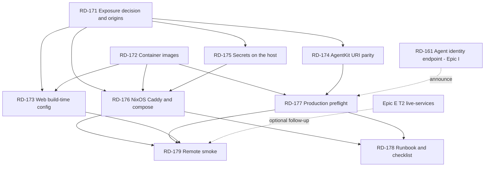

# Epic D — Demo Deployment

> Background only. You do **not** need this file to execute a ticket —
> `node scripts/backlog.mjs show RD-xxx` tells you what to load.
> Tickets live in `plan/tickets/`; status is in `plan/state.md`.

Parent index: `plan/backlog.md`. Prerequisite reading: `README.md` (env tables), `.env.example`,
`apps/web/.env.example`, `docs/world-agentkit.md`.

Not to be confused with `docs/sui-deployment.md`, which is about publishing the **Move package**.
This epic is about hosting the **three services** somewhere a visitor can open in a browser.

## Why This Epic Exists

Everything runs on `localhost` today. `pnpm demo:up` starts the provider on `:4021`, the agent on
`:4022`, and the web app on `:3000` (`scripts/demo-up.sh`), and that is the only way the system has
ever run. There is **no Dockerfile in the repository** and no host configuration of any kind.

The deployment target is a Hetzner VPS running NixOS, already on the user's headscale network, with
Caddy and a valid certificate already configured. The stated constraints, from the session that
produced this epic:

| Constraint | Consequence |
|---|---|
| A visitor may want to see it online | Headscale-only exposure is not sufficient. Someone outside the tailnet must be able to load the app. |
| The demo must run against real services, not mocks | `AGENTKIT_MODE=real`, `WALRUS_MODE=real`, `NEXT_PUBLIC_WALRUS_MODE=http`, `PROVIDER_STORE=postgres`. Every mock fallback in this repo is silent by design — see RD-177. |
| Deployment target is Sui **testnet** | No mainnet keys, no mainnet gas. The published package is the testnet one in `packages/contracts-config/testnet.json`. |
| Ease over cleanliness | Prefer one `docker compose up` on the host over an orchestrated pipeline. This epic does not build CI/CD. |

### The two things that will actually break

Most of this epic is ordinary containerization. Two items are not, and both fail in ways that look
like something else:

**1. The AgentKit header is bound to the exact request URL.** The agent signs
`${PROVIDER_API_URL}${path}` (`apps/agent/src/providerClient.ts:46,50`), putting that absolute URL in
the payload's `uri` and `resources` and the bare hostname in `domain`
(`apps/agent/src/agentkitSigner.ts:68-78`). The provider validates against `c.req.url` — the URL *as
the Node server saw it* (`apps/provider-api/src/middleware/agentkit.ts:12`). On localhost these are
the same string. Behind Caddy terminating TLS they are not: the agent signs
`https://api.example/...` while the provider reconstructs `http://…:4021/...`. The failure is
`401 AGENTKIT_UNVERIFIED` with no indication that a scheme mismatch caused it. That is RD-174, and it
is the single highest-risk ticket in the epic.

**2. `NEXT_PUBLIC_*` is inlined at build time.** Next.js bakes these into the bundle
(`README.md:142`, `apps/web/.env.example`). The web image is therefore **origin-specific** — an image
built with `NEXT_PUBLIC_PROVIDER_API_URL=http://localhost:4021` will have every browser on the public
internet trying to reach the visitor's own laptop. Changing the origin means rebuilding the image, not
restarting it. That is RD-173.

### The mode-mismatch failure already observed

Running `pnpm demo:up`, uploading a packet, then clicking *Start run* produced:

```
Run failed: Provider API /listings/listing_lisbon_eligible/applications
returned 401: AGENTKIT_UNVERIFIED
```

with the agent reporting `agentkit: mock`. Tracked as **RD-180** (`plan/backlog.md` → *Open Thread*),
deferred until after this epic. The verifier is chosen by a single string comparison —
`mode === "real" ? real : mock` (`packages/agentkit/src/server.ts:118`) — and the mock verifier
requires `x-demo-*` headers while the real one requires an `agentkit` header. An agent in mock mode
talking to a provider in real mode sends the wrong header set and gets exactly that 401. Nothing logs
the disagreement unless `AGENTKIT_DEBUG=1`. **This is a local bug, not a deployment bug, but it is the
same class of failure the deployment will hit at a larger blast radius** — RD-177 exists to make both
impossible to ship.

## What This Epic Does Not Do

| Option | Why not |
|---|---|
| CI/CD pipeline, image registry, automated rollout | The deploy is a demo with one operator and one host. `docker compose up -d` over SSH is the right size. Revisit only if the demo outlives the event. |
| Kubernetes, Nomad, or any scheduler | Three containers and a Postgres. |
| A NixOS module that builds the apps from source | The repo is developed on Arch inside distrobox and `AGENTS.md` forbids assuming Nix for repo tooling. `deploy/` is the **only** directory where NixOS-specific configuration belongs, and even there it should be thin — Caddy vhosts and a systemd unit that calls `docker compose`. |
| Horizontal scaling, health-check-driven restarts, zero-downtime deploys | One visitor at a time. `restart: unless-stopped` is the entire availability story. |
| Migrating off testnet | Out of scope and explicitly not wanted. |
| Fixing the `AGENTKIT_UNVERIFIED` mode mismatch | A local configuration bug, not a deploy task. It is tracked as **RD-180** in `plan/backlog.md` → *Open Thread*, and the user has deferred it until after this epic. RD-177 **detects** it; it does not fix it. Do not let this epic block on it — but see the risk table for what it costs RD-179. |

## Rules For Every Ticket In This Epic

| Rule | Requirement |
|---|---|
| One origin table | RD-171 produces the canonical origin strings. Every other ticket reads them from there. No ticket invents a hostname. |
| Build-time vs run-time | Before adding any configuration value, decide which it is. `NEXT_PUBLIC_*` is build-time and cannot be changed by restarting a container. Everything else is run-time. State which one in the ticket. |
| No secret in an image layer | See RD-175. The user is willing to bake secrets in for convenience; the cheaper option is a root-owned `env_file` on the host, which is *less* work than baking and keeps the image safe to rebuild and copy around. |
| Mocks fail the deploy | A production start that silently falls back to a mock is a demo that lies on stage. Every mode must be asserted at startup, not discovered at demo time. |
| The local path keeps working | `pnpm demo:up` must still work unchanged after every ticket. Containerization is additive — do not move the apps' entry points or rewrite their `start` scripts to require Docker. |
| Integration integrity | The deployed instance is the one visitors see. If Walrus or Seal is running mocked there, the UI label must say so, per `plan/backlog.md` → Coordination Rules. |
| Secrets discipline | `deploy/` must contain no key material. Only `*.example` files are committed. Verify with `git status` before every commit in this epic. |

## Ticket Index

| ID | Title | Lane | Deps |
|---|---|---|---|
| RD-171 | Public exposure decision and canonical origin table | L0 | none — **needs a user decision** |
| RD-172 | Container images for web, provider API, and agent | L0 | none |
| RD-173 | Web image build-time configuration and origin guard | L0 / L7 | RD-171, RD-172 |
| RD-174 | AgentKit resource-URI parity behind the reverse proxy | L3 Provider | RD-171 |
| RD-175 | Secrets and environment on the host | L0 | RD-171 |
| RD-176 | NixOS host wiring — Caddy, compose unit, tailnet | L0 | RD-171, RD-172 |
| RD-177 | Production preflight — fail loudly on any mock or mode mismatch | L0 / L8 | RD-172 |
| RD-178 | Hosting runbook, rollback, and pre-demo checklist | L9 Docs | RD-176, RD-177 |
| RD-179 | Remote smoke against the deployed origin | L10 QA | RD-176, RD-177 |

RD-172 and RD-174 are the natural first wave: different directories, no shared files, and RD-174 is
the long pole. RD-171 gates almost everything but is a decision plus one committed table — do it first
and it costs an hour.

---

## Dependency Graph



## Parallel Execution Plan

Three agents at the widest point. The epic is gated at both ends — RD-171 is a decision everything
reads, and RD-176 is a single host only one agent can touch.

| Wave | Agents | Tickets | Notes |
|---|---:|---|---|
| 0 | 1 | RD-171 | A decision plus one table. Needs the user; everything downstream needs it. Do not start Wave 1 tickets that consume origins until this lands — RD-172 is safe to start in parallel because it consumes none. |
| 1 | 2 | **A** RD-172 · **B** RD-174 | `deploy/` and `apps/provider-api/src/middleware/`. Zero shared files, and RD-174 is the long pole — start it early. |
| 2 | 2 | **A** RD-173 · **B** RD-175 | Both read the origin table; A owns the Dockerfile's web stage, B owns the env example. |
| 3 | 1 | RD-176 | One host, one operator. Serialize. |
| 4 | 2 | **A** RD-177 · **B** RD-178 (draft) | The preflight can be written and unit-tested before the host exists; the runbook's troubleshooting table needs RD-177's messages, so B drafts and finishes after A. |
| 5 | 1 | RD-179 | Needs everything live. Live-spend gated. |

### Contended Files

| File | Wanted by | Rule |
|---|---|---|
| `deploy/Dockerfile` | RD-172, RD-173 | RD-172 creates it, RD-173 extends the web stage. Strictly sequential. |
| `deploy/docker-compose.yml` | RD-172, RD-173, RD-175, RD-177 | RD-172 creates it; the rest add one section each. Announce, do not serialize — the edits are in different blocks. |
| `apps/agent/src/server.ts` | RD-175 (public-agent case only), Epic I RD-161 | Check RD-161's status first; if it is in flight, defer the token to after it lands. |
| `apps/agent/src/checkEnv.ts` | RD-177 | Sole owner within this epic. |
| `packages/contracts-config/testnet.json` | RD-179, plus RD-115/RD-123/RD-133 | Append-only blocks; announce before writing. |
| `AGENTS.md` | RD-178, plus Epic E RD-152 and Epic I RD-165 | Announce; the edits are in different sections. |
| `README.md` | RD-174, RD-178 | Different sections (env table vs docs links). Announce. |

## Known Risks

| Risk | Owner | Mitigation |
|---|---|---|
| `AGENTKIT_UNVERIFIED` on the deployed host after everything looks healthy | RD-174 | The URI-parity fix plus the startup log of the effective base. Do not debug this by disabling AgentKit verification — that deletes the World half of the demo. |
| Web image baked with `localhost` origins; works for the operator, broken for visitors | RD-173 | Build-time guard and the bundle grep in RD-179. |
| Agent origin tailnet-only means the visitor cannot press *Start run* | RD-171 | Decide before RD-176, not on the day of a live demo. Re-verify in RD-176's acceptance criteria. |
| Deployed instance silently running a mock | RD-177 | Hard startup failure on every mode assertion. |
| Agent Sui address runs out of testnet gas mid-demo | RD-178 | Balance check in the pre-demo checklist; top up the night before. |
| Walrus blob expires between upload and the landlord's read | RD-175, RD-177 | `AGENT_ACCESS_WINDOW_DAYS` strictly inside `WALRUS_EPOCHS`, asserted at startup rather than trusted. |
| First `docker compose build` on a small VPS is slow enough to derail a demo | RD-176 | Build and warm the images at least a day ahead; never let the day of a live demo be the first build. |
| The unresolved local `AGENTKIT_UNVERIFIED` mode mismatch is still open | **RD-180**, outside this epic | Tracked as an Open Thread in `plan/backlog.md`, deferred until after this epic by the user's decision. RD-177 detects the class at startup; detection is not a fix, and **RD-179's live run will fail the same way until RD-180 is resolved.** Do not let RD-179 be the place this is discovered. |

## Definition Of Done

1. A visitor on the open internet opens one URL and sees the working application.
2. The renter creates a mandate, uploads a packet, and starts an agent run entirely through the deployed origin — no localhost, no tunnel on the visitor's side.
3. That run reserves against the provider with a real AgentKit header, verified against the public URL, and submits a real transaction to Sui testnet. Its digest and receipt ID are recorded in `packages/contracts-config/testnet.json`.
4. No service on the deployed host is running a mock, and the preflight would have refused to start if one were.
5. Only Caddy listens on a public interface; no private key exists in any image layer or git object.
6. The stack survives a reboot without manual intervention.
7. `docs/hosting.md` takes a reader from a clean VPS to that URL, and its troubleshooting table names a file or variable for every symptom listed.
8. `pnpm demo:up` still works unchanged on a developer machine.
