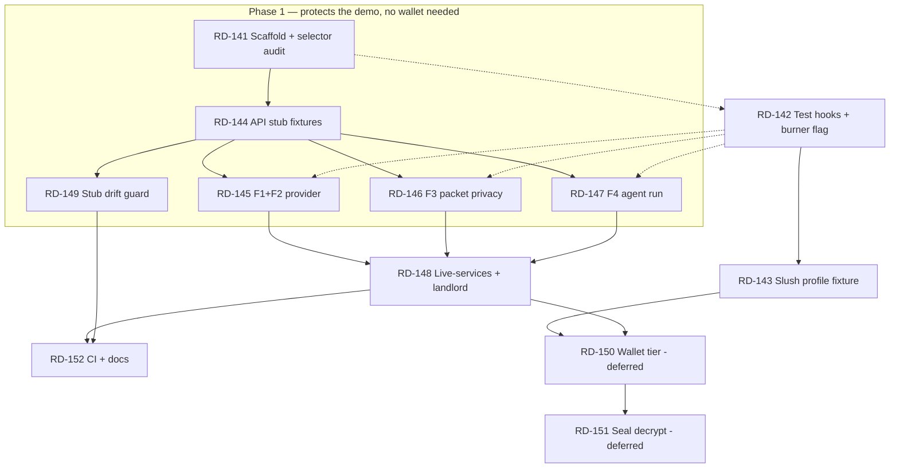

# Epic E — Playwright E2E Tests

> Background only. You do **not** need this file to execute a ticket —
> `node scripts/backlog.mjs show RD-xxx` tells you what to load.
> Tickets live in `plan/tickets/`; status is in `plan/state.md`.

Parent index: `plan/backlog.md`. Prerequisite reading: `docs/browser-testing.md`, `docs/demo-script.md`.

## Why This Epic Exists

Every subsystem has unit tests (143 JS/TS + 28 Move) and every claim in `docs/demo-script.md` has been
verified **by hand, once**. Nothing re-verifies the demo path after a change. The failure that matters
is not "a function returns the wrong value" — it is "the provider dashboard shows no listings on stage
because `next start` served a stale build", which no unit test can catch.

This epic covers the four flows that are actually demoed, in the browser, with the real app:

| # | Flow | Page | Why it is demo-critical |
|---|---|---|---|
| F1 | Role navigation | `/` | First thing shown on stage. |
| F2 | Provider: listings table + receipt verification | `/provider` | Sui receipt → `accepted` is the Sui proof surface. |
| F3 | Renter: encrypt and upload packet | `/renter` | "Plaintext never leaves the browser" — the privacy claim. |
| F4 | Agent operator: eligible run + ineligible refusal | `/agent` | "Sui limits what the agent can do" — the core message. |
| F5 | Landlord: on-chain receipt panel | `/landlord` | Receipt fields read live from testnet. |
| F6 | Renter: mandate create → status → revoke | `/renter` | Wallet-signed; revocation is the renter's stop control. |
| F7 | Landlord: Seal request-access → decrypt | `/landlord` | Browser-only by construction (RD-136); stretch. |

## Recommended Order — Start Here

**Do not work this epic front-to-back.** Recorded 2026-07-25, with the demo imminent and the last three
commits being demo fixes (explorer subdomain, provider dashboard refresh, Seal namespace) — exactly the
class of bug the first slice below would have caught.

### Phase 1 — the minimum slice that protects the demo (do this first)

| Order | Ticket | Why it is in the slice |
|---|---|---|
| 1 | RD-141 scaffold + selector audit | ~1 h; unblocks everything else |
| 2 | RD-147 agent run (F4) | This *is* the core message: the eligible run completes, Porto is refused |
| 3 | RD-145 provider + receipt verification (F1+F2) | Step 8 of `docs/demo-script.md`; guards the explorer-link fix |
| 4 | RD-146 packet privacy (F3) | Asserts the "plaintext never leaves the browser" claim |
| 5 | RD-149 stub drift guard | One second of vitest; the only thing stopping the stubs from rotting |

**The property that makes this slice cheap: none of these four flows needs a wallet.** Navigation, the
provider dashboard, the agent page, and `PacketBuilder`'s AES-GCM path never touch a connected account.
So RD-142 and RD-143 are **not** prerequisites here — the expensive wallet work is the optional part of
this epic, not its foundation. Pull RD-142 in only if RD-141's audit reports a `NEEDS TESTID` that a
scoped text selector cannot cover.

### Phase 2 — after the demo, if the tests are earning their keep

RD-148 (live services), RD-152 (CI + docs), then RD-142 + RD-143 when a wallet-gated flow actually needs
covering.

### Deferred, with reasons

| Ticket | Why it is not worth doing yet |
|---|---|
| RD-150 wallet tier | Spends real gas, needs the user's Slush session, headed-only, never runs in CI. Real value — it covers the digest-vs-object-ID parsing trap `AGENTS.md` warns about — but not before a demo. |
| RD-151 Seal decrypt | Must build an entire new on-chain chain just to satisfy `ctx.sender() == receipt.landlord`, for proof the Move denial matrix already carries. Worst effort-to-evidence ratio in the epic. |

### The honest counter-argument

E2E tests are not what anyone evaluates this project on, and `AGENTS.md` still lists RD-014
(two-live-agent World proof) as PARTIAL. If integration-proof completeness matters more than demo
insurance, RD-014 is the better use of the same hours — this epic protects a demo that already works.

## The Central Constraint

**The app writes to Sui testnet through a wallet.** There is no hermetic way to fake that: the frontend
talks gRPC (`@mysten/sui` `SuiGrpcClient`) to `fullnode.testnet.sui.io:443`, and faking binary protobuf
responses in `page.route` is not a reasonable engineering investment for a demo repo. The repo rule
"never fake Sui" points the same way.

So this epic does **not** try to make one suite do everything. It defines three tiers, and every ticket
states which tier it belongs to.

| Tier | Playwright project | Browser context | External deps | Runs in CI | What it proves |
|---|---|---|---|---|---|
| **T1 stubbed** | `stubbed` | fresh, ephemeral | none — provider API and agent API intercepted by `page.route`; no chain access; dApp Kit's built-in burner wallet for account-gated UI | yes, on every push | UI wiring, state machines, privacy assertions, error paths |
| **T2 live-services** | `live-services` | fresh, ephemeral | real `provider-api` + `agent` servers via Playwright `webServer`; read-only testnet gRPC | on demand / nightly | The app talks to the real APIs and reads real on-chain objects |
| **T3 wallet** | `wallet` | **persistent — `.playwright-wallet-profile/`** | T2 plus the user's live Slush web-wallet session; **spends gas** | never automatically | Real wallet signing through Slush, `create_mandate`, `revoke_mandate`, `create_listing` |

T3 is under the repo's **live-spend gate** (`plan/backlog.md` → Coordination Rules): get the user's
explicit go-ahead before the first run. It also depends on a session only the user can renew, so it
`test.skip()`s — loudly, with the reason — when the profile is missing, locked, or its session has
expired. A skipped test is honest; a passing stub of a chain write is not.

### Rejected Alternatives

| Option | Why not |
|---|---|
| Localnet (`sui start`) + publish per run | Package/object IDs are compile-time constants in `packages/contracts-config`; making them env-overridable touches L0-owned canonical config that the demo, the agent, and the provider all read. Cost is high, and it would weaken the "one canonical ID source" invariant RD-115 established. Revisit only if chain writes must become hermetic. |
| Stubbing Sui gRPC in `page.route` | Binary protobuf request/response synthesis. Brittle, and a green test would prove nothing about the real client. |
| A hand-rolled Wallet Standard mock wallet | Unnecessary twice over: dApp Kit already ships `unsafeBurnerWalletInitializer` for the no-chain case, and the real Slush session in `.playwright-wallet-profile/` covers the signing case. A hand-rolled wallet would also prove nothing about the wallet path the demo actually uses. Keep it as a last-resort fallback only if the burner flag is rejected by L7. |
| `@vitest/browser` (already a devDep of `apps/web`) | Component-level, single-origin. Cannot orchestrate three servers, cross-origin stubs, and a wallet. |

---

## Architecture

New workspace package `apps/e2e` (`@casium/e2e`) — covered by the existing `apps/*` glob in
`pnpm-workspace.yaml`, so no workspace change is needed.

```
apps/e2e/
  package.json              scripts: e2e:stubbed, e2e:live, e2e:testnet, e2e:ui  (NO "test" script — see below)
  playwright.config.ts      three projects, webServer wiring, reporters
  tsconfig.json
  README.md                 how to run each tier, what each needs
  src/
    fixtures/
      test.ts               extended `test` export: composes wallet + stub fixtures
      providerApi.ts        page.route handlers for http://localhost:4021/**
      agentApi.ts           page.route handlers for http://localhost:4022/**
      data.ts               fixture payloads — IDs imported from @casium/contracts-config
      console.ts            console-error collector (see Log Hygiene below)
    wallet/
      profile.ts            persistent-context launch: profile path, SingletonLock check
      session.ts            slush:session preflight — decode exp, never log the token
      connect.ts            auto-connect detection + ConnectButton/"Slush" fallback, address read
      approve.ts            approveInSlush / rejectInSlush popup helpers (my.slush.app/dapp-request)
  specs/
    navigation.spec.ts          T1  F1
    provider-dashboard.spec.ts  T1  F2
    renter-packet.spec.ts       T1  F3
    agent-run.spec.ts           T1  F4
    live-services.spec.ts       T2  F2/F4/F5 against real servers
    landlord-receipt.spec.ts    T2  F5
    mandate-lifecycle.spec.ts   T3  F6
    listing-create.spec.ts      T3  F6
    seal-decrypt.spec.ts        T3  F7 (stretch)
```

**Do not define a `test` script in `apps/e2e/package.json`.** The root `pnpm -r --if-present test` would
pick it up and every existing `pnpm test` invocation would start browsers. E2E runs under its own
`pnpm e2e:*` scripts and its own root aliases.

### Wallet Strategy (the one non-obvious piece)

**The wallet is in the user profile directory.** `.playwright-wallet-profile/` is not an obstacle to
work around — it is the wallet. Nothing in this epic hand-rolls a signer for the signing tiers.

Verified against the installed packages, not assumed:

| Fact | Source | Consequence for tests |
|---|---|---|
| dApp Kit registers the **Slush web wallet** by default (`slushWalletConfig !== null` → `slushWebWalletInitializer`), and `apps/web/app/client-providers.tsx` passes no override | `@mysten/dapp-kit-core/dist/index.mjs` | The wallet appears with no app change. Its registered name is `"Slush"`. |
| `autoConnect` defaults to `true` with a 5 s `autoConnectTimeout` | same | With the profile loaded the app may connect **without any click**. Specs must assert the connected state and only click Connect if it did not. |
| The profile holds `mysten-dapp-kit:selected-wallet-and-address` **and** the Slush `slush:session` JWT under origin `http://localhost:3000` | inspected in `Default/Local Storage/leveldb` | **Serving on port 3000 is mandatory, not conventional.** Any other port and the session is invisible and Slush will demand a Google sign-in — which is the user's action, never an agent's. |
| The recorded account is `0x4541d030…` | same | It is **not** `PUBLISHER_ADDRESS` (`0x371321…`). Seeded listings and existing receipts use the publisher as landlord, so `/landlord` → "Your Applications" is legitimately **empty** for this wallet. See RD-148 and RD-151. |
| Signing opens a popup: `window.open('about:blank','_blank')` navigated to `https://my.slush.app/dapp-request`, then `postMessage`; the channel polls and rejects if the popup closes | `@mysten/window-wallet-core/dist/web-wallet-channel/dapp-post-message-channel.mjs` | Every signature needs `const popup = await page.waitForEvent('popup')` **before** the click resolves, then an approve click inside `popup`. A closed popup surfaces as a rejection, which is also how the refusal path gets tested. |
| Chromium locks a user-data-dir (`SingletonLock`) | Chromium | The T3 project runs `workers: 1`, and it cannot run while an opencode Playwright MCP session holds the same profile. Fail fast on the lock with that message. |

**Fixture shape** — `chromium.launchPersistentContext()` cannot be selected through a Playwright project
option, so T3 overrides the `context` fixture (worker-scoped) with a persistent launch pointed at
`E2E_WALLET_PROFILE` (default `.playwright-wallet-profile`). Provide alongside it:

- `walletSession` — a **preflight** that decodes the `exp` of the `slush:session` JWT and fails with
  `Slush session expired — the user must re-authenticate (docs/browser-testing.md)`. Fail fast; never
  print the token, and never attempt the sign-in.
- `walletAddress` — reads the connected address from the page instead of hardcoding it, so a profile
  re-auth to a different account does not silently break every spec.
- `approveInSlush(page, action)` — the popup helper above, plus a `rejectInSlush` that closes the popup.

**T1 needs no signatures at all** — it never executes a transaction. It only needs an account to exist so
that `MandateForm` and `ListingForm` render instead of their connect prompts. Use dApp Kit's built-in
burner: `createDAppKit({ enableBurnerWallet: … })`, env-gated so production is untouched (RD-142).

**No private key ever enters this harness.** There is no `E2E_SUI_PRIVATE_KEY`: the signing key stays
inside Slush, and gas comes from the profile's own account.

---

## Rules For Every Ticket In This Epic

| Rule | Requirement |
|---|---|
| Selectors | Prefer `getByRole` / `getByText` / `getByLabel` against the strings already in the components. Add a `data-testid` **only** when text is genuinely ambiguous, and only through RD-142 — no other ticket may edit `apps/web`. |
| No arbitrary waits | No `waitForTimeout`. Use web-first assertions and `expect.poll`. The `/agent` page polls the agent API every 2 s, so agent assertions need a ≥ 15 s expect timeout, not a sleep. |
| Object IDs | `scripts/check-object-ids.mjs` scans `apps/**/*.ts` and excludes only `*.test.ts` — Playwright `*.spec.ts` files **are** scanned. Import every ID from `@casium/contracts-config`. Run `pnpm lint:object-ids` before claiming a ticket done. |
| Dialogs | `RevokeButton` calls `window.confirm`; `PacketBuilder`'s round-trip check calls `alert`. Register `page.on('dialog', …)` **before** the click or the test hangs. |
| CORS preflight | The stubbed APIs are cross-origin (`:3000` → `:4021`/`:4022`) and POSTs send `content-type: application/json`, so the browser sends an `OPTIONS` preflight. Stub handlers must answer `OPTIONS` with `access-control-allow-origin: *`, `-methods`, `-headers` or every POST fails before your handler sees it. |
| Build-time env | Next.js inlines `NEXT_PUBLIC_*` at **build** time. A tier needing different modes (e.g. Seal) needs its own build, not a different runtime env. State the build command in the ticket. |
| Port 3000 | The Slush session in the profile is bound to origin `http://localhost:3000`. T2/T3 must serve there. If the port is busy, **stop** — do not fall back to 3001, the session will be gone. |
| Wallet profile | T1/T2 use fresh ephemeral contexts. T3 uses `.playwright-wallet-profile/` read-write, `workers: 1`. **Never delete it, never re-authenticate it, never sign in on the user's behalf** (`docs/browser-testing.md`). If it is missing, locked, or expired: skip with the reason. |
| Log hygiene | Sharper for T3 than for T1: this profile's console logs carry OAuth URLs and the user's email, and traces/videos capture the Slush popup and account identifiers. For the `wallet` project set `trace: 'off'`, `video: 'off'`, `screenshot: 'only-on-failure'`, keep artifacts local, and never attach them to a ticket, PR, or chat. Console assertions compare **single message strings**, never dumps. Add `apps/e2e/test-results/`, `apps/e2e/playwright-report/` to `.gitignore` (RD-141). |
| Secrets | No private key belongs in this harness — the signer is Slush. Never print or persist the `slush:session` JWT, and never copy the profile into a repo path or an artifact bundle. |
| Evidence | A ticket is done when its `Verification` row is satisfied by a real run — paste the Playwright summary line (`N passed`), not a claim. |

### Ports And Text Anchors (verified against current source)

| Service | Port | Notes |
|---|---|---|
| web | 3000 | `next build` then `next start` for T1/T2 stability; `dev` only for authoring |
| provider-api | 4021 | `PROVIDER_STORE=memory` default; listings are seeded (`listing_lisbon_eligible`, `listing_porto_ineligible`) |
| agent | 4022 | `/health`, `POST /runs` → `202 {runId,status:"running"}`, `GET /runs/:id` |

Anchors that exist today — use them, and if one changes, update the spec in the same commit:
`"Renter Dashboard"`, `"Provider Dashboard"`, `"Agent Operator"`, `"Landlord — Access Panel"`,
`"Encrypt and upload packet"`, `"Packet uploaded"`, `"Walrus blob ID"`,
`"[MOCK encryption — AES-GCM, key in browser only]"`, `"Start run"`, `"Running…"`, `"Agent online"`,
`"Agent offline:"`, stage labels `loading-mandate → evaluating → uploading → reserving → submitting →
verifying → complete`, `"Status: complete"`, `"Status: ineligible"`, `"Verify Sui receipt"`,
placeholders `"tx digest"` / `"receipt object ID (0x...)"`, `"No listings yet."`,
`"No applications yet. The agent will populate this once it submits."`, `"+ New listing"`,
`"Create mandate on testnet"`, `"Revoke mandate"`, `"✅ Mandate revoked."`, `"Loading mandate from
testnet…"`, `"✅ Active"` / `"⛔ Revoked"`, `"Request access (sign session key)"`, `"Decrypt packet"`,
`"Packet decrypted"`, `"Decryption failed:"`.

---

## Ticket Index

| ID | Title | Tier | Lane | Deps |
|---|---|---|---|---|
| RD-141 | E2E harness scaffold and selector audit | — | L10 | none |
| RD-142 | Test hooks (`data-testid`) and env-gated burner wallet in `apps/web` | — | L7 | RD-141 |
| RD-143 | Persistent Slush wallet-profile fixture | T3 | L10 | RD-141 |
| RD-144 | Provider and agent API stub fixtures | T1 | L10 | RD-141 |
| RD-145 | Flow F1+F2 — navigation, listings, receipt verification | T1 | L10 | RD-144 (RD-142 only if the audit demands a testid) |
| RD-146 | Flow F3 — renter packet upload and privacy assertions | T1 | L10 | RD-144 (RD-142 only if the audit demands a testid) |
| RD-147 | Flow F4 — agent run: complete / ineligible / offline | T1 | L10 | RD-144 (RD-142 only if the audit demands a testid) |
| RD-148 | Live-services tier and landlord receipt panel (F5) | T2 | L10 | RD-145..147 |
| RD-149 | Stub drift guard against the real provider API | T1 | L10 | RD-144 |
| RD-150 | Wallet tier — mandate lifecycle and listing create (F6) | T3 | L10 | RD-143, RD-148 |
| RD-151 | Seal landlord decrypt E2E (F7) | T3 | L6+L10 | RD-150 |
| RD-152 | CI workflow, root scripts, and docs | — | L9 | RD-145..149 |

New lane **L10 QA/E2E** owns `apps/e2e/`. Only RD-142 may touch `apps/web/`; only RD-152 may touch
`README.md`, `AGENTS.md`, `docs/`, and `.github/`.

---

## Dependency Graph

Solid edges are hard dependencies. Dotted edges are conditional — RD-142 is needed only if RD-141's
selector audit finds text selectors insufficient for that spec.



## Parallel Execution Plan

Useful concurrency here is **three agents**, matching the repo's existing guidance. Waves 1–3 are
Phase 1 from *Recommended Order* above; stop there if the demo is close.

| Wave | Phase | Agents | Tickets | Notes |
|---|---|---|---|---|
| 1 | 1 | 1 | RD-141 | Nothing else can start; it defines the config every other ticket edits. |
| 2 | 1 | 1 | RD-144 | Stub fixtures. No wallet work is needed to reach a green Phase 1. |
| 3 | 1 | 3 | RD-147 ‖ RD-145 ‖ RD-146 (+ RD-149 for whoever finishes first) | One spec file each, no shared edits. RD-147 first if only one agent is available. |
| 4 | 2 | 1 | RD-148, then RD-152 | Both touch shared files (`playwright.config.ts`, docs, CI); serialize them. |
| 5 | 2 | 1 | RD-142 → RD-143 | Only when a wallet-gated flow actually needs covering. RD-143 needs RD-142's burner flag for its T1 half. |
| 6 | deferred | 1 | RD-150 → RD-151 | Live-spend gated; one agent, sequential, with the user in the loop. **Never two agents at once here** — one Chromium at a time may hold the wallet profile, and that includes any interactive browser session the user or another agent has open. |

## Definition Of Done

### Phase 1 — the slice worth shipping before the demo

1. `pnpm test:e2e` (T1) is green from a clean clone and needs no servers, no wallet, and no network.
2. It covers F4 (agent complete + ineligible), F2 (listings + receipt verification), F3 (packet upload with the no-plaintext assertion), and F1 navigation.
3. `pnpm -r --if-present test` still runs only the pre-existing unit suites — no browser launches.
4. `pnpm lint:object-ids` is clean.
5. No artifact, log, key, or wallet profile is committed.

Phase 1 is a legitimate stopping point. If the epic never goes past it, the demo path is still guarded.

### Full epic

6. `pnpm test:e2e:live` (T2) is green with the three real servers and read-only testnet access.
7. T3 either passes through the real Slush wallet or skips with a specific reason (no profile, profile locked, session expired, `E2E_ALLOW_SPEND` unset) — never silently passes.
8. CI runs T1 on push and never spends gas or touches testnet writes.
