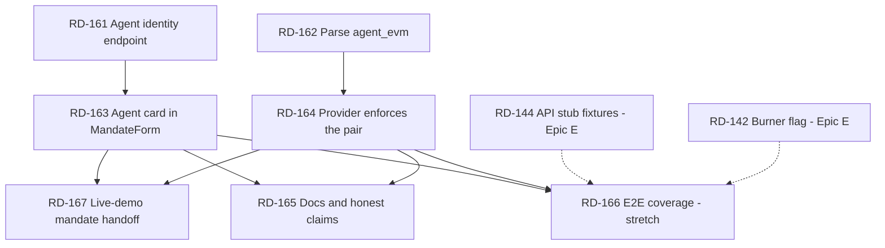

# Epic I — Agent Identity Binding

> Background only. You do **not** need this file to execute a ticket —
> `node scripts/backlog.mjs show RD-xxx` tells you what to load.
> Tickets live in `plan/tickets/`; status is in `plan/state.md`.

Parent index: `plan/backlog.md`. Prerequisite reading: `docs/world-agentkit.md`, `docs/provider-api.md`.

## Why This Epic Exists

The mandate carries **two** addresses for one agent — `agent_sui` and `agent_evm` — because the agent has
one identity per chain. Sui enforces the first. World AgentKit verifies the second. The core product
message ("World limits who the agent represents. Sui limits what the agent can do.") lives exactly in
that pair.

Today the pair is **entered by hand and never cross-checked.** Two independent problems:

| # | Problem | Evidence |
|---|---|---|
| 1 | **The renter is asked to author the agent's identity.** `MandateForm` has two free-text inputs: `agentSuiAddress` starts empty so it must be pasted, and `agentEvmAddress` is hardcoded to a demo constant. | `apps/web/src/components/MandateForm.tsx:37-38` |
| 2 | **`agent_evm` is write-only.** Nothing reads it — no Move getter, `submit_application` never touches it, `parseMandate` does not even parse it, and the provider compares the request against the AgentKit header, never against the mandate. | `packages/move/sources/rental.move` (no reader), `packages/sui-client/src/objects.ts:5-19`, `apps/provider-api/src/services/applications.ts:158` |

The two compound. Because nothing reads `agent_evm`, a wrong value has **no observable effect** — the
mandate is created, the agent runs, the demo passes, and the on-chain record of who was authorized is
simply wrong. A field whose mistakes are invisible must never be hand-typed.

The failure modes are asymmetric, which is what makes problem 2 the more serious half:

| Mistake | What happens today | Severity |
|---|---|---|
| Wrong `agent_sui` | Fails closed, loudly. `create_mandate` transfers the `AgentCap` to the typo'd address (`rental.move:171`) and `submit_application` aborts on `sender == mandate.agent_sui` (`rental.move:234`). The renter must revoke and recreate. | Annoying, self-announcing |
| Wrong `agent_evm` | **Nothing.** The mandate works. No abort, no rejection, no log line. | Silent — the one that matters |

There is also a standing honesty gap: `ERROR_CODES.MANDATE_EVM_MISMATCH` reads *"The verified EVM agent
does not match the Sui mandate"* (`packages/shared/src/errors.ts:32`), but the check behind it never
looks at the mandate. This epic makes that message true.

## What This Epic Does Not Do

**On-chain EVM enforcement is out of scope, deliberately.** Recording the rejected options so nobody
re-derives them:

| Option | Why not |
|---|---|
| Verify an EVM signature inside `submit_application` | The Move module would need secp256k1 recovery plus an AgentKit message format, and the agent submits from its **Sui** key — there is no EVM signature in that transaction to check. Wrong layer. |
| Add `mandate_agent_evm()` getter to `rental.move` | Would require a package upgrade (the RD-133 path) for a value TypeScript already reads straight out of the object's JSON fields. Cost is a live deploy; benefit is zero. If a future Move-side consumer needs it, fold the getter into whatever upgrade is already shipping. |
| Have the web app verify AgentBook registration before creating the mandate | AgentBook lookup is server-side in `packages/agentkit` and needs `AGENTKIT_EVM_RPC_URL`. Exposing it to the browser is a new surface for a check the provider already performs at reservation time. |

The enforcement point this epic chooses is **the provider's `reserve` call** (RD-164): it is the only
place that simultaneously holds an AgentKit-verified EVM signer, a Sui client, and the mandate ID. That
is where a mismatched pair becomes a 403 instead of a silent success.

## The Identity Pair — Source Of Truth

| Value | Authoritative source | Read by |
|---|---|---|
| `agentSuiAddress` | The agent process — `AGENT_SUI_ADDRESS`, or derived from `AGENT_SUI_PRIVATE_KEY` (`apps/agent/src/checkEnv.ts:9-29`) | Move (`sender` check), `AgentCap` transfer target, provider `mandateAgentSuiAddress` |
| `agentEvmAddress` | The agent's World registration — `AGENTKIT_DEMO_AGENT_EVM_ADDRESS` in mock mode; recovered from the `agentkit` header signature in live mode (`packages/agentkit/src/server.ts:80-88`) | Provider AgentBook lookup → `humanIdHash` → duplicate-human enforcement |

**The agent service already knows both.** That is the whole basis of RD-161: the values do not need to
be typed, they need to be *fetched*. `GET /health` already publishes `agentSuiAddress`
(`apps/agent/src/server.ts:63-74`) and the web app already polls it (`apps/web/app/agent/page.tsx:297`).

## Rules For Every Ticket In This Epic

| Rule | Requirement |
|---|---|
| Display, do not hide | The renter is signing a delegation of spending authority. Never remove the addresses from the UI — remove only the *authoring* of them. A renter who cannot see who they are authorizing is worse off than one who types it. |
| Self-assertion is not verification | The agent's `/health` asserts its own addresses. That is fine for prefilling a form and **not** fine as a security claim. Never label a fetched pair "verified" anywhere in the UI. Verification is RD-164's job, and it happens at the provider. |
| Fail loudly | Every check this epic adds must produce a specific error code and a user-visible message. Silently coercing, lowercasing away, or defaulting a mismatched address defeats the entire point of the epic. |
| Object IDs and addresses | `scripts/check-object-ids.mjs` scans `apps/**/*.ts` excluding `*.test.ts`. No address literal in app code — import from `@casium/contracts-config`. Run `pnpm lint:object-ids` before claiming a ticket done. |
| Integration integrity | Do not describe the binding as enforced until RD-164 lands. Until then the README and docs must say the mandate *records* the EVM identity. |
| Demo safety | The demo path (`docs/demo-script.md`) must keep working at every commit. RD-163 changes a form the demo drives; RD-164 adds a rejection that must not fire on the happy path. Both tickets carry a demo-regression check in their acceptance criteria. |

## Ticket Index

| ID | Title | Lane | Deps |
|---|---|---|---|
| RD-161 | Agent identity endpoint — publish the pair from the agent service | L8 Agent | none |
| RD-162 | Parse `agent_evm` in `parseMandate` and `RentalMandate` | L2 Sui TS | none |
| RD-163 | Replace the two address inputs with a fetched agent card | L7 Frontend | RD-161 |
| RD-164 | Provider enforces the mandate's on-chain identity pair at reserve | L3 Provider | RD-162 |
| RD-165 | Docs and honest-claim update for the identity binding | L9 Demo/docs | RD-163, RD-164 |
| RD-166 | E2E coverage — agent card and mismatch denial (stretch) | L10 QA/E2E | RD-163, RD-164, RD-144 |
| RD-167 | Live-demo mandate handoff UX — stop defaulting to smoke mandate | L7 Frontend | RD-163, RD-164 |

RD-161 and RD-162 are leaf work in different packages with no shared files — **the natural first wave,
two agents in parallel.**

---

## Dependency Graph

## Parallel Execution Plan

Two agents, two waves. The epic is small and its two halves are genuinely independent until they meet
at the docs.

| Wave | Agents | Tickets | Notes |
|---|---|---|---|
| 1 | 2 | **A** RD-161 · **B** RD-162 | Different packages (`apps/agent`, `packages/sui-client`), zero shared files. The cleanest split in the epic. |
| 2 | 2 | **A** RD-163 · **B** RD-164 | Frontend and provider. `applications.ts` is contended — B must confirm no Epic C/W ticket holds it before starting. A's browser verification is live-spend gated. |
| 3 | 1 | RD-165 | Needs both halves settled before any claim is written. |
| 4 | 1 | RD-167 | Frontend-only UX fix for real testnet demo; do before rehearsal. |
| 5 | 1 | RD-166 | Only once Epic E's scaffold exists; otherwise `DEFERRED`. |

### Contended Files

| File | Wanted by | Rule |
|---|---|---|
| `apps/provider-api/src/services/applications.ts` | RD-164, plus Epic C RD-110/117 and Epic W RD-126 | One owner at a time. Epic C is DONE, so RD-164 should have a clear run — confirm before starting. |
| `apps/web/src/components/MandateForm.tsx` | RD-163 only | Sole owner within this epic. |
| `apps/web/app/agent/page.tsx` | RD-163 (one import line), RD-167, Epic E RD-142 | RD-167 owns the live-demo handoff. Announce before touching if Epic E is live. |
| `apps/web/app/renter/page.tsx` | RD-167 | Sole owner for the handoff/stepper behavior. |
| `apps/web/src/components/PacketBuilder.tsx` | RD-167, prior Walrus/Seal work | Keep packet registration semantics intact; only add handoff callback/storage. |
| `apps/agent/src/server.ts` | RD-161 | Sole owner within this epic. |

## Definition Of Done

1. A renter creates a mandate without typing either address, and can still see both before signing.
2. The mandate's on-chain `agent_sui` provably equals the agent service's own configured address — verified by reading the created object back from testnet, not by inspection of the form.
3. A reserve call whose AgentKit-verified EVM signer does not match the mandate's on-chain `agent_evm` is rejected with 403 `MANDATE_EVM_MISMATCH`, demonstrated live against testnet.
4. `agent_evm` is read by at least one code path that can reject. It is no longer a write-only field.
5. `docs/world-agentkit.md` states which layer enforces which half of the pair, and says plainly that on-chain EVM enforcement is out of scope, with the reason.
6. The full demo path in `docs/demo-script.md` runs end to end unchanged apart from Step 4's simplified form.
7. The live demo path never silently defaults to a legacy smoke mandate; archived smoke IDs are evidence-only.
8. `pnpm -r --if-present test` and `build` are green; `pnpm lint:object-ids` is clean.
