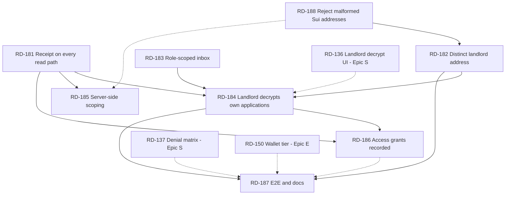

# Epic L — The Landlord Is A Real Party

> Background only. You do **not** need this file to execute a ticket —
> `node scripts/backlog.mjs show RD-xxx` tells you what to load.
> Tickets live in `plan/tickets/`; status is in `plan/state.md`.

Parent index: `plan/backlog.md`. Prerequisite reading: `docs/seal.md`, `docs/provider-api.md`.
Builds directly on Epic S (RD-131 … RD-138), which shipped the policy. This epic makes the app use it.

## Why This Epic Exists

The landlord is **load-bearing on chain and decorative in the app.**

On chain the role is the whole privacy claim. `RentalListing.landlord` is set at creation
(`packages/move/sources/rental.move:176`), copied into `ApplicationReceipt.landlord` at submit
(`rental.move:248`), and is the *sole identity gate* on document decryption — check 1 of
`seal_approve_packet` is `assert!(tx_context::sender(ctx) == receipt.landlord, ESEAL_WRONG_SENDER)`
(`rental.move:353`). The provider's verifier independently cross-checks
`receipt.landlord == application.landlordSuiAddress` (`apps/provider-api/src/services/suiVerifier.ts:104`).
Six Move tests prove the denial paths.

In the running application, none of that is exercised. Verified against the code before writing these
tickets:

| # | Gap | Evidence |
|---|---|---|
| 1 | **The decrypt UI is not wired to the landlord's own applications.** `PacketViewer` is rendered exactly twice, both inside the collapsed *Demo evidence* `
` for two hardcoded receipts. The wallet-connected "Your Applications" inbox never renders it. | `apps/web/app/landlord/page.tsx:130,149` vs `:99` |
| 2 | **The only action in the landlord inbox is a provider action.** `/landlord` reuses `ApplicationInbox` verbatim; its sole control is *Verify Sui receipt* → `POST /applications/:id/verify`, which flips status to `accepted`. Same component as `/provider`, no role differentiation. | `apps/web/src/components/ApplicationInbox.tsx:35-58,84-116` |
| 3 | **The receipt ID never reaches the landlord on the Postgres path.** Neither `dbGetApplication` nor `listAll`'s DB branch joins `sui_receipts`, so `receipt` is `undefined` for every accepted application. It is populated only in memory mode, by `verify` writing into a `Map`. | `apps/provider-api/src/services/applications.ts:110-130`, `:405-430` vs `:485` |
| 4 | **Scoping is cosmetic.** `GET /applications` is unauthenticated and returns everything; the page fetches all and filters client-side by connected address. | `apps/provider-api/src/routes/applications.ts:23`, `apps/web/app/landlord/page.tsx:69-71` |
| 5 | **Landlord and provider are the same address everywhere.** `landlordSuiAddress: PUBLISHER_ADDRESS` in demo listings, seeds, and E2E fixtures. `landlord.spec.ts` even comments that the agent and provider are the same address on these objects. | `services/listings.ts:27,39`, `db/seeds.ts:14,25`, `apps/e2e/src/fixtures/data.ts:88,101,123` |
| 6 | **Access-grant logging is built but dead.** `document_access_grants`, `createAccessGrant`, and both routes exist. Nothing in `apps/web` or `apps/agent` calls them — RD-136 asked for this and it was never wired. | `drizzle/0001_initial.sql:57`, `routes/applications.ts:76,99`, zero callers |
| 7 | **No test covers the real landlord path.** The live tier asserts the wallet-gated *empty* state, that two demo receipts render, and that the Seal button is **absent** (tier pinned to mock encryption). | `apps/e2e/specs/live/landlord.spec.ts:21-27,66-89` |

Gap 5 is what makes the rest unfalsifiable: when provider, landlord, and agent are one address, every
wallet that can act as one can act as all three, so `ESEAL_WRONG_SENDER` can never fire on the demo
path. The strongest guarantee in the system is currently untested by construction.

## What This Epic Does Not Do

| Option | Why not |
|---|---|
| Add authentication to the provider API | The provider has no session concept and adding one touches every route, the agent client, and all three E2E tiers. RD-185 adds *scoping* (a server-side filter) and says plainly in the docs that it is not *authorization*. A demo does not need auth; it does need to stop implying it has it. |
| Move landlord accept/reject on chain | `ApplicationReceipt.status` has exactly two states (`STATUS_SUBMITTED`, `STATUS_WITHDRAWN`) and adding a third means a package upgrade for a field no policy reads. Acceptance stays a provider-side record. |
| A separate landlord notification channel | Out of scope; the inbox polls on a 15s interval and that is sufficient for a demo. |
| Landlord-authored listings | The provider creates listings and names the landlord. Changing that inverts the data model for no demo gain. |

## Rules For Every Ticket In This Epic

| Rule | Requirement |
|---|---|
| Provider ≠ landlord | Once RD-182 lands, no new fixture, seed, or doc may reuse one address for both roles. A test that passes only because the addresses are equal is not a test. |
| Keys never leave the machine | The landlord wallet is created by an agent under a standing grant. Private keys, keystore files, and recovery phrases are never written to a file, a ticket, a log, or a commit. Addresses only. |
| Scoping is not authorization | Never label a filtered list "private", "authorized", or "access controlled" in UI or docs. The only real gate in this system is `seal_approve_packet`, and it lives in Move. |
| Plaintext stays in memory | Inherited from RD-136 and non-negotiable. A decrypted packet is never logged, persisted, or sent to the provider — including to the access-grant endpoint, which records *that* a decrypt happened, never *what* was read. |
| Mock labeling | `NEXT_PUBLIC_ENCRYPTION_MODE=mock` must keep showing the `seal-mode-alert` fallback banner and must not offer a Seal button it cannot complete. Every ticket that touches the packet panel re-checks this. |
| Object IDs and addresses | No address literal in app code — import from `@casium/contracts-config`. Run `pnpm lint:object-ids` before claiming a ticket done. |
| Demo safety | `docs/demo-script.md` must run end to end at every commit. RD-182 changes addresses the script names; RD-183 removes a button Step 8 clicks. Both carry a demo-regression check. |

## Wallet Provisioning — The Landlord Address Is The Agent's To Create

**Standing authorization, granted by the user on 2026-07-26.** The index's *Host Setup Boundary* makes
wallet creation a user action. For this one address the user has delegated it: **whoever takes RD-182
creates and funds the landlord Sui address themselves.** Do not wait for it to be handed over, and do
not ask again.

Scope of the grant, deliberately narrow:

| Permitted | Not permitted |
|---|---|
| `sui client new-address ed25519 landlord` on the demo machine | Touching, rotating, or re-funding any other wallet — publisher, renter, or agent |
| `sui client faucet` for that address on **testnet** | Any mainnet operation |
| Exporting the resulting **address** into `packages/contracts-config` | Committing a private key, keystore file, or recovery phrase — ever, in any form |

The address must be a Sui address (`0x` + 64 hex), distinct from `PUBLISHER_ADDRESS`, with its key in
the demo machine's `sui.keystore`. The landlord signs a Seal `SessionKey` in the browser, so an address
without its key can seed a listing but cannot decrypt anything. If `sui client new-address` prints a
recovery phrase, it stays in the terminal — it is never pasted into a file, a ticket, or a commit.

**Why it must be a Sui address.** The landlord is a Sui-only party:

| Consumer | Field | Type |
|---|---|---|
| `seal_approve_packet` check 1 (`rental.move:353`) | `receipt.landlord`, compared against `tx_context::sender(ctx)` | Sui address, 32 bytes |
| `submit_application` (`rental.move:248`) | copies `listing.landlord` onto the receipt | Sui address |
| Provider verifier (`suiVerifier.ts:104`) | `receipt.landlord == application.landlordSuiAddress` | Sui address |
| Seal `SessionKey` signature (RD-136) | signed by the connected Sui wallet | Sui keypair |

There is no landlord EVM field anywhere in the schema, on chain, or in the database, and none should be
added. EVM addresses in this project belong to **the agent only**, because World AgentKit verifies the
agent's human backing (`agentEvmAddress`, `packages/shared/src/schemas.ts:10,36`). Nothing in the
landlord path touches World, MetaMask, or World Chain.

**The confusion is silent today, which is why RD-188 exists.** `suiAddressSchema` is
`/^0x[a-fA-F0-9]+$/` with **no length constraint** (`packages/shared/src/schemas.ts:4`), so a 40-hex
EVM address passes listing validation, is stored, is copied onto the on-chain receipt, and fails only
much later — when the landlord's real Sui wallet does not match `receipt.landlord` and Seal refuses
with `ESEAL_WRONG_SENDER` (17). That abort names the sender check, not the malformed address, so the
demo would look like a policy denial when it is a typo.

---

## Dependency Graph

## Parallel Execution Plan

Three agents at the widest point. The provider chain and the frontend chain are independent until they
meet at RD-184, and RD-182 is a data/config change that touches neither component.

| Wave | Agents | Tickets | Notes |
|---|---:|---|---|
| 1 | 3 | **A** RD-181 · **B** RD-183 · **C** RD-188 → RD-182 | Provider service, web component, and schema/config. A and B share no files. RD-188 is small and lands first in lane C so RD-182 cannot seed a malformed address. Lane C creates the landlord wallet itself — no user hand-off, see *Wallet Provisioning*. |
| 2 | 2 | **A** RD-184 · **B** RD-185 | A is the epic's centerpiece and needs all of wave 1. B continues A's owner from RD-181 if `applications.ts` is still held. |
| 3 | 2 | **A** RD-186 · **B** RD-187 (specs only) | B can write the wallet-tier specs against RD-184's UI while A adds the grant write; B's doc pass waits for A. |
| 4 | 1 | RD-187 (docs) | Last, once every claim is settled. |

### Contended Files

| File | Wanted by | Rule |
|---|---|---|
| `apps/provider-api/src/services/applications.ts` | RD-181, RD-185, plus Epic C RD-110/117, Epic W RD-126, Epic I RD-164 | One owner at a time. Epic C is DONE; confirm RD-164 is not live before starting. |
| `apps/web/src/components/ApplicationInbox.tsx` | RD-183, RD-184, RD-186 | Same owner takes all three, in that order. |
| `apps/web/app/landlord/page.tsx` | RD-184, RD-185 (one query param) | RD-184 owns it; RD-185's edit is two lines — announce, do not serialize. |
| `apps/web/src/components/PacketViewer.tsx` | RD-186 | Sole owner. RD-184 should consume it unchanged; if it cannot, RD-184 takes it first. |
| `packages/contracts-config/testnet.json` | RD-182, plus RD-115/123/133/179 | Append-only blocks; announce before writing. |
| `apps/e2e/src/fixtures/data.ts` | RD-182, RD-187, plus Epic E | Announce; Epic E owns the tier scaffolding. |
| `.playwright-wallet-profile/` | RD-187, Epic E RD-150 | One run at a time. Wallet re-authentication is the user's action, never an agent's. |
| `docs/seal.md` | RD-182, RD-184, RD-186, RD-187 | RD-187 does the consolidating pass; earlier tickets append evidence only. |
| `packages/shared/src/schemas.ts` | RD-188 | Sole owner, but imported by every app — announce before starting. |

## Definition Of Done

1. A landlord connects a wallet, sees only applications on their own listings, and decrypts one in the browser after a single signature — with no hardcoded object ID involved.
2. A wallet that is not the receipt's landlord is refused, and the failure names `ESEAL_WRONG_SENDER` (17) on screen.
3. Provider and landlord are different addresses on the demo path, so criterion 2 is a real test rather than a tautology.
4. The landlord dashboard offers no provider controls; verification remains the provider's action.
5. An accepted application carries its receipt on every provider read path, in both memory and Postgres modes.
6. A successful decrypt leaves a `document_access_grants` row; a failed one does not; no plaintext ever leaves the browser.
7. `docs/provider-api.md` states plainly that `GET /applications` is unauthenticated and that landlord filtering is not authorization.
8. `docs/demo-script.md` Step 9 walks the live application, not a fixture, and names the wallet per tab.
9. An address of the wrong shape — an EVM address in a Sui field being the motivating case — is rejected by the API with a message naming the confusion, never by a Seal abort hours later.
10. `pnpm -r --if-present test` and `build` are green; `pnpm lint:object-ids` is clean.
