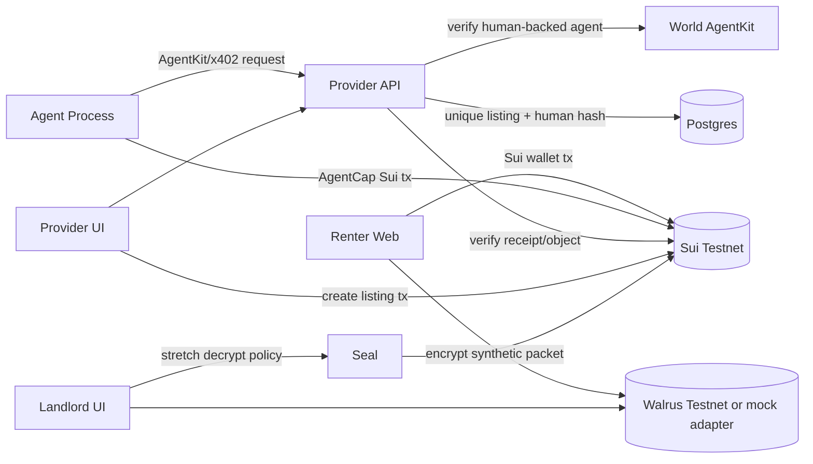
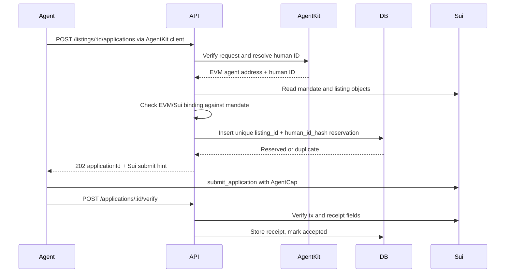

# RentDelegate Development Spec

This spec converts `plan/backlog.md` into an implementation contract for parallel agents. If this file conflicts with executable config added later, trust the executable config and update this spec.

## 1. Product Contract

| Item | Requirement |
|---|---|
| Working title | RentDelegate |
| Core message | “World limits who the agent represents. Sui limits what the agent can do.” |
| Demo goal | A renter authorizes an AI agent to submit rental applications under a scoped, inspectable, revocable Sui mandate. |
| World role | Verify a human-backed EVM agent and prevent the same World human from applying twice to the same listing. |
| Sui role | Enforce mandate scope, agent authorization, listing eligibility, application count, revocation, and receipts. |
| Privacy role | Store only encrypted synthetic application packets on Walrus; use Seal only as a stretch for policy-controlled landlord access. |

Non-goals: lease signing, rent/deposit payments, legal identity verification, credit scoring, production tenant screening, arbitrary listing scraping, real-world legal representation, and real identity or financial documents.

## 2. Source Of Truth And Ticket Mapping

| Source | Use |
|---|---|
| `plan/backlog.md` | Ticket IDs, dependency graph, ownership lanes, acceptance criteria. |
| `AGENTS.md` | Current repo state, environment constraints, coordination rules. |
| `spec/development-spec.md` | Interface and implementation contract for builders. |

Critical ticket order:

| Area | Required order |
|---|---|
| Skeleton/shared | RD-001 -> RD-002 |
| Sui | RD-003 -> RD-004 -> RD-005 -> RD-006 -> RD-007 -> RD-008 |
| Backend | RD-009 -> RD-010 -> RD-011 -> RD-013 |
| World | RD-012 -> RD-014 |
| Walrus | RD-101 -> RD-102 |
| UI/agent/E2E | RD-103, RD-104, RD-105 -> RD-106 -> RD-107 |
| Seal | RD-201 only after core demo is stable |

## 3. Repository Target State

Package manager: `pnpm` workspaces.

```text
apps/
  web/
  provider-api/
  agent/
packages/
  move/
  shared/
  sui-client/
  agentkit/
  walrus/
  seal/
  contracts-config/
scripts/
docs/
plan/
spec/
```

| Path | Responsibility | First ticket |
|---|---|---|
| `apps/web` | Renter, agent, provider, landlord demo UI | RD-103, RD-104 |
| `apps/provider-api` | Listing provider API, DB, AgentKit verification, receipt verification | RD-009 |
| `apps/agent` | Deterministic agent process | RD-105 |
| `packages/move` | Sui Move package | RD-003 |
| `packages/shared` | Zod schemas, constants, shared error codes | RD-002 |
| `packages/sui-client` | Sui object readers and PTB builders | RD-008 |
| `packages/agentkit` | AgentKit client/server wrappers | RD-012 |
| `packages/walrus` | Real and mock encrypted blob adapters | RD-101 |
| `packages/seal` | Seal stretch adapter | RD-201 |
| `packages/contracts-config` | Deployed package/object IDs | RD-007 |
| `scripts` | Deploy, seed, demo reset/run | RD-007, RD-106 |
| `docs` | README support docs and demo evidence | RD-107 |

## 4. Shared Constants And Schemas

### 4.1 Municipality Codes

```ts
export const MUNICIPALITIES = {
  LISBON: 1,
  OEIRAS: 2,
  CASCAIS: 3,
  AMADORA: 4,
  ALMADA: 5,
  PORTO_INELIGIBLE_DEMO: 6,
} as const;
```

### 4.2 Permission Flags

```ts
export const ACTION_SUBMIT_DOCS = 1n;
export const ACTION_WITHDRAW = 2n;
```

Do not add lease-signing or fund-transfer flags. Those actions are out of scope and must remain impossible.

### 4.3 Canonical IDs

| Field | Format | Source |
|---|---|---|
| `mandateId` | Sui object ID | `RentalMandate` |
| `ownerCapId` | Sui object ID | `OwnerCap` |
| `agentCapId` | Sui object ID | `AgentCap` |
| `listingObjectId` | Sui object ID | `RentalListing` |
| `receiptId` | Sui object ID | `ApplicationReceipt` |
| `applicationId` | `app_...` | Provider DB |
| `txDigest` | Sui tx digest | Sui RPC |
| `walrusBlobId` | Walrus blob ID or `mock:...` | Walrus adapter |
| `humanIdHash` | `sha256:...` or `hmac-sha256:...` | Provider API after AgentKit verification |

### 4.4 Zod Schema Targets

`packages/shared/src/schemas.ts` must define at least:

```ts
export const CreateMandateSchema = z.object({
  agentSuiAddress: z.string(),
  agentEvmAddress: z.string(),
  maxMonthlyRentEur: z.number().int().positive(),
  allowedMunicipalities: z.array(z.number().int().positive()).min(1),
  minBedrooms: z.number().int().min(0),
  expiresAtMs: z.number().int().positive(),
  remainingApplications: z.number().int().positive(),
  permittedActions: z.number().int().nonnegative(),
});

export const ReserveApplicationSchema = z.object({
  mandateId: z.string(),
  listingObjectId: z.string(),
  agentSuiAddress: z.string(),
  agentEvmAddress: z.string(),
  walrusBlobId: z.string(),
  packetHash: z.string(),
  accessExpiresAtMs: z.number().int().positive(),
  idempotencyKey: z.string().uuid(),
});

export const VerifyReceiptSchema = z.object({
  applicationId: z.string(),
  txDigest: z.string(),
  receiptId: z.string(),
});
```

## 5. System Architecture



Trust boundaries:

| Boundary | Rule |
|---|---|
| Renter to agent | Agent never receives renter wallet custody, `OwnerCap`, plaintext docs, lease authority, or fund-transfer authority. |
| Agent to provider | Provider accepts only AgentKit-verified requests. |
| Provider to Sui | Provider cannot override mandate checks; Move is final for scope. |
| Agent to listing data | Agent must use provider-created Sui `RentalListing` objects, not self-supplied attributes. |
| Walrus | Treat all blobs and blob IDs as public; upload ciphertext only. |
| World human ID | Hash immediately; store only `humanIdHash`. |

## 6. Sui Move Spec

### 6.1 Module

| Item | Value |
|---|---|
| Package path | `packages/move` |
| Module path | `rentdelegate::rental` unless implementation finds a better name before RD-004 consumers exist |
| Build command after RD-003 | `sui move build --path packages/move` |
| Test command after RD-003 | `sui move test --path packages/move` |

### 6.2 Objects

| Object | Ownership | Required fields |
|---|---|---|
| `RentalMandate` | Shared | `id`, `owner`, `agent_sui`, `agent_evm`, `max_monthly_rent_eur`, `allowed_municipalities`, `min_bedrooms`, `expires_at_ms`, `remaining_applications`, `revoked`, `permitted_actions`, `created_at_ms`, `metadata_version`, duplicate listing tracker if implemented |
| `OwnerCap` | Renter-owned | `id`, `mandate_id` |
| `AgentCap` | Agent-owned | `id`, `mandate_id`, `agent_sui` |
| `RentalListing` | Shared | `id`, `external_listing_id`, `provider`, `landlord`, `municipality`, `monthly_rent_eur`, `bedrooms`, `active`, `expires_at_ms`, `metadata_ref`, `created_at_ms` |
| `ApplicationReceipt` | Shared for MVP status updates | `id`, `mandate_id`, `listing_id`, `agent`, `provider`, `landlord`, `walrus_blob_id`, `packet_hash`, `submitted_at_ms`, `access_expires_at_ms`, `status`, `world_ref_hash` |

### 6.3 Functions

| Function | Actor | Must enforce |
|---|---|---|
| `create_mandate` | Renter | Future expiry; creates shared mandate, `OwnerCap` to renter, `AgentCap` to agent. |
| `create_listing` | Provider | Creates provider-controlled authoritative listing object. |
| `submit_application` | Agent | All mandate, listing, cap, sender, permission, allowance, and duplicate checks. Creates receipt and decrements allowance exactly once. |
| `revoke_mandate` | Renter | Requires `OwnerCap` and sender equals mandate owner. |
| `withdraw_application` | Renter | Requires `OwnerCap`; updates receipt status. |
| `rotate_agent` | Renter, optional P2/P1 | Requires `OwnerCap`; updates Sui/EVM addresses and creates new `AgentCap`. |
| `seal_approve` | Seal/client stretch | Read-only policy helper for landlord access. |

### 6.4 `submit_application` Preconditions

The Move implementation must abort unless all are true:

| Check | Source |
|---|---|
| Mandate not expired | `Clock` and `RentalMandate.expires_at_ms` |
| Mandate not revoked | `RentalMandate.revoked` |
| Listing active and not expired | `RentalListing` |
| Rent within max | `RentalListing.monthly_rent_eur <= RentalMandate.max_monthly_rent_eur` |
| Municipality allowed | `RentalListing.municipality in RentalMandate.allowed_municipalities` |
| Bedrooms sufficient | `RentalListing.bedrooms >= RentalMandate.min_bedrooms` |
| Agent has correct cap | `AgentCap.mandate_id == RentalMandate.id` |
| Cap agent matches mandate | `AgentCap.agent_sui == RentalMandate.agent_sui` |
| Sender is authorized agent | `tx_context::sender(ctx) == RentalMandate.agent_sui` |
| Allowance remains | `remaining_applications > 0` |
| Document submit allowed | `permitted_actions & ACTION_SUBMIT_DOCS != 0` |
| Same mandate/listing not already submitted | Duplicate tracker if implemented |

### 6.5 Events

| Event | Required fields |
|---|---|
| `MandateCreated` | `mandate_id`, `owner`, `agent_sui` |
| `ListingCreated` | `listing_id`, `provider`, `landlord` |
| `ApplicationSubmitted` | `receipt_id`, `mandate_id`, `listing_id`, `agent`, `remaining_applications` |
| `MandateRevoked` | `mandate_id`, `owner` |
| `ApplicationWithdrawn` | `receipt_id`, `mandate_id`, `listing_id` |

### 6.6 Move Test Matrix

| Test | Expected |
|---|---|
| Valid mandate creation | Shared mandate plus caps owned by correct addresses. |
| Valid listing creation | Shared listing with provider-controlled fields. |
| Successful application | Receipt created, allowance decremented once. |
| Rent above maximum | Abort. |
| Disallowed municipality | Abort. |
| Too few bedrooms | Abort. |
| Expired mandate | Abort. |
| Revoked mandate | Abort. |
| Zero allowance | Abort. |
| Wrong `AgentCap` | Abort. |
| `AgentCap` from another mandate | Abort. |
| Unauthorized sender | Abort. |
| Inactive listing | Abort. |
| Duplicate same mandate/listing | Abort if duplicate tracker is implemented. |
| Owner-only revoke | Non-owner aborts. |
| Withdrawal | Receipt status changes to withdrawn. |

## 7. Provider API Spec

### 7.1 Service

| Item | Requirement |
|---|---|
| App path | `apps/provider-api` |
| Framework target | Hono on Node.js with TypeScript |
| Database | Postgres with migrations, preferably Drizzle |
| Auth model | Agent submission endpoints require AgentKit verification; demo provider endpoints may be unauthenticated but must not be represented as production auth. |

### 7.2 Endpoints

| Method | Path | Actor | Behavior |
|---|---|---|---|
| `GET` | `/health` | DevOps/UI | Return service status and version/config mode without secrets. |
| `POST` | `/listings` | Provider | Create DB listing row tied to a Sui `RentalListing` object or return tx hint. |
| `GET` | `/listings` | Agent/UI | List active demo listings with Sui object IDs. |
| `GET` | `/listings/:id` | Agent/UI | Return one listing and Sui object ID. |
| `POST` | `/listings/:id/applications` | Agent | AgentKit-verified reservation and Sui submit hint. |
| `GET` | `/applications/:id` | Agent/provider/UI | Return application status, receipt, errors. |
| `POST` | `/applications/:id/verify` | Agent/provider | Verify Sui receipt after tx. |
| `POST` | `/applications/:id/withdraw` | Renter/provider/UI | Mark app withdrawn after Sui withdrawal verification. |

### 7.3 Database Schema

Required tables:

```sql
create table listings (
  id text primary key,
  sui_listing_id text unique not null,
  external_listing_id text not null,
  provider_sui_address text not null,
  landlord_sui_address text not null,
  municipality_code bigint not null,
  monthly_rent_eur bigint not null,
  bedrooms integer not null,
  active boolean not null default true,
  created_at timestamptz not null default now()
);

create table applications (
  id text primary key,
  listing_id text not null references listings(id),
  mandate_id text not null,
  agent_sui_address text not null,
  agent_evm_address text not null,
  human_id_hash text not null,
  walrus_blob_id text not null,
  packet_hash text not null,
  status text not null,
  idempotency_key text not null,
  error_code text,
  created_at timestamptz not null default now(),
  updated_at timestamptz not null default now(),
  unique (agent_evm_address, idempotency_key)
);

create table human_listing_usage (
  listing_id text not null references listings(id),
  human_id_hash text not null,
  application_id text not null references applications(id),
  created_at timestamptz not null default now(),
  primary key (listing_id, human_id_hash)
);

create table verified_agents (
  agent_evm_address text primary key,
  human_id_hash text not null,
  last_verified_at timestamptz not null,
  agentkit_metadata jsonb not null default '{}'
);

create table sui_receipts (
  receipt_id text primary key,
  application_id text not null references applications(id),
  tx_digest text not null unique,
  mandate_id text not null,
  listing_object_id text not null,
  submitted_at_ms bigint not null,
  raw_object jsonb not null,
  verified_at timestamptz not null default now()
);

create table document_access_grants (
  id text primary key,
  application_id text not null references applications(id),
  receipt_id text not null,
  requester_sui_address text not null,
  status text not null,
  expires_at timestamptz not null,
  created_at timestamptz not null default now()
);
```

### 7.4 Application Reservation Flow



### 7.5 Error Codes

| Code | HTTP | Meaning |
|---|---:|---|
| `AGENTKIT_UNVERIFIED` | 401 | AgentKit verification failed. |
| `DUPLICATE_HUMAN_LISTING` | 409 | Same World human already reserved or applied to listing. |
| `MANDATE_EVM_MISMATCH` | 403 | AgentKit EVM address does not match mandate EVM address. |
| `MANDATE_SUI_MISMATCH` | 403 | Request Sui agent address does not match mandate Sui address. |
| `LISTING_NOT_FOUND` | 404 | Provider listing ID not found. |
| `SUI_MANDATE_REJECTED` | 422 | Sui precheck or transaction rejection. |
| `RECEIPT_INVALID` | 422 | Receipt does not match application. |
| `IDEMPOTENCY_CONFLICT` | 409 | Same idempotency key with different payload. |

## 8. World AgentKit Spec

| Requirement | Implementation target |
|---|---|
| Agent registration | Register demo EVM agent address with AgentKit/AgentBook. |
| Agent requests | Use AgentKit client or `agentkit.fetch` equivalent for provider endpoint. |
| Provider verification | Hono middleware using AgentKit hooks or low-level verifier. |
| Human ID handling | Hash immediately; never store raw human ID. |
| Duplicate prevention | Enforce `primary key (listing_id, human_id_hash)` in `human_listing_usage`. |
| Downtime behavior | Return 503/401-style failure; do not bypass verification in sponsor demo. |

Required demo cases:

| Case | Expected |
|---|---|
| First verified agent application | Succeeds through reservation and Sui receipt verification. |
| Second agent backed by same human for same listing | Rejected with `DUPLICATE_HUMAN_LISTING`. |
| Agent backed by different human | Accepted if Sui mandate permits. |
| Unverified agent | Rejected before Sui submission. |
| Verified agent with invalid Sui mandate | AgentKit passes, Sui or backend binding rejects. |

## 9. Sui TypeScript Client Spec

`packages/sui-client` must provide these exports after RD-008:

```ts
export type RentDelegateConfig = {
  network: "testnet" | "localnet";
  rpcUrl: string;
  packageId: string;
};

export function createRentDelegateClient(config: RentDelegateConfig): RentDelegateClient;

export type RentDelegateClient = {
  getMandate(id: string): Promise<RentalMandate>;
  getListing(id: string): Promise<RentalListing>;
  getReceipt(id: string): Promise<ApplicationReceipt>;
  buildCreateMandateTx(input: CreateMandateInput): Transaction;
  buildCreateListingTx(input: CreateListingInput): Transaction;
  buildSubmitApplicationTx(input: SubmitApplicationInput): Transaction;
  buildRevokeMandateTx(input: RevokeMandateInput): Transaction;
  buildWithdrawApplicationTx(input: WithdrawApplicationInput): Transaction;
};
```

The client must not hide signer custody. Frontend signs renter/provider actions through wallet adapter. Agent signs agent actions with its own testnet key.

## 10. Walrus And Packet Privacy Spec

### 10.1 Packet Schema

Synthetic packet fields:

```ts
export type SyntheticApplicationPacket = {
  version: 1;
  generatedAt: string;
  disclaimer: "Synthetic demo data. Not real ID or financial data.";
  identityPlaceholder: { name: string; document: "SYNTHETIC_ID" };
  payslipPlaceholder: { employer: string; monthlyIncome: "synthetic" };
  employmentProof: string;
  rentalReferences: string[];
  coverLetter: string;
  proofOfFunds?: string | null;
};
```

### 10.2 Encryption

| Item | Requirement |
|---|---|
| Algorithm | AES-GCM through Web Crypto for MVP. |
| Plaintext location | Renter browser and authorized landlord browser only. |
| Stored blob | Ciphertext bytes only. |
| Onchain data | `walrus_blob_id`, `packet_hash`, access expiry, no plaintext. |
| Backend data | Blob ID, packet hash, status, no plaintext. |

### 10.3 Adapter Interface

```ts
export type WalrusUploadResult = {
  mode: "real" | "mock";
  blobId: string;
  objectId?: string;
  size: number;
};

export type WalrusAdapter = {
  upload(bytes: Uint8Array): Promise<WalrusUploadResult>;
  download(blobId: string): Promise<Uint8Array>;
  status(blobId: string): Promise<{ available: boolean; expiresAt?: string }>;
};
```

Mock blob IDs must start with `mock:` and the UI/README must label mock mode.

## 11. Seal Stretch Spec

Seal is not on the critical path. Implement only after RD-106 is stable.

Minimal policy inputs:

| Input | Purpose |
|---|---|
| `mandate` | Check not revoked. |
| `listing` | Check requester is landlord. |
| `receipt` | Check matching listing/mandate, submitted status, access expiry. |
| `requester` | Landlord Sui address. |
| `Clock` | Expiration check. |

Fallback if Seal is not completed: manual demo key exchange after provider receipt verification. Label as “Seal fallback mode”; do not claim real Seal access control.

## 12. Frontend Spec

| Route | Persona | Required capabilities |
|---|---|---|
| `/` | All | Demo overview, core message, links to role views. |
| `/renter` | Renter | Connect Sui wallet, create mandate, register agent addresses, build/upload encrypted packet, view allowance/applications, revoke mandate, withdraw application. |
| `/agent` | Agent/operator | Show mandate, eligible/ineligible listings, AgentKit status, submit application, show Sui tx and receipt. |
| `/provider` | Provider | Create/list demo listings, view applications, show World uniqueness status, verify Sui receipt. |
| `/landlord` | Landlord | Request packet access, show Seal or fallback mode, decrypt permitted packet if available. |

Transaction UX must show expected signer address, connected signer address, tx digest, object IDs, and readable error code.

## 13. Agent Spec

The agent is deterministic for authorization. LLM use is allowed only for summaries or explanations.

Allowed actions:

| Action | Constraint |
|---|---|
| Read mandate/listing objects | From Sui/provider API only. |
| Explain eligibility | Based on deterministic rule result. |
| Reserve application | Through AgentKit-authenticated provider request. |
| Submit Sui application | With agent-owned Sui key and `AgentCap`. |
| Verify receipt | Via provider API. |

Forbidden actions:

| Action | Reason |
|---|---|
| Sign lease | Out of scope. |
| Transfer funds | Out of scope. |
| Modify mandate | Owner-only. |
| Use renter wallet | Violates trust model. |
| Read plaintext documents | Agent does not need document contents. |
| Invent listing data | Move must validate provider-created listing. |
| Bypass AgentKit/provider API | Breaks World proof. |

## 14. Environment Variables

Do not commit real `.env` files.

Sui and Walrus are installed in `~/.local/bin/`, but that directory should not be exported into `PATH` for this repo. If `sui` or `walrus` are not found, invoke `~/.local/bin/sui` or `~/.local/bin/walrus` directly. Do not modify shell startup files.

### Web

```bash
NEXT_PUBLIC_PROVIDER_API_URL=http://localhost:4021
NEXT_PUBLIC_SUI_NETWORK=testnet
NEXT_PUBLIC_SUI_RPC_URL=https://fullnode.testnet.sui.io:443
NEXT_PUBLIC_PACKAGE_ID=0x...
NEXT_PUBLIC_WALRUS_MODE=mock
NEXT_PUBLIC_WALRUS_AGGREGATOR_URL=https://...
NEXT_PUBLIC_WALRUS_PUBLISHER_URL=https://...
NEXT_PUBLIC_SEAL_ENABLED=false
```

### Provider API

```bash
PORT=4021
DATABASE_URL=postgres://...
CORS_ORIGIN=http://localhost:3000
SUI_RPC_URL=https://fullnode.testnet.sui.io:443
SUI_PACKAGE_ID=0x...
AGENTKIT_MODE=free-trial
WORLD_CHAIN_ID=eip155:480
BASE_CHAIN_ID=eip155:8453
LOG_LEVEL=debug
```

### Agent

```bash
PROVIDER_API_URL=http://localhost:4021
SUI_RPC_URL=https://fullnode.testnet.sui.io:443
SUI_PACKAGE_ID=0x...
AGENT_SUI_PRIVATE_KEY_BASE64=REPLACE_WITH_TESTNET_ONLY_SECRET
AGENT_SUI_ADDRESS=0x...
AGENT_EVM_PRIVATE_KEY=REPLACE_WITH_TESTNET_ONLY_SECRET
AGENT_EVM_ADDRESS=0x...
MANDATE_ID=0x...
AGENT_CAP_ID=0x...
```

## 15. Commands

Commands are only authoritative after the corresponding manifests/scripts exist.

| Stage | Command |
|---|---|
| Workspace install after RD-001 | `pnpm install` |
| Workspace build after RD-001 | `pnpm -r --if-present build` |
| Workspace tests after RD-001 | `pnpm -r --if-present test` |
| Move build after RD-003 | `sui move build --path packages/move` |
| Move tests after RD-003 | `sui move test --path packages/move` |

If `sui` is not on `PATH`, use `~/.local/bin/sui move build --path packages/move` and `~/.local/bin/sui move test --path packages/move`. If `walrus` is not on `PATH`, use `~/.local/bin/walrus` for Walrus verification commands.

Do not add undocumented required command order unless executable config makes it true.

## 16. Observability Spec

Every provider API request should include or create a correlation ID.

Log fields:

| Field | Use |
|---|---|
| `correlationId` | Tie frontend, agent, backend, and Sui operations. |
| `applicationId` | Provider application state. |
| `listingId` | Provider listing ID. |
| `listingObjectId` | Sui listing object. |
| `mandateId` | Sui mandate object. |
| `receiptId` | Sui receipt object. |
| `txDigest` | Sui explorer/debug. |
| `agentEvmAddress` | AgentKit address. |
| `agentSuiAddress` | Sui authorized agent. |
| `humanIdHash` | Duplicate-human debug without raw ID. |
| `walrusBlobId` | Blob lookup. |

## 17. Development Acceptance Criteria

### 17.1 Core Demo Done

| Requirement | Done when |
|---|---|
| Renter mandate | Testnet `RentalMandate` exists and is visible from UI or script. |
| Agent authorization | Agent Sui address owns `AgentCap`; renter wallet is not used by agent. |
| Listing verification | Move validates provider-created `RentalListing` data. |
| World verification | At least one real AgentKit-verified flow succeeds. |
| Duplicate human | Same human/listing is rejected by DB uniqueness. |
| Sui enforcement | Valid listing succeeds; invalid listing fails in Move. |
| Receipt | `ApplicationReceipt` exists and provider verifies it. |
| Walrus | Real encrypted blob upload works or mock is clearly labeled. |
| Revocation | Renter revokes mandate; later submission fails. |
| Documentation | README includes setup, sponsor mapping, limitations, tx links, and synthetic-data disclaimer. |

### 17.2 Required Demo Failure Cases

| Case | Expected visible result |
|---|---|
| Unverified agent | Provider rejects before Sui tx. |
| Same World human, same listing | Provider returns duplicate-human rejection. |
| Rent above max | Sui Move abort or frontend displays precheck failure plus Move-backed rule. |
| Disallowed municipality | Sui Move abort or frontend displays precheck failure plus Move-backed rule. |
| Revoked mandate | Sui Move abort. |
| Wrong agent cap or signer | Sui Move abort. |

## 18. Security Rules

| Rule | Enforcement |
|---|---|
| No real documents | UI packet generator uses synthetic placeholders and warning. |
| No plaintext document upload | Walrus adapter accepts encrypted bytes only from UI flow. |
| No raw World human ID storage | Middleware hashes before DB write. |
| No renter wallet custody | Agent app requires its own Sui key and `AgentCap`. |
| No fake sponsor integrations | Sui and AgentKit final demo must be real; mocks only for Walrus/Seal and labeled. |
| No secrets in repo | `.gitignore` must exclude `.env`, wallet files, generated keys. |

## 19. Fallback Levels

| Level | Contents | Claim allowed |
|---|---|---|
| A | Sui, AgentKit, Walrus, Seal, frontend, API, agent | Full sponsor story. |
| B | Sui, AgentKit, encrypted Walrus, manual key exchange | Strong Sui/World; Seal not claimed. |
| C | Sui, AgentKit, mock encrypted blob adapter | Sui/World only; Walrus clearly mocked. |
| D | Sui mandate enforcement, provider listing objects, AgentKit verification, duplicate-human rejection, receipt, UI | Minimum core sponsor demo. |

Never fake Sui Move enforcement or World AgentKit verification in the final claimed demo.
