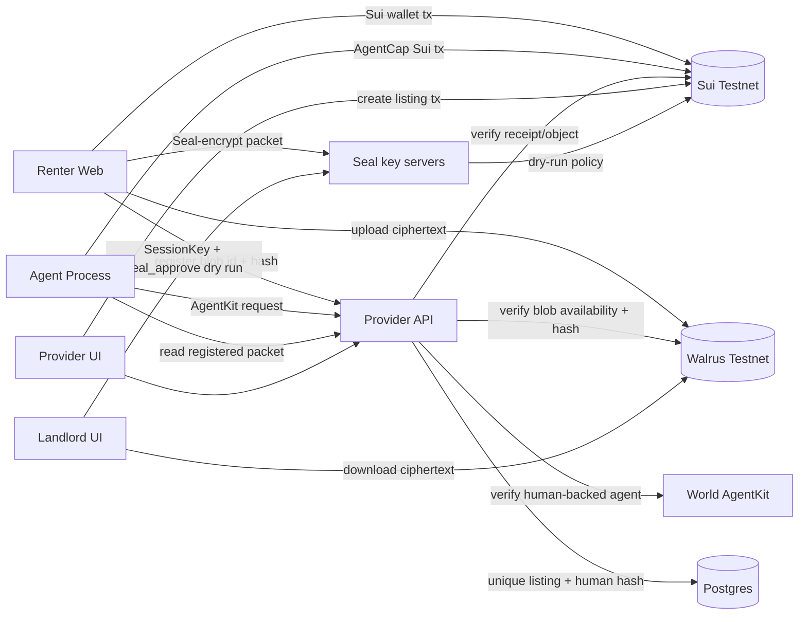
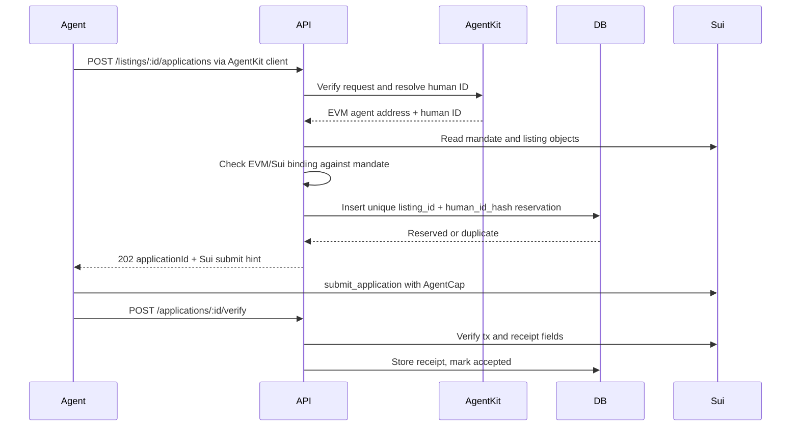

# RentDelegate Development Spec

This spec converts the backlog (`plan/backlog.md` and its epic files) into an implementation contract for parallel agents. If this file conflicts with executable config added later, trust the executable config and update this spec.

## 1. Product Contract

| Item | Requirement |
|---|---|
| Working title | RentDelegate |
| Core message | “World limits who the agent represents. Sui limits what the agent can do.” |
| Demo goal | A renter authorizes an AI agent to submit rental applications under a scoped, inspectable, revocable Sui mandate. |
| World role | Verify a human-backed EVM agent and prevent the same World human from applying twice to the same listing. |
| Sui role | Enforce mandate scope, agent authorization, listing eligibility, application count, revocation, and receipts. |
| Privacy role | Store only encrypted synthetic application packets on Walrus, and gate landlord decryption through a Seal policy enforced by Move. Both are required scope, not stretch. |

Non-goals: lease signing, rent/deposit payments, legal identity verification, credit scoring, production tenant screening, arbitrary listing scraping, real-world legal representation, and real identity or financial documents.

## 2. Source Of Truth And Ticket Mapping

| Source | Use |
|---|---|
| `plan/backlog.md` | Index, work lanes, dependency graph, parallel execution plan, file-ownership rules. |
| `plan/backlog-completion.md` | Epic C tickets — RD-109 … RD-118. |
| `plan/backlog-walrus.md` | Epic W tickets — RD-121 … RD-126. |
| `plan/backlog-seal.md` | Epic S tickets — RD-131 … RD-138. |
| `plan/backlog-identity.md` | Epic I tickets — RD-161 … RD-167. Agent identity binding and live-demo mandate handoff UX. |
| `plan/backlog-archive.md` | Completed RD-001 … RD-108. Evidence trail; do not edit. |
| `AGENTS.md` | Current repo state, environment constraints, coordination rules. |
| `spec/development-spec.md` | Interface and implementation contract for builders. |

Critical ticket order for remaining work:

| Area | Required order |
|---|---|
| Foundation | RD-115 (canonical IDs) and RD-131 (Seal identity decision) first, before lanes diverge |
| Provider | RD-109 -> RD-110 -> RD-117, RD-126 |
| Agent | RD-112 -> RD-111 -> RD-113 |
| Frontend | RD-114 -> RD-116, RD-136 |
| Identity UX | RD-161/RD-162 -> RD-163/RD-164 -> RD-165 -> RD-167; RD-166 is stretch coverage |
| Walrus | RD-121 -> RD-122 -> RD-123 -> RD-124, RD-126 |
| Seal | RD-131 -> RD-132 -> RD-133 -> RD-135 -> RD-136 -> RD-137 |
| Evidence | RD-138 last |

Completed order, for reference: RD-001 -> RD-002; RD-003 -> RD-008; RD-009 -> RD-013; RD-012 ->
RD-014; RD-101 -> RD-102; RD-103/RD-104/RD-105 -> RD-106 -> RD-107 -> RD-108.

## 3. Repository Target State

Package manager: `pnpm` workspaces.

```text
apps/
  web/
  provider-api/
  agent/
packages/
  move/
  shared/
  sui-client/
  agentkit/
  walrus/
  seal/
  contracts-config/
scripts/
docs/
plan/
spec/
```

| Path | Responsibility | First ticket |
|---|---|---|
| `apps/web` | Renter, agent, provider, landlord demo UI | RD-103, RD-104; `/agent` route in RD-116 |
| `apps/provider-api` | Listing provider API, Postgres, AgentKit verification, receipt and blob verification | RD-009; persistence in RD-109 |
| `apps/agent` | Deterministic agent process and run service | RD-105, RD-108; service mode in RD-113 |
| `packages/move` | Sui Move package including the Seal policy function | RD-003; `seal_approve` in RD-132 |
| `packages/shared` | Zod schemas, constants, shared error codes, Seal identity derivation | RD-002; identity in RD-131 |
| `packages/sui-client` | Sui object readers, PTB builders, `AgentCap` discovery | RD-008; discovery in RD-112 |
| `packages/agentkit` | AgentKit client/server wrappers | RD-012 |
| `packages/walrus` | Mock, CLI, and HTTP encrypted blob adapters | RD-101; HTTP adapter in RD-122 |
| `packages/seal` | Seal client wrapper — encryption, key servers, session keys | RD-134 |
| `packages/contracts-config` | Deployed package/object IDs. The **only** place object ID literals may appear | RD-007; enforced by RD-115 |
| `scripts` | Deploy, seed, demo reset/run, live smokes | RD-007, RD-106, RD-123, RD-137 |
| `docs` | README support docs and demo evidence | RD-107, RD-138 |

## 4. Shared Constants And Schemas

### 4.1 Municipality Codes

```ts
export const MUNICIPALITIES = {
  LISBON: 1,
  OEIRAS: 2,
  CASCAIS: 3,
  AMADORA: 4,
  ALMADA: 5,
  PORTO_INELIGIBLE_DEMO: 6,
} as const;
```

### 4.2 Permission Flags

```ts
export const ACTION_SUBMIT_DOCS = 1n;
export const ACTION_WITHDRAW = 2n;
```

Do not add lease-signing or fund-transfer flags. Those actions are out of scope and must remain impossible.

### 4.3 Canonical IDs

| Field | Format | Source |
|---|---|---|
| `mandateId` | Sui object ID | `RentalMandate` |
| `ownerCapId` | Sui object ID | `OwnerCap` |
| `agentCapId` | Sui object ID | `AgentCap` |
| `listingObjectId` | Sui object ID | `RentalListing` |
| `receiptId` | Sui object ID | `ApplicationReceipt` |
| `applicationId` | `app_...` | Provider DB |
| `txDigest` | Sui tx digest | Sui RPC |
| `walrusBlobId` | Walrus blob ID or `mock:...` | Walrus adapter |
| `humanIdHash` | `sha256:...` or `hmac-sha256:...` | Provider API after AgentKit verification |

### 4.4 Zod Schema Targets

`packages/shared/src/schemas.ts` must define at least:

```ts
export const CreateMandateSchema = z.object({
  agentSuiAddress: z.string(),
  agentEvmAddress: z.string(),
  maxMonthlyRentEur: z.number().int().positive(),
  allowedMunicipalities: z.array(z.number().int().positive()).min(1),
  minBedrooms: z.number().int().min(0),
  expiresAtMs: z.number().int().positive(),
  remainingApplications: z.number().int().positive(),
  permittedActions: z.number().int().nonnegative(),
});

export const ReserveApplicationSchema = z.object({
  mandateId: z.string(),
  listingObjectId: z.string(),
  agentSuiAddress: z.string(),
  agentEvmAddress: z.string(),
  walrusBlobId: z.string(),
  packetHash: z.string(),
  accessExpiresAtMs: z.number().int().positive(),
  idempotencyKey: z.string().uuid(),
});

export const VerifyReceiptSchema = z.object({
  applicationId: z.string(),
  txDigest: z.string(),
  receiptId: z.string(),
});
```

## 5. System Architecture



Trust flow in one line: the renter's plaintext never leaves their browser; the ciphertext is public
on Walrus; the *key* is released only when Move says this landlord may read this application now.

Trust boundaries:

| Boundary | Rule |
|---|---|
| Renter to agent | Agent never receives renter wallet custody, `OwnerCap`, plaintext docs, lease authority, or fund-transfer authority. |
| Agent to provider | Provider accepts only AgentKit-verified requests. |
| Provider to Sui | Provider cannot override mandate checks; Move is final for scope. |
| Agent to listing data | Agent must use provider-created Sui `RentalListing` objects, not self-supplied attributes. |
| Walrus | Treat all blobs and blob IDs as public; upload ciphertext only. |
| World human ID | Hash immediately; store only `humanIdHash`. |

## 6. Sui Move Spec

### 6.1 Module

| Item | Value |
|---|---|
| Package path | `packages/move` |
| Module path | `rentdelegate::rental` unless implementation finds a better name before RD-004 consumers exist |
| Build command after RD-003 | `sui move build --path packages/move` |
| Test command after RD-003 | `sui move test --path packages/move` |

### 6.2 Objects

| Object | Ownership | Required fields |
|---|---|---|
| `RentalMandate` | Shared | `id`, `owner`, `agent_sui`, `agent_evm`, `max_monthly_rent_eur`, `allowed_municipalities`, `min_bedrooms`, `expires_at_ms`, `remaining_applications`, `revoked`, `permitted_actions`, `created_at_ms`, `metadata_version`, duplicate listing tracker if implemented |
| `OwnerCap` | Renter-owned | `id`, `mandate_id` |
| `AgentCap` | Agent-owned | `id`, `mandate_id`, `agent_sui` |
| `RentalListing` | Shared | `id`, `external_listing_id`, `provider`, `landlord`, `municipality`, `monthly_rent_eur`, `bedrooms`, `active`, `expires_at_ms`, `metadata_ref`, `created_at_ms` |
| `ApplicationReceipt` | Shared for MVP status updates | `id`, `mandate_id`, `listing_id`, `agent`, `provider`, `landlord`, `walrus_blob_id`, `packet_hash`, `submitted_at_ms`, `access_expires_at_ms`, `status`, `world_ref_hash` |

### 6.3 Functions

| Function | Actor | Must enforce |
|---|---|---|
| `create_mandate` | Renter | Future expiry; creates shared mandate, `OwnerCap` to renter, `AgentCap` to agent. |
| `create_listing` | Provider | Creates provider-controlled authoritative listing object. |
| `submit_application` | Agent | All mandate, listing, cap, sender, permission, allowance, and duplicate checks. Creates receipt and decrements allowance exactly once. |
| `revoke_mandate` | Renter | Requires `OwnerCap` and sender equals mandate owner. |
| `withdraw_application` | Renter | Requires `OwnerCap`; updates receipt status. |
| `rotate_agent` | Renter, optional P2 | Requires `OwnerCap`; updates Sui/EVM addresses and creates new `AgentCap`. |
| `seal_approve_packet` | Seal key servers, on behalf of the landlord | Non-`public` `entry fun`; first parameter `id: vector<u8>`; aborts unless every landlord-access condition in §11.3 holds. |

### 6.4 `submit_application` Preconditions

The Move implementation must abort unless all are true:

| Check | Source |
|---|---|
| Mandate not expired | `Clock` and `RentalMandate.expires_at_ms` |
| Mandate not revoked | `RentalMandate.revoked` |
| Listing active and not expired | `RentalListing` |
| Rent within max | `RentalListing.monthly_rent_eur <= RentalMandate.max_monthly_rent_eur` |
| Municipality allowed | `RentalListing.municipality in RentalMandate.allowed_municipalities` |
| Bedrooms sufficient | `RentalListing.bedrooms >= RentalMandate.min_bedrooms` |
| Agent has correct cap | `AgentCap.mandate_id == RentalMandate.id` |
| Cap agent matches mandate | `AgentCap.agent_sui == RentalMandate.agent_sui` |
| Sender is authorized agent | `tx_context::sender(ctx) == RentalMandate.agent_sui` |
| Allowance remains | `remaining_applications > 0` |
| Document submit allowed | `permitted_actions & ACTION_SUBMIT_DOCS != 0` |
| Same mandate/listing not already submitted | Duplicate tracker if implemented |

### 6.5 Events

| Event | Required fields |
|---|---|
| `MandateCreated` | `mandate_id`, `owner`, `agent_sui` |
| `ListingCreated` | `listing_id`, `provider`, `landlord` |
| `ApplicationSubmitted` | `receipt_id`, `mandate_id`, `listing_id`, `agent`, `remaining_applications` |
| `MandateRevoked` | `mandate_id`, `owner` |
| `ApplicationWithdrawn` | `receipt_id`, `mandate_id`, `listing_id` |

### 6.6 Move Test Matrix

| Test | Expected |
|---|---|
| Valid mandate creation | Shared mandate plus caps owned by correct addresses. |
| Valid listing creation | Shared listing with provider-controlled fields. |
| Successful application | Receipt created, allowance decremented once. |
| Rent above maximum | Abort. |
| Disallowed municipality | Abort. |
| Too few bedrooms | Abort. |
| Expired mandate | Abort. |
| Revoked mandate | Abort. |
| Zero allowance | Abort. |
| Wrong `AgentCap` | Abort. |
| `AgentCap` from another mandate | Abort. |
| Unauthorized sender | Abort. |
| Inactive listing | Abort. |
| Duplicate same mandate/listing | Abort if duplicate tracker is implemented. |
| Owner-only revoke | Non-owner aborts. |
| Withdrawal | Receipt status changes to withdrawn. |
| `seal_approve_packet` happy path | Landlord, submitted receipt, matching identity, unexpired access, unrevoked matching mandate — no abort. |
| Seal caller is not the landlord | Abort with the sender error code. |
| Seal identity does not match the receipt | Abort — ciphertext is bound to one mandate/listing pair. |
| Seal on a withdrawn receipt | Abort — withdrawal revokes document access. |
| Seal past `access_expires_at_ms` | Abort — checked against `Clock`. |
| Seal with a revoked mandate | Abort — mandate revocation revokes document access. |
| Seal with a mandate that is not the receipt's mandate | Abort. |

## 7. Provider API Spec

### 7.1 Service

| Item | Requirement |
|---|---|
| App path | `apps/provider-api` |
| Framework target | Hono on Node.js with TypeScript |
| Database | Postgres with drizzle migrations. State must be durable across restarts — an in-process `Map` does not satisfy this spec (RD-109). |
| Auth model | Agent submission endpoints require AgentKit verification; demo provider endpoints may be unauthenticated but must not be represented as production auth. |
| Storage mode | `/health` reports the active store (`postgres` or `memory`) and the active Walrus mode. A `memory` store is permitted only for tests. |

### 7.2 Endpoints

| Method | Path | Actor | Behavior | Ticket |
|---|---|---|---|---|
| `GET` | `/health` | DevOps/UI | Service status, store mode, Walrus mode, AgentKit mode. No secrets. | done |
| `POST` | `/listings` | Provider | Create DB listing row tied to a Sui `RentalListing` object or return tx hint. | done |
| `GET` | `/listings` | Agent/UI | List active demo listings with Sui object IDs. | done |
| `GET` | `/listings/:id` | Agent/UI | Return one listing and Sui object ID. | done |
| `POST` | `/listings/:id/applications` | Agent | AgentKit-verified reservation and Sui submit hint. | done |
| `GET` | `/applications/:id` | Agent/provider/UI | Return application status, receipt, errors. | done |
| `POST` | `/applications/:id/verify` | Agent/provider | Verify Sui receipt, blob availability, and packet hash after tx. | RD-126 |
| `GET` | `/applications` | Provider/UI | List applications filtered by `listingId`, `mandateId`, `status`, with stable ordering. | RD-110 |
| `POST` | `/applications/:id/withdraw` | Renter/provider/UI | Mark withdrawn only after verifying the Sui withdrawal transaction. | RD-110, RD-117 |
| `POST` | `/mandates` | Renter UI | Register a mandate created in the browser so the agent can act on it without an env edit. | RD-112 |
| `GET` | `/mandates/:id` | Agent/UI | Return registered mandate metadata and its `agentCapId` hint. | RD-112 |
| `POST` | `/packets` | Renter UI | Register `{mandateId, listingObjectId, walrusBlobId, packetHash, sizeBytes, encryptionMode}`. Never accepts ciphertext or key material. | RD-111 |
| `GET` | `/packets/:mandateId` | Agent | Return the registered packet record the agent must submit. | RD-111 |
| `POST` | `/applications/:id/access-grants` | Landlord UI | Record a document access event against `document_access_grants`. | RD-110, RD-136 |
| `GET` | `/applications/:id/access-grants` | Provider/UI | List access grants for an application. | RD-110 |

### 7.3 Database Schema

Required tables:

```sql
create table listings (
  id text primary key,
  sui_listing_id text unique not null,
  external_listing_id text not null,
  provider_sui_address text not null,
  landlord_sui_address text not null,
  municipality_code bigint not null,
  monthly_rent_eur bigint not null,
  bedrooms integer not null,
  active boolean not null default true,
  created_at timestamptz not null default now()
);

create table applications (
  id text primary key,
  listing_id text not null references listings(id),
  mandate_id text not null,
  agent_sui_address text not null,
  agent_evm_address text not null,
  human_id_hash text not null,
  walrus_blob_id text not null,
  packet_hash text not null,
  status text not null,
  idempotency_key text not null,
  error_code text,
  created_at timestamptz not null default now(),
  updated_at timestamptz not null default now(),
  unique (agent_evm_address, idempotency_key)
);

create table human_listing_usage (
  listing_id text not null references listings(id),
  human_id_hash text not null,
  application_id text not null references applications(id),
  created_at timestamptz not null default now(),
  primary key (listing_id, human_id_hash)
);

create table verified_agents (
  agent_evm_address text primary key,
  human_id_hash text not null,
  last_verified_at timestamptz not null,
  agentkit_metadata jsonb not null default '{}'
);

create table sui_receipts (
  receipt_id text primary key,
  application_id text not null references applications(id),
  tx_digest text not null unique,
  mandate_id text not null,
  listing_object_id text not null,
  submitted_at_ms bigint not null,
  raw_object jsonb not null,
  verified_at timestamptz not null default now()
);

create table document_access_grants (
  id text primary key,
  application_id text not null references applications(id),
  receipt_id text not null,
  requester_sui_address text not null,
  status text not null,
  expires_at timestamptz not null,
  created_at timestamptz not null default now()
);
```

Added by the completion, Walrus, and Seal epics:

```sql
-- RD-112: a mandate created in the browser must be actionable without an env edit.
create table mandates (
  mandate_id text primary key,
  owner_sui_address text not null,
  owner_cap_id text not null,
  agent_cap_id text not null,
  agent_sui_address text not null,
  create_tx_digest text not null,
  registered_at timestamptz not null default now()
);

-- RD-111: the renter's packet record. Blob ID and hash only.
-- Ciphertext and key material must never be stored here.
create table packets (
  id text primary key,
  mandate_id text not null references mandates(mandate_id),
  listing_object_id text not null,
  walrus_blob_id text not null,
  packet_hash text not null,
  size_bytes bigint not null,
  encryption_mode text not null,          -- 'seal' | 'aes-gcm-fallback'
  storage_mode text not null,             -- 'mock' | 'http' | 'cli'
  seal_identity text,                     -- hex, null in fallback mode
  blob_expires_at_epoch bigint,           -- RD-124
  created_at timestamptz not null default now(),
  unique (mandate_id, listing_object_id)
);

-- RD-126: record what the verifier actually checked, so a skipped check is auditable.
alter table sui_receipts
  add column blob_verification text not null default 'skipped-mock',  -- 'verified' | 'skipped-mock'
  add column packet_hash_matched boolean;

-- RD-136: distinguish an approved decrypt from a denied attempt.
alter table document_access_grants
  add column denial_reason text,          -- Move abort name when refused
  add column seal_session_expires_at timestamptz;
```

Schema rules:

| Rule | Reason |
|---|---|
| No table stores plaintext, ciphertext, or key material | The provider is not in the trust path for documents. |
| `human_id_hash` only, never the raw World human ID | Spec §18. |
| Uniqueness is enforced by database constraints, not application code | The duplicate-human guarantee must survive process restart and concurrent writers. |

### 7.4 Application Reservation Flow



### 7.5 Error Codes

| Code | HTTP | Meaning |
|---|---:|---|
| `AGENTKIT_UNVERIFIED` | 401 | AgentKit verification failed. |
| `DUPLICATE_HUMAN_LISTING` | 409 | Same World human already reserved or applied to listing. |
| `MANDATE_EVM_MISMATCH` | 403 | AgentKit EVM address does not match mandate EVM address. |
| `MANDATE_SUI_MISMATCH` | 403 | Request Sui agent address does not match mandate Sui address. |
| `LISTING_NOT_FOUND` | 404 | Provider listing ID not found. |
| `SUI_MANDATE_REJECTED` | 422 | Sui precheck or transaction rejection. |
| `RECEIPT_INVALID` | 422 | Receipt does not match application. |
| `IDEMPOTENCY_CONFLICT` | 409 | Same idempotency key with different payload. |
| `BLOB_UNAVAILABLE` | 422 | `walrus_blob_id` on the receipt does not resolve to a stored blob (RD-126). |
| `PACKET_HASH_MISMATCH` | 422 | Stored blob hashes differently from the receipt's `packet_hash` (RD-126). |
| `PACKET_NOT_REGISTERED` | 404 | Agent requested a packet for a mandate with no registered packet (RD-111). |
| `MANDATE_NOT_REGISTERED` | 404 | Agent or UI referenced an unregistered mandate (RD-112). |
| `AGENT_CAP_AMBIGUOUS` | 409 | Zero or multiple `AgentCap` objects matched the mandate during discovery (RD-112). |
| `WITHDRAWAL_UNVERIFIED` | 422 | Withdraw requested without a verifiable on-chain `withdraw_application` transaction (RD-117). |

## 8. World AgentKit Spec

| Requirement | Implementation target |
|---|---|
| Agent registration | Register demo EVM agent address with AgentKit/AgentBook. |
| Agent requests | Use AgentKit client or `agentkit.fetch` equivalent for provider endpoint. |
| Provider verification | Hono middleware using AgentKit hooks or low-level verifier. |
| Human ID handling | Hash immediately; never store raw human ID. |
| Duplicate prevention | Enforce `primary key (listing_id, human_id_hash)` in `human_listing_usage`. |
| Downtime behavior | Return 503/401-style failure; do not bypass verification in sponsor demo. |

Required demo cases:

| Case | Expected |
|---|---|
| First verified agent application | Succeeds through reservation and Sui receipt verification. |
| Second agent backed by same human for same listing | Rejected with `DUPLICATE_HUMAN_LISTING`. |
| Agent backed by different human | Accepted if Sui mandate permits. |
| Unverified agent | Rejected before Sui submission. |
| Verified agent with invalid Sui mandate | AgentKit passes, Sui or backend binding rejects. |

## 9. Sui TypeScript Client Spec

`packages/sui-client` must provide these exports after RD-008:

```ts
export type RentDelegateConfig = {
  network: "testnet" | "localnet";
  rpcUrl: string;
  packageId: string;
};

export function createRentDelegateClient(config: RentDelegateConfig): RentDelegateClient;

export type RentDelegateClient = {
  getMandate(id: string): Promise<RentalMandate>;
  getListing(id: string): Promise<RentalListing>;
  getReceipt(id: string): Promise<ApplicationReceipt>;
  buildCreateMandateTx(input: CreateMandateInput): Transaction;
  buildCreateListingTx(input: CreateListingInput): Transaction;
  buildSubmitApplicationTx(input: SubmitApplicationInput): Transaction;
  buildRevokeMandateTx(input: RevokeMandateInput): Transaction;
  buildWithdrawApplicationTx(input: WithdrawApplicationInput): Transaction;

  // RD-112: replaces AGENT_CAP_ID as the default path.
  // Must reject ambiguity rather than picking a cap arbitrarily.
  findAgentCapForMandate(input: {
    agentSuiAddress: string;
    mandateId: string;
  }): Promise<{ agentCapId: string } | { error: "AGENT_CAP_AMBIGUOUS" | "AGENT_CAP_NOT_FOUND" }>;

  // RD-136: the only command in the dry-run PTB the key servers evaluate.
  buildSealApprovePacketTx(input: {
    sealIdentity: Uint8Array;
    receiptId: string;
    mandateId: string;
  }): Transaction;
};
```

The client must not hide signer custody. Frontend signs renter/provider actions through wallet adapter. Agent signs agent actions with its own testnet key. RD-008 only requires PTB construction; RD-108 completes private-key-backed agent submission and receipt verification.

After the RD-133 upgrade, `RentDelegateConfig` must carry both `packageId` (latest, for transaction
targets) and `sealNamespacePackageId` (pinned by RD-131, for Seal identity). Conflating them silently
breaks either transactions or decryption.

## 10. Walrus And Packet Privacy Spec

### 10.1 Packet Schema

Synthetic packet fields:

```ts
export type SyntheticApplicationPacket = {
  version: 1;
  generatedAt: string;
  disclaimer: "Synthetic demo data. Not real ID or financial data.";
  identityPlaceholder: { name: string; document: "SYNTHETIC_ID" };
  payslipPlaceholder: { employer: string; monthlyIncome: "synthetic" };
  employmentProof: string;
  rentalReferences: string[];
  coverLetter: string;
  proofOfFunds?: string | null;
};
```

### 10.2 Encryption

| Item | Requirement |
|---|---|
| Algorithm | **Seal** for the shipped path (§11). AES-GCM through Web Crypto is retained only as an explicitly labeled offline fallback mode. |
| Plaintext location | Renter browser and authorized landlord browser only. Never on any server, in any log, or in any database. |
| Stored blob | Ciphertext bytes only. Treat every blob and blob ID as public. |
| `packet_hash` | Computed over the ciphertext bytes actually uploaded, so the provider's verification (RD-126) can match it. |
| Onchain data | `walrus_blob_id`, `packet_hash`, access expiry. No plaintext, no key material. |
| Backend data | Blob ID, packet hash, size, mode. No plaintext, no ciphertext, no key material. |

### 10.3 Adapter Interface

The implemented interface in `packages/walrus/src/adapter.ts` is authoritative:

```ts
export type WalrusBlobStatus = "stored" | "not_found" | "unknown";

export type WalrusUploadResult = {
  blobId: string;
  size: number;
  storage: "mock" | "walrus";
};

export type WalrusAdapter = {
  upload(bytes: Uint8Array): Promise<WalrusUploadResult>;
  download(blobId: string): Promise<Uint8Array>;
  status(blobId: string): Promise<WalrusStatusResult>;
};
```

RD-124 extends `WalrusStatusResult` with blob lifetime so expiry becomes a first-class state.

### 10.4 Storage Modes

One `WALRUS_MODE` / `NEXT_PUBLIC_WALRUS_MODE` selects the backend everywhere (RD-125):

| Mode | Adapter | Runs in | Use |
|---|---|---|---|
| `mock` | `createMockWalrusAdapter` | Node + browser | Tests and offline development. Blob IDs start with `mock:`. |
| `http` | `createWalrusHttpAdapter` | Node + browser | The shipped renter path. Publisher/aggregator HTTP API; no `node:` imports may reach the browser bundle. |
| `cli` | `createWalrusCliAdapter` | Node only | Server-side and scripted uploads. Spawns `~/.local/bin/walrus`; never export that directory into `PATH`. |

Labeling rules, which are sponsor-integrity requirements and not cosmetics:

| Rule | Reason |
|---|---|
| A blob ID prefixed `mock:` must never render as live, and a real blob ID must never render as mock | A component prop default must not be able to disagree with the ciphertext. |
| The README sponsor table may claim a live Walrus integration only after RD-123 actually succeeded | Fallback level in §19 governs the claim. |
| `/health` reports the active mode | Makes the running configuration checkable rather than assumed. |

### 10.5 Blob Lifecycle

| Requirement | Detail |
|---|---|
| Lifetime covers access | The stored blob lifetime must be at least `access_expires_at_ms`. Submitting an application whose access window exceeds the blob's lifetime is rejected before the transaction (RD-124). |
| Epochs are derived, not guessed | Compute the required epoch count from the intended access window against current epoch duration. The current `WALRUS_EPOCHS=1` default is unrelated to access expiry and must not survive. |
| Expiry is observable | Landlord UI shows remaining blob lifetime, remaining on-chain access, and remaining Seal session TTL as three distinct facts — they expire independently. |
| Renewal exists | The adapter supports extension so a blob can be kept alive for a still-valid grant. |

## 11. Seal Access Control Spec

Seal is required scope (Epic S, `plan/backlog-seal.md`). It replaces the current dead end where the
AES-GCM key exists only in the renter's React state and is never transmitted, leaving the on-chain
`access_expires_at_ms` grant authorizing access to something nobody can decrypt.

### 11.1 Model

The packet is encrypted to an *identity*, not to a recipient key. Threshold key servers release the
decryption key only after dry-running a Move function that decides whether this caller may read this
application right now. The policy therefore lives in Move, where it is enforced, rather than in a
backend, where it would be a promise.

### 11.2 Identity And Namespace

| Item | Requirement |
|---|---|
| Inner identity | `id = bcs(mandateId) ‖ bcs(listingObjectId)`. Both are known at packet-build time, and together they scope the ciphertext to exactly one intended application. |
| Why not the receipt ID | The `ApplicationReceipt` does not exist when the renter encrypts. The identity cannot depend on it. |
| Namespace | Seal prepends the package ID to the inner identity. RD-131 pins whether that is the original published package ID (`0x7e0130cd…`) or the upgraded one, confirmed against Seal upgrade guidance. Choosing wrong makes every previously encrypted packet permanently unreadable. |
| Single derivation | `deriveSealIdentity()` in `packages/shared/src/seal.ts` is the only place these bytes are laid out, so encryption and the Move policy can never drift. |

### 11.3 Move Policy

```move
entry fun seal_approve_packet(
    id: vector<u8>,
    receipt: &ApplicationReceipt,
    mandate: &RentalMandate,
    clock: &Clock,
    ctx: &TxContext,
)
```

Shape requirements imposed by Seal: the function must be `entry` and **not** `public`, its first
parameter must be `id: vector<u8>`, it must abort with a meaningful code when access is denied, and it
must not be invoked from any other Move function or PTB command.

| Check | Abort meaning |
|---|---|
| `ctx.sender() == receipt.landlord` | Caller is not the landlord for this application. |
| `id == derive(receipt.mandate_id, receipt.listing_id)` | Ciphertext is not bound to this receipt. |
| `receipt.status == STATUS_SUBMITTED` | Withdrawal revokes document access. |
| `clock.timestamp_ms() <= receipt.access_expires_at_ms` | The access window has closed. |
| `object::id(mandate) == receipt.mandate_id` | Wrong mandate supplied. |
| `!mandate.revoked` | Mandate revocation revokes document access. |

`RentalMandate`, `RentalListing`, and `ApplicationReceipt` are all shared objects, so the landlord can
supply them as inputs to a dry-run PTB with no object-model change.

### 11.4 Client Requirements

| Item | Requirement |
|---|---|
| SDK | `@mysten/seal`, wrapped by `packages/seal`. Application code must not call the SDK directly. |
| Key servers | Allowlisted testnet key server object IDs from config, with explicit weights and `verifyKeyServers: true`. The on-chain `KeyServer` object holds the authoritative URL. |
| Threshold | `1` is permitted for local development only. The demo ships at `>= 2` — a single key server is a single point of trust and undercuts the claim. |
| Backup key | `encrypt()` returns a symmetric backup key that bypasses the policy entirely. It must be discarded immediately: never persisted, never logged, never returned from the wrapper's public API. |
| Session key | `SessionKey.create({address, packageId, ttlMin, suiClient})`, approved once by the landlord signing a personal message through dApp Kit. |
| Decrypt path | Build a PTB whose only command is `seal_approve_packet`, serialize with `onlyTransactionKind: true`, `fetchKeys`, then `decrypt` locally. |
| Plaintext | Stays in browser memory. Never persisted, never logged, never sent to the provider. |

### 11.5 Required Denial Proofs

RD-137 must reproduce each of these live, with the distinct abort surfaced to the user:

| Case | Expected |
|---|---|
| Caller is not the landlord | Denied. |
| Identity does not match the receipt | Denied. |
| Receipt withdrawn | Denied. |
| Mandate revoked after submission | Denied. |
| Past `access_expires_at_ms` | Denied. |
| Expired `SessionKey` | Denied, before the policy is even reached. |
| Mandate/receipt mismatch | Denied. |

A denial proven only by fixture must be labeled as a fixture, exactly as RD-014 is.

### 11.6 Fallback

If Seal cannot be completed, fall back to AES-GCM with a manual key handoff, label it **"Seal fallback
mode"** at every surface, and do not claim policy-controlled access. That is fallback level B in §19.

## 12. Frontend Spec

| Route | Persona | Required capabilities | Status |
|---|---|---|---|
| `/` | All | Demo overview, core message, links to role views. | Built |
| `/renter` | Renter | Connect wallet, create mandate, register it (RD-112), build and Seal-encrypt a packet, upload to Walrus, view allowance and applications, revoke mandate, withdraw application (RD-117). | Built; fixtures to remove (RD-114) |
| `/agent` | Agent/operator | Mandate summary, per-rule eligibility with reasons for both eligible and refused listings, AgentKit status, trigger a run, staged progress, tx digest, receipt, provider verification. | **Missing — RD-116** |
| `/provider` | Provider | Create and list listings, view applications from `GET /applications`, World uniqueness status, verify Sui receipt. | Built; fixtures to remove (RD-114) |
| `/landlord` | Landlord | List receipts for the connected landlord, create a Seal session, decrypt a permitted packet, see denials with their Move abort reason. | Built read-only; Seal in RD-136 |

Data rules:

| Rule | Ticket |
|---|---|
| No page may render a hardcoded object ID outside a clearly labeled evidence panel. | RD-114 |
| Every page renders a correct empty state, loading state, and error state. | RD-114 |
| The active Walrus and encryption modes are derived from the data, never from a component prop default. | RD-125, RD-135 |

### 12.1 Live Demo Mandate Handoff

The real testnet demo path must use a fresh mandate created for the currently running agent identity.
Legacy smoke objects remain useful evidence, but they must not be the default interactive path because
old mandates may have `agent_evm = null` and will correctly fail the provider's identity binding check
with `MANDATE_EVM_MISMATCH`.

Mandate selection priority on `/agent`:

| Priority | Source | Meaning |
|---:|---|---|
| 1 | URL `?mandateId=0x...` | Explicit handoff, usually from packet upload. |
| 2 | `localStorage.rentdelegate:lastPacketMandateId` | Last mandate with a registered packet. |
| 3 | `localStorage.rentdelegate:lastMandateId` | Last mandate created in the renter flow. |
| 4 | none | No active mandate; disable Start and explain that a mandate + packet are required. |

`SMOKE.mandateId` must not be used as priority 4. Smoke IDs may appear only inside a clearly labeled
evidence/fallback panel. The UI must not imply that an archived smoke mandate is compatible with live
AgentKit signing.

Browser storage keys for demo handoff:

| Key | Value | Written when |
|---|---|---|
| `rentdelegate:lastMandateId` | `RentalMandate` object ID | Mandate creation succeeds. |
| `rentdelegate:lastOwnerCapId` | `OwnerCap` object ID | Mandate creation succeeds. |
| `rentdelegate:lastAgentCapId` | `AgentCap` object ID | Mandate creation succeeds. |
| `rentdelegate:lastMandateTxDigest` | Create mandate tx digest | Mandate creation succeeds. |
| `rentdelegate:lastPacketMandateId` | Mandate ID used for packet registration | Packet registration succeeds. |
| `rentdelegate:lastPacketBlobId` | Walrus blob ID | Packet registration succeeds. |
| `rentdelegate:lastPacketHash` | Packet hash | Packet registration succeeds. |

Renter page requirements:

| State | Required behavior |
|---|---|
| No active mandate | Show the mandate form; disable packet upload with “Create a mandate first.” |
| Mandate created/restored | Show mandate object IDs and enable packet upload for exactly that mandate. |
| Packet uploaded | Show a prominent “Start agent run” link to `/agent?mandateId=<active mandate>`. |
| Smoke evidence | Collapsed by default and labeled “archived evidence,” not “current demo state.” |

Agent page requirements:

| State | Required behavior |
|---|---|
| Mandate from URL/storage | Pre-fill the run card and show the source: URL, recent packet, recent mandate, or manual. |
| No active mandate | Disable Start and link back to `/renter` to create/upload a packet. |
| `MANDATE_EVM_MISMATCH` | Explain that the selected mandate was not created for the current agent EVM signer, and instruct the operator to create/select a fresh mandate after restarting the agent. |
| Smoke mandate selected manually | Warn that archived smoke mandates may have empty `agent_evm` and can fail live AgentKit runs. |

Transaction UX must show expected signer address, connected signer address, tx digest, object IDs, and readable error code.

Frontend work is verified in a real browser, not only by component tests. `docs/browser-testing.md`
covers the harness paths, the Slush web-wallet session prerequisite, the ports, the wallet signing
pitfalls, and what a browser verification must capture. RD-136's landlord decryption has no CLI path
at all — a personal-message signature plus a key-server round trip only happen in page context.

## 13. Agent Spec

The agent is deterministic for authorization. LLM use is allowed only for summaries or explanations.

RD-108 delivered autonomous testnet execution: the agent loads its key from process env, verifies the
derived Sui address matches `AGENT_SUI_ADDRESS`, signs and executes the PTB with the agent-owned
`AgentCap`, parses the created `ApplicationReceipt`, and calls provider receipt verification.

Remaining requirements:

| Requirement | Detail | Ticket |
|---|---|---|
| Service mode | `POST /runs {mandateId, listingObjectId?}` starts a run; `GET /runs/:id` reports staged progress; `GET /health` reports signer address and AgentKit mode. The CLI entrypoint stays, over the same pipeline — the logic must not be forked. | RD-113 |
| Cap discovery | Given a `mandateId`, find the `AgentCap` owned by `AGENT_SUI_ADDRESS` whose `agent_cap_mandate_id` matches. Abort on zero or multiple matches. `AGENT_CAP_ID` becomes an optional override, not a requirement. | RD-112 |
| Renter's packet | Submit the packet registered by the renter for that mandate. Refuse to submit when none is registered — never generate a substitute packet. | RD-111 |
| Real listing IDs | Read every object ID from `@rentdelegate/contracts-config`. The ineligible listing must be the real one, so refusal is proven by a rule, not by a read failure. | RD-115 |
| Blob lifetime check | Refuse to submit when the intended access window exceeds the stored blob lifetime. | RD-124 |
| Secret hygiene | The signing key never appears in a response body, a log line, or a run record. | RD-113 |

Allowed actions:

| Action | Constraint |
|---|---|
| Read mandate/listing objects | From Sui/provider API only. |
| Explain eligibility | Based on deterministic rule result. |
| Reserve application | Through AgentKit-authenticated provider request. |
| Submit Sui application | With agent-owned Sui key and `AgentCap`. |
| Verify receipt | Via provider API. |

Forbidden actions:

| Action | Reason |
|---|---|
| Sign lease | Out of scope. |
| Transfer funds | Out of scope. |
| Modify mandate | Owner-only. |
| Use renter wallet | Violates trust model. |
| Read plaintext documents | Agent does not need document contents. |
| Invent listing data | Move must validate provider-created listing. |
| Bypass AgentKit/provider API | Breaks World proof. |

## 14. Environment Variables

Do not commit real `.env` files.

Sui and Walrus are installed in `~/.local/bin/`, but that directory should not be exported into `PATH` for this repo. If `sui` or `walrus` are not found, invoke `~/.local/bin/sui` or `~/.local/bin/walrus` directly. Do not modify shell startup files.

### Web

```bash
NEXT_PUBLIC_PROVIDER_API_URL=http://localhost:4021
NEXT_PUBLIC_SUI_NETWORK=testnet
NEXT_PUBLIC_SUI_RPC_URL=https://fullnode.testnet.sui.io:443
NEXT_PUBLIC_PACKAGE_ID=0x...
NEXT_PUBLIC_AGENT_API_URL=http://localhost:4022
NEXT_PUBLIC_WALRUS_MODE=mock            # mock | http | cli
NEXT_PUBLIC_WALRUS_AGGREGATOR_URL=https://...
NEXT_PUBLIC_WALRUS_PUBLISHER_URL=https://...
NEXT_PUBLIC_ENCRYPTION_MODE=seal        # seal | aes-gcm-fallback
NEXT_PUBLIC_SEAL_PACKAGE_ID=0x...       # identity namespace, pinned by RD-131
NEXT_PUBLIC_SEAL_KEY_SERVER_OBJECT_IDS=0x...,0x...
NEXT_PUBLIC_SEAL_THRESHOLD=2            # 1 is development only
NEXT_PUBLIC_SEAL_SESSION_TTL_MIN=30
```

### Provider API

```bash
PORT=4021
DATABASE_URL=postgres://...
PROVIDER_STORE=postgres                 # postgres | memory (memory is tests only)
CORS_ORIGIN=http://localhost:3000
SUI_RPC_URL=https://fullnode.testnet.sui.io:443
SUI_PACKAGE_ID=0x...
AGENTKIT_MODE=free-trial
WORLD_CHAIN_ID=eip155:480
BASE_CHAIN_ID=eip155:8453
WALRUS_MODE=mock                        # mock | http | cli
WALRUS_AGGREGATOR_URL=https://...
LOG_LEVEL=debug
```

### Agent

```bash
PROVIDER_API_URL=http://localhost:4021
SUI_RPC_URL=https://fullnode.testnet.sui.io:443
SUI_PACKAGE_ID=0x...
AGENT_SUI_PRIVATE_KEY_BASE64=REPLACE_WITH_TESTNET_ONLY_SECRET
# Optional alternative accepted by RD-108 implementation: AGENT_SUI_PRIVATE_KEY=suiprivkey...
AGENT_SUI_ADDRESS=0x...
AGENT_EVM_PRIVATE_KEY=REPLACE_WITH_TESTNET_ONLY_SECRET
AGENT_EVM_ADDRESS=0x...
AGENT_SERVER_PORT=4022
MANDATE_ID=0x...                        # per-run input, or supplied by POST /runs
AGENT_CAP_ID=0x...                      # optional override; discovered by default after RD-112
WALRUS_MODE=cli                         # mock | http | cli
WALRUS_BIN=/home/<user>/.local/bin/walrus
```

Agent private keys are testnet-only secrets and must come from the process environment or a local uncommitted `.env` file. They must never be committed, logged, or derived from the renter wallet. The derived signer address must match `AGENT_SUI_ADDRESS` before submitting any Sui transaction.

### Single-Agent Deployment Decision

The current demo assumes exactly one deployed agent identity. `AGENT_SUI_ADDRESS` is stable across
renters and mandates, and the corresponding private key is held only by the agent runtime. Renter
mandate creation should use this stable address as the authorized Sui agent.

`AgentCap` remains per mandate. A single stable agent address can own many `AgentCap` objects, one for
each `RentalMandate`. For a submission, the agent must use the `AgentCap` whose `mandate_id` matches
the target mandate. RD-112 makes automatic cap discovery from owned Sui objects the default path —
`AGENT_CAP_ID` degrades to an optional override — because requiring it as input is what forces a
hand-edited `.env` between the browser creating a mandate and the agent acting on it.

Multi-agent wallet routing, per-renter agent addresses, and agent redeployment/rotation UX are out of
scope for the current P1 implementation.

## 15. Commands

Commands are only authoritative after the corresponding manifests/scripts exist.

| Stage | Command |
|---|---|
| Workspace install after RD-001 | `pnpm install` |
| Workspace build after RD-001 | `pnpm -r --if-present build` |
| Workspace tests after RD-001 | `pnpm -r --if-present test` |
| Move build after RD-003 | `sui move build --path packages/move` |
| Move tests after RD-003 | `sui move test --path packages/move` |
| Agent run after RD-105 | `pnpm --filter @rentdelegate/agent start` builds/reports the PTB path unless RD-108 execution env is configured |
| Agent signer check | `pnpm --filter @rentdelegate/agent check:env` |
| Duplicate-human demo | `pnpm demo:duplicate-human` |
| Provider migrations after RD-109 | `pnpm --filter @rentdelegate/provider-api db:migrate` |
| Agent service after RD-113 | `pnpm --filter @rentdelegate/agent serve` |
| Walrus funding preflight after RD-121 | `pnpm --filter @rentdelegate/walrus check:env` |
| Walrus live smoke after RD-123 | `node scripts/walrus-live-smoke.mjs` — **spends live WAL and SUI; requires explicit go-ahead** |
| Seal denial matrix after RD-137 | `node scripts/seal-denial-demo.mjs` |

If `sui` is not on `PATH`, use `~/.local/bin/sui move build --path packages/move` and `~/.local/bin/sui move test --path packages/move`. If `walrus` is not on `PATH`, use `~/.local/bin/walrus` for Walrus verification commands.

Do not add undocumented required command order unless executable config makes it true.

## 16. Observability Spec

Every provider API request should include or create a correlation ID.

Log fields:

| Field | Use |
|---|---|
| `correlationId` | Tie frontend, agent, backend, and Sui operations. |
| `applicationId` | Provider application state. |
| `listingId` | Provider listing ID. |
| `listingObjectId` | Sui listing object. |
| `mandateId` | Sui mandate object. |
| `receiptId` | Sui receipt object. |
| `txDigest` | Sui explorer/debug. |
| `agentEvmAddress` | AgentKit address. |
| `agentSuiAddress` | Sui authorized agent. |
| `humanIdHash` | Duplicate-human debug without raw ID. |
| `walrusBlobId` | Blob lookup. |

## 17. Development Acceptance Criteria

### 17.1 Core Demo Done

| Requirement | Done when |
|---|---|
| Renter mandate | Testnet `RentalMandate` exists and is visible from UI or script. |
| Agent authorization | Agent Sui address owns `AgentCap`; renter wallet is not used by agent. |
| Listing verification | Move validates provider-created `RentalListing` data. |
| World verification | At least one real AgentKit-verified flow succeeds. |
| Duplicate human | Same human/listing is rejected by DB uniqueness. |
| Sui enforcement | Valid listing succeeds; invalid listing fails in Move. |
| Receipt | `ApplicationReceipt` exists and provider verifies it; pre-seeded receipts satisfy current demo evidence, while autonomous agent-created receipts require RD-108. |
| Walrus | Real encrypted blob upload works or mock is clearly labeled. |
| Revocation | Renter revokes mandate; later submission fails. |
| Documentation | README includes setup, sponsor mapping, limitations, tx links, and synthetic-data disclaimer. |

All of §17.1 is satisfied as of 2026-07-25.

### 17.1b Full Application Done

The bar for the complete application, beyond the core demo. Each row names the ticket that delivers it.

| Requirement | Done when | Ticket |
|---|---|---|
| Durable state | The provider restarts with applications, receipts, and the human/listing uniqueness row intact, and a repeat reservation still returns `409` afterwards. | RD-109 |
| No env-edit seams | A mandate created in the browser is actionable by the agent with no `.env` change and no process restart. | RD-112, RD-113 |
| Renter's own packet | The blob ID in the on-chain `ApplicationReceipt` is the one the renter's browser produced. | RD-111 |
| Live storage | A real Walrus blob is uploaded, certified, and read back byte-identical, and its lifetime covers its access grant. | RD-123, RD-124 |
| Verified storage | Receipt verification rejects a receipt whose blob is missing or whose ciphertext hashes differently. | RD-126 |
| Policy-controlled access | An authorized landlord decrypts in the browser after one signature; every unauthorized path is denied by a Move abort surfaced to the user. | RD-136, RD-137 |
| Live data UI | No page renders a hardcoded object ID outside a labeled evidence panel; every page has correct empty, loading, and error states. | RD-114 |
| Full agent story in browser | Scope, per-rule evaluation, refusal, submission, receipt, and verification are all visible without a terminal. | RD-116 |
| Revocability | Mandate revocation and application withdrawal both work end to end, and both revoke document access. | RD-117, RD-132 |
| Traceability | One agent run is traceable by a single correlation ID across agent logs, provider logs, and the stored row. | RD-118 |
| Honest claims | Every README sponsor row is backed by something actually run, with the achieved §19 fallback level stated. | RD-138 |

### 17.2 Required Demo Failure Cases

| Case | Expected visible result |
|---|---|
| Unverified agent | Provider rejects before Sui tx. |
| Same World human, same listing | Provider returns duplicate-human rejection — after a restart as well as before. |
| Rent above max | Sui Move abort or frontend displays precheck failure plus Move-backed rule. |
| Disallowed municipality | Sui Move abort or frontend displays precheck failure plus Move-backed rule. |
| Revoked mandate | Sui Move abort. |
| Wrong agent cap or signer | Sui Move abort. |
| Receipt pointing at a missing blob | Provider returns `BLOB_UNAVAILABLE`. |
| Non-landlord requests a document | Seal key servers refuse; UI names the Move abort. |
| Landlord requests after access expiry | Seal key servers refuse. |
| Landlord requests a withdrawn or revoked application's document | Seal key servers refuse. |

## 18. Security Rules

| Rule | Enforcement |
|---|---|
| No real documents | UI packet generator uses synthetic placeholders and warning. |
| No plaintext document upload | Walrus adapter accepts encrypted bytes only from the UI flow. |
| No raw World human ID storage | Middleware hashes before DB write. |
| No renter wallet custody | Agent app requires its own Sui key and `AgentCap`. |
| No fake sponsor integrations | Sui, AgentKit, Walrus, and Seal must all be real in the final claimed demo. A mock is permitted only as a labeled fallback, labeled at *every* surface including the README, and it downgrades the claimable level in §19. |
| No Seal backup key retention | The symmetric backup key from `encrypt()` bypasses the policy entirely; discard it immediately — never persist, log, or return it. |
| No plaintext outside the browser | Decrypted packets stay in browser memory: never persisted, never logged, never sent to the provider. |
| No secrets in repo | `.gitignore` must exclude `.env`, wallet files, generated keys. |

## 19. Fallback Levels

| Level | Contents | Claim allowed | Requires |
|---|---|---|---|
| A | Sui, AgentKit, live Walrus, Seal policy access, durable provider, live-data UI, agent service | Full sponsor story: policy-controlled document access enforced by Move. | All of Epics C, W, S |
| B | Sui, AgentKit, live Walrus, AES-GCM with manual key exchange | Strong Sui/World/Walrus. **Seal not claimed** — label "Seal fallback mode". | Epics C and W |
| C | Sui, AgentKit, mock blob adapter | Sui/World only; Walrus clearly labeled mock everywhere. | Epic C |
| D | Sui mandate enforcement, provider listing objects, AgentKit verification, duplicate-human rejection, receipt, UI | Minimum core sponsor demo. | Satisfied today |

The repo currently sits at **level D**, with the honest caveats that provider state is not durable and
the Walrus integration has never touched the network. Level A is the target of the three active epics.

Never fake Sui Move enforcement or World AgentKit verification in the final claimed demo. A level may
only be claimed after the work that backs it has actually been run — not after it has been written.
